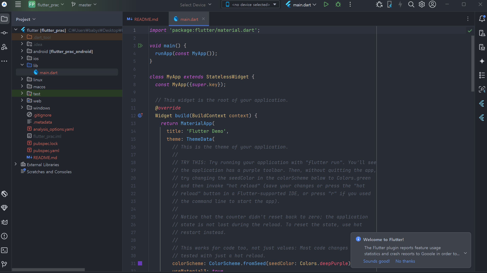

# 1단계 : 다트 입문
> 다트로 코딩하는 데 필요한 기초 지식인 변수, 상수, 컬렉션, 연산자, 제어문, 함수 

<br>

1.1 다트 프로그래밍 언어(Dart programming language)
---
- 구글이 개발

  - 2011년 10월 GOTO 콘퍼런스에서 공개
 
- 크롬에 다트 가상 머신(Dart virtual machine)을 심어 자바스크립트 대체 시도

  - 웹 개발에 혼란을 가져온다는 이유로 실패
 
  - 자바스크립트로 완전 컴파일 가능
 
  - 모바일 영역에서 각광
 
- 장점

  - UI(User Interface) 제작에 최적화되어 있음
 
    - 완전한 비동기 언어
   
    - 이벤트 기반
   
    - 아이솔레이트(Isolate)를 이용한 동시성 기능 제공
   
  - 효율적인 UI 코딩 기능 제공
  
    - 널 안정성(Null Safety)
   
    - 스프레드 기능(Spread Operator)
   
    - 컬렉션 if문(Collection if)
   
  - 효율적인 개발 환경 제공
 
    - 핫 리로드 ⇒ 코드의 변경 사항을 즉시 화면에 반영
   
  - 멀티 플랫폼에서 로깅 및 디버깅 실행 가능
 
  - AOT 컴파일 가능
 
    - 어떤 플랫폼에서든 빠른 속도
   
  - 자바스크립트로의 완전한 컴파일 지원
 
  - 백엔드 프로그래밍 지원

<br>

#### 💡 다트 언어의 컴파일 플랫폼
- 자바스크립트 언어로 완전한 컴파일 가능

- 네이티브 플랫폼과 마찬가지로 중분 컴파일 지원

- 모바일이나 데스크톱 기기를 타기팅하는 네이티브 플랫폼으로 컴파일 가능

- 웹을 타기팅하는 웹 플랫폼으로 컴파일 가능

<br>

> 다트 언어가 컴파일되는 플랫폼

|구분|개발할 때|배포할 떄|
|:-:|:-:|:-:|
|네이티브<br>x64/ARM|JIT + VM|AOT + 런타임|
|웹<br>자바스크립트|dartdevc|dart2js|

<br>

- 다트 네이티브 플랫폼

  - JIT(Just In Time) 컴파일 방식과 AOT(Ahead of Time) 컴파일 방식 사용
 
    - JIT 방식은 핫 리로드, 실시간 매트릭스(matrics) 확인 기능, 디버깅 기능 제공
   
      - 하드웨어 리소스를 적게 사용하는 것보다 빠르게 개발할 수 있는 효율이 중요
     
    - AOT 방식은 ARM64/x64 기계어로 다트 언어가 직접 컴파일 ⇒ 효율적인 프로그램 실행
   
      - SW 배포시 목적 코드로 변환되어 있어야 리소스를 효율적으로 사용 가능

<br>

---

<br>

1.2 문법 공부 환경
---
- 안드로이드 스튜디오나 다른 IDE 사용가능

- 다트패드(dartpad) 사이트가 유용

<br>

### 01. 다트패드
- [다트패드](https://dartpad.dev) 접속해서 연습

<br>

### 02. 안드로이드 스튜디오
- main.dart 파일에 main() 함수 제외 기본 생성 코드 모두 삭제
> lib/main.dart
```dart
  void main() {
    print('hello world');
  }
```

<br>

- 안드로이드 스튜디오 아래 [Terminal] 에서 명령어 사용하여 코드 실행
> Terminal
```dart
  dart lib/main.dart
```

> 결과

|-|
|-|
||


<br>

#### 💡 flutter 프로젝트 생성 방법
|-|
|-|
||
||
||
||

- new flutter project 선택

- flutter SDK 경로 설정

- 프로젝트 이름 입력 후 프로젝트 위치 지정

  - Project Name, Module Name 은 대문자 지원 X
 
- 프로젝트 생성 완료되면 프로젝트 디렉터리 생성 및 프로젝트 파일 오픈

- 애뮬레이터 설정

  - flutter 앱 실행을 위해 안드로이드 애뮬레이터 필요
 
  - 'AVD Maganer' 열어서 가상 장치 생성 or 기존 가상 장치 사용하여 애뮬레이터 설정
 
- 앱 실행

  - 툴바의 'Run' 클릭 or 'main.dart' 파일 우클릭 후 'Run' 클릭

<br>

---

<br>

1.3 기초 문법
---
### 01. 메인 함수
- 프로그램 시작점인 엔트리 함수 기호 : main()

> 형식
```dart
  void main() {  
    // 원하는 코드 작성
  }
```
- void : 아무 값도 반환하지 않는다는 뜻

- main 뒤의 괄호 안에 입력받을 매개변수 지정 가능

  - 괄호 안이 비어있으면 아무런 매개변수도 받지 않는다는 뜻

<br>

### 02. 주석
- 주석 : 프로그램을 실행했을 때 프로그램에서 코드로 인식하지 않는 부분

  - 개발자끼리 소통하거나 코드에 대한 정보 남기는 데 사용
 
  - 주석 기호 : //, /* */, ///

> 형식
```dart
  void main() {
    // 주석을 작성하는 첫 번째 방법은
    // 한 줄 주석
    
    /*
    * 여러 줄 주석 방법
    * 시작 기호는 /* 이고, 끝나는 기호는 */
    * 필수는 아니지만 관행상 중간 줄의 시작으로 * 사용
    * */
    
    /// 슬래시 세 개 사용시
    /// 문서 주식 작성 가능
    /// DartDoc, 안드로이드 스튜디오 같은 
    /// IDE 에서 문서(Documentation)로 인식
  }
```

<br>

### 03. print() 함수
- 문자열을 콘솔에 출력하는 함수

> 형식
```dart
  void main() {
    // 콘솔에 출력
    print('Hello World');
  }
```

<br>

### 04. var를 사용한 변수 선언
- 'var 변수명 = 값;' 형식으로 변수 선언

  - var : 변수의 값을 사용해서 변수의 타입을 유추하는 키워드
 
    - 타입을 한 번 유추하면 추론된 타입 고정
   
    - 고정된 변수 타입과 다른 변수 타입의 값을 같은 변수에 다시 저장 불가

- 변수에 값이 들어가면 자동으로 타입을 추론하는 타입 추론 기능 제공

  - 명시적으로 타입을 선언하지 않아도 OK
 
  - 실제 코드가 컴파일될 때 추론된 타입으로 var이 치환됨
 

> 형식
```dart
  void main() {
    var name = '윤정한';
    print(name);
  
    // 변수값 변경 가능
    name = '이용복';
    print(name);
  
    // var name = '이민호'; // Error : 변수명 중복 불가
  }
```

> 실행 결과
```dart
  윤정한
  이용복
```

<br>

### 05. dynamic을 사용한 변수 선언
- 변수의 타입이 고정되지 않아서 다른 타입의 값 저장 가능

> 형식
```dart
  void main() {
    dynamic name = '윤정한';
    name = 1;
  }  
```

<br>

### 06. final/const를 사용한 변수 선언
- final/const 키워드는 변수 값을 처음 선언 후 변경 불가

  - final
 
    - 런타임 상수 (실행 해봐야 값을 알 수 있음)
   
    - 코드가 실행될 때 확정되면 사용
 
  - const
 
    - 빌드 타임 상수
   
    - 코드를 실행하지 않은 상태에서 값이 확정되면 사용
   
> 형식1
```dart
  void main() {
    final String name = '세븐틴';
    // name = '스트레이키즈';  // Error : finial로 선언한 변수는 선언 후 값 변경 불가
  
    const String name2 = '스트레이키즈';
    // name2 = '데이식스';   // Error : const로 선언한 변수는 선언 후 값 변경 불가
  }
```

<br>

> 형식2
```dart
  void main() {
    final DateTime now = DateTime.now();
  
    print(now);
  }
```

> 실행 결과
```dart
  2024-09-30 02:01:31.764298
```

<br>

> 형식3
```dart
  void main() {
    const DateTime now = DateTime.now();
    // Error : 빌드 타임에 값을 알 수 있어야 하는데 DateTime() 함수는 런타임에 반환되는 값을 알 수 있기 때문
  
    print(now);
  }
```

<br>

### 07. 변수 타입
- 모든 변수는 고유의 변수 타입을 가짐

  - 직접적으로 변수 타입 명시해주면 코드가 직관적이라 유지보수 편해짐
 
  - 문자열, 정수, 실수, 불리언(true/false)

> 형식
```dart
  void main() {
    // String - 문자열
    String name = '윤정한';
  
    // int - 정수
    int isInt = 30;
  
    // double - 실수
    double isDouble = 2.5;
  
    // bool - 불리언 (true/false)
    bool isTrue = true;
  
    print(name);
    print(isInt);
    print(isDouble);
    print(isTrue);
  }
```

> 실행 결과
```
  윤정한
  30
  2.5
  true
```

<br>

----

<br>

1.4 컬렉션
---
- 여러 값을 하나의 변수에 저장할 수 있는 타입

  - List : 여러 값을 순서대로 저장
 
  - Map : 특정 키 값을 기반으로 빠르게 값을 검색
 
  - Set : 중복된 데이터를 제거할 때 사용
 
- 서로의 타입으로 자유롭게 형변환 가능

<br> 

### 01. List 타입
- 여러 값을 순서대로 나열한 변수에 저장할 때 사용

- 원소 : 리스트의 구성 단위

  - **리스트명[인덱스]** 형식으로 특정 원소에 접근 가능
 
  - 인덱스 = 원소의 순번
 
    - 제일 첫 원소는 0으로 지정
   
    - 마지막 원소는 '리스트 길이 - 1'로 지정
   
- 리스트의 길이는 length로 확인 가능

> 형식
```dart
  void main() {
    // 리스트에 넣을 타입을 <> 사이에 명시 가능
    List<String> strayKidsList = ['방찬', '리노', '창빈', '현진', '한', '필릭스', '승민', '아이엔'];
  
    print(strayKidsList);
    print(strayKidsList[0]);  // 첫 원소 지정
    print(strayKidsList[7]);  // 마지막 원소 지정
  
    print(strayKidsList.length);  // 길이 반환
  
    strayKidsList[5] = '이용복';   // 5번 인덱스값 변경
    print(strayKidsList);
  }
```

> 실행 결과
```
  [방찬, 리노, 창빈, 현진, 한, 필릭스, 승민, 아이엔]
  방찬
  아이엔
  8
  [방찬, 리노, 창빈, 현진, 한, 이용복, 승민, 아이엔]
```

<br>

#### 🔸 add() 함수
- List 에 값을 추가할 때 사용

  - 추가하고 싶은 값을 매개변수에 입력

> 형식
```dart
  void main() {
    List<String> strayKidsList = ['방찬', '리노', '창빈', '현진', '한', '필릭스', '승민'];
  
    strayKidsList.add('아이엔'); // 리스트의 끝에 추가
  
    print(strayKidsList);
  }
```

> 실행 결과
```
  [방찬, 리노, 창빈, 현진, 한, 필릭스, 승민, 아이엔]
```

<br>

#### 🔸 where() 함수
- List 에 있는 값들을 순서대로 순회(coping)하면서 특정 조건에 맞는 값만 필터링하는 데 사용

- 매개변수에 함수 입력

  - 입력된 함수는 기존 값을 하나씩 매개변수로 입력받음
 
  - 각 값별로 true 반환시 값 유지, false 반환시 값 버림
 
- 순회 종료시 유지된 값들을 기반으로 이터러블 반환

  - 이터러블(Iterable)
 
    - 추상 클래스로 List 나 Set 등의 컬렉션 타입들이 상속받는 클래스
   
    - List 와 Set 같은 컬렉션이 공통으로 사용하는 기능을 정의해둔 클래스
   
    - where(), map() 등 순서가 있는 값을 반환할 때 사용
   
> 형태
```dart
  void main() {
    List<String> strayKidsList = ['방찬', '리노', '창빈', '현진', '한', '필릭스', '승민', '아이엔'];
  
    final newList = strayKidsList.where(
        (name) => name == '현진' || name == '필릭스',  // '현진' 또는 '필릭스' 만 유지
    );
  
    print(newList);
    print(newList.toList());  // Iterable 을 List 로 다시 변환할 때 .toList() 사용
  }
```

> 실행 결과
```
  (현진, 필릭스)
  [현진, 필릭스]
```

<br>

