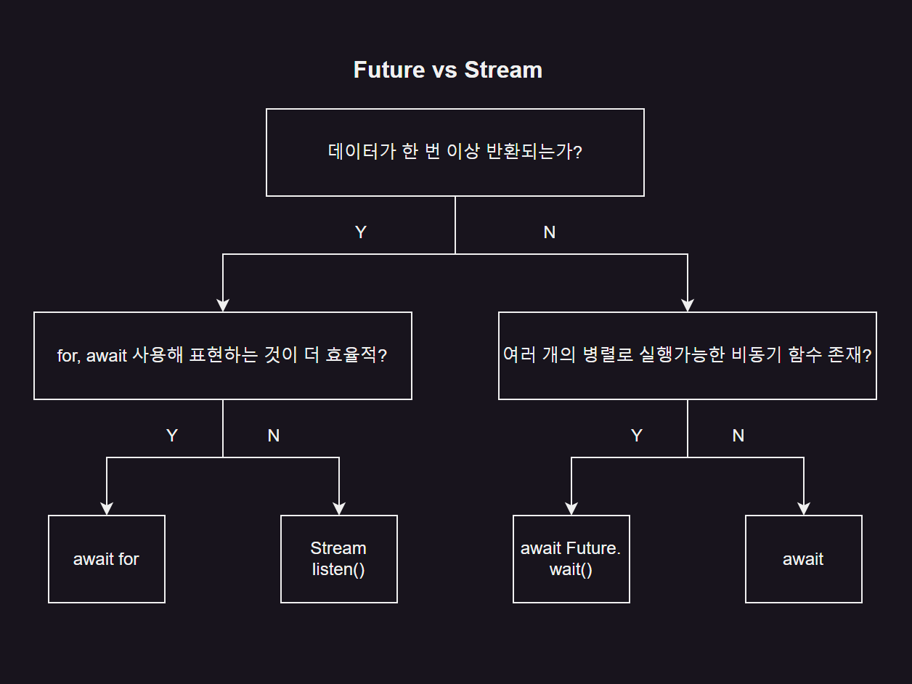

 # 3단계 : 다트 비동기 프로그래밍
> 다트 언어는 동기/비동기 프로그래밍 지원 <br>
> 동기 : 요청하고 나서 응답이 올 때까지 더는 코드를 진행하지 못하고 기다렸다고 응답을 받으면 그제서야 다음 코드 진행 <br>
> 비동기 : 요청하고 나서 응답을 받지 않았는데도 대기하지 않고 다음 코드 진행

<br>

3.1 동기 vs 비동기 프로그래밍
---
- 동기 방식 사용시

  - 함수 실행하면 다음 코드가 실행되기 전에 해당 함수의 결과값이 먼저 반환
 
- 비동기 방식 사용시

  - 요청한 결과를 기다리지 않고 응답 순서 또한 요청한 순서와 다를 수 있음
 
  - 컴퓨터 자원을 낭비하지 않고 더 효율적으로 코드 실행 가능

<br>

---

<br>

3.2 Future
---
- '미래'라는 단어의 의미대로 미래에 받아올 값을 뜻함

- List 나 Set 처럼 제네릭으로 어떤 미래의 값을 받아올지 정할 수 있음

- 비동기 프로그래밍은 서버 요청과 같이 오래 걸리는 작업을 기다린 후 값을 받아와야 하함

  - 미래값을 표현하는 Future 클래스 필요

- Future.delayed() : 특정 기간동안 아무것도 하지 않고 기다림

> 형식
```dart
  Future<String> name;    // 미래에 받을 String 값
  Future<int> number;     // 미래에 받을 int 값
  Future<bool> isOpened;  // 미래에 받을 boolean 값
```

<br>

> lib/3/3.2/1.dart
```dart
  void main() {
    addNumbers(1, 1);
  }
  
  void addNumbers(int number1, int number2) {
    print('$number1 + $number2 계산 시작');           // (2)
  
    // Future.delayed() 사용시 일정 시간 후에 콜백 함수 실행 가능
    Future.delayed(Duration(seconds: 3), () {       // 3초간 대기
      print('$number1 + $number2 = ${number1 + number2}');    // (4)
    });
    // => Future.delated() 는 비동기 연산이기 때문에 CPU 가 3초간 대기해야 한다는 메시지를 받으면
    //    리소스를 허비하지 않고고 다음 코드를 바로 실행
  
    print('$number1 + $number2 코드 실행 끝');         // (3)
  }
  
  // => (2), (4), (3) 순서가 아닌 (2), (3), (4) 순서로 값 출력
```

> 실행 결과
```
  1 + 1 계산 시작
  1 + 1 코드 실행 끝
  1 + 1 = 2
```

<br>

---

<br>

3.3 async 와 await
---
- 비동기 프로그래밍을 유지하면서 코드 가독성 유지

- 함수롤 async 지정 후 대기하고 싶은 비동기 함수를 실행할 때 await 사용시 코드는 작성한 순서대로 실행

> lib/3/3.3/1.dart
```dart
  void main() {
    addNumbers(1, 1);
    addNumbers(2, 2);
    // => 비동기로 실행됨
  }
  
  // async 키워드 : 함수 매개변수 정의와 바디 사이에 입력
  Future<void> addNumbers(int number1, int number2) async {
    print('$number1 + $number2 계산 시작');
  
    // await : 대기하고 싶은 비동기 함수 앞에 입력
    await Future.delayed(Duration(seconds: 3), () {
      print('$number1 + $number2 = ${number1 + number2}');
    });
  
    print('$number1 + $number2 코드 실행 끝');
  } 
```

> 실행 결과
```
  1 + 1 계산 시작
  2 + 2 계산 시작
  1 + 1 = 2
  1 + 1 코드 실행 끝
  2 + 2 = 4
  2 + 2 코드 실행 끝
```

<br>

> lib/3/3.3/2.dart : addNumbers(1,1), addNumbers(2,2) 가 순차적으로 실행되길 원한다면?
```dart
  // async 와 await 키워드 추가
  void main() async {
    await addNumbers(1, 1);
    await addNumbers(2, 2);
    // => 비동기로 실행됨
  }
  
  // async 키워드 : 함수 매개변수 정의와 바디 사이에 입력
  Future<void> addNumbers(int number1, int number2) async {
    print('$number1 + $number2 계산 시작');
  
    // await : 대기하고 싶은 비동기 함수 앞에 입력
    await Future.delayed(Duration(seconds: 3), () {
      print('$number1 + $number2 = ${number1 + number2}');
    });
  
    print('$number1 + $number2 코드 실행 끝');
  }
```

> 실행 결과
```
  1 + 1 계산 시작
  1 + 1 = 2
  1 + 1 코드 실행 끝
  2 + 2 계산 시작
  2 + 2 = 4
  2 + 2 코드 실행 끝
```

<br>

### 01. 결과값 반환받기
- async, await 키워드 사용한 함수에서도 결과값 받아낼 수 있음

  - Future 클래스 사용

> lib/3/3.3/3.dart
```dart
  void main() async {
    final result = await addNumbers(1, 1);
    print('결과값 : $result');   // 일반 함수와 동일하게 반환값 받을 수 있음
  
    final result2 = await addNumbers(2, 2);
    print('결과값 : $result2');
  }
  
  Future<int> addNumbers(int number1, int number2) async {
    print('$number1 + $number2 계산 시작');
  
    await Future.delayed(Duration(seconds: 3), () {
      print('$number1 + $number2 = ${number1 + number2}');
    });
  
    print('$number1 + $number2 코드 실행 끝');
  
    return number1 + number2;
  }
```

> 실행 결과
```
  1 + 1 계산 시작
  1 + 1 = 2
  1 + 1 코드 실행 끝
  결과값 : 2
  2 + 2 계산 시작
  2 + 2 = 4
  2 + 2 코드 실행 끝
  결과값 : 4
```

<br>

---

<br>

3.4 Stream
---
- 한 번 리슨(listen)하면 Stream 에 주입되는 모든 값들을 지속적으로 받아옴

- 지속적으로 값을 반환 받을 때 사용

  - Future 는 반환값을 딱 한 번 받아내는 비동기 프로그래밍

<br>

|-|
|-|
||
|- Future.wait() 함수는 하나의 Future 로 구성된 리스트를 매개변수로 입력받음<br><br>- 입력된 비동기 함수들은 모두 동시에 실행<br><br>- 응답값 요청을 보낸 순서대로 저장해둠(호출한 순서대로 응답값을 받지는 않음)|

<br>

### 01. 스트림 기본 사용법
- 플러터에서 기본으로 제공하는 dart:async 패키지 불러오기

  - StreamController 를 listen() 해야 값을 지속적으로 받환받을 수 있음

> lib/3/3.4/1.dart
```dart
  import 'dart:async';
  
  void main() {
    final controller = StreamController();  // StreamController 선언
    final stream = controller.stream;       // Stream 가져오기
  
    // Stream 에 listen() 함수 실행하면 값이 주입될 때마다 콜백 함수 실행 가능
    final streamListener1 = stream.listen((val){
      print(val);
    });
  
    // Stream 에 값 주입하기
    controller.sink.add(1);
    controller.sink.add(2);
    controller.sink.add(3);
    controller.sink.add(4);
  }
```

> 실행 결과
```
  1
  2
  3
  4
```

<br>

### 02. 브로드캐스트 스트림(broadcast stream)
- 스트림은 단 한번만 listen() 실행 가능

- 하나의 스트림을 생성하고 여러 번 listen() 함수 실행하려면

  - 브로드캐스트 스트림 사용

> lib/3/3.4/2.dart
```dart
  import 'dart:async';
  
  void main() {
    final controller = StreamController();
  
    // 여러 번 리슨할 수 있는 Broadcast Stream 객체 생성
    final stream = controller.stream.asBroadcastStream();
  
    // 첫 번째 listen() 함수
    final streamListener1 = stream.listen((val) {
      print('listening 1');
      print(val);
    });
  
    // 두 번째 listen() 함수
    final streamListener2 = stream.listen((val) {
      print('listening 2');
      print(val);
    });
  
    // add() 실행할 때마다 listen() 하는 모든 콜백 함수에 값 주입됨
    controller.add(1);
    controller.add(2);
    controller.add(3);
  }
```

> 실행 결과
```
  listening 1
  1
  listening 2
  1
  listening 1
  2
  listening 2
  2
  listening 1
  3
  listening 2
  3
```

<br>

### 03. 함수로 스트림 반환하기
- StreamController 사용하지 않고 직접 스트림을 반환하는 함수 작성 가능

- Future 반환하는 함수는 async 로 함수 선언 후 return 키워드로 값 반환

- 스트림 반환하는 함수는 async* 로 함수 선언 후 yield 키워드로 값 반환

> lib/3/3.4/3.dart
```dart
  import 'dart:async';
  
  // Stream 을 반환하는 함수는 async* 로 선언
  Stream<String> calculate(int number) async* {
    for(int i = 0; i < 5; i++) {
      // StreamVontroller 의 add() 처럼 yield 키워드를 이용해서 값 반환
      yield 'i = $i';
      await Future.delayed(Duration(seconds: 1));
    }
  }
  
  void playStream() {
    // StreamController 와 마찬가지로 listen() 함수로 콜백 함수 입력
    calculate(1).listen((val) {
      print(val);
    });
  }
  
  void main() {
    playStream();
  }
```

> 실행 결과
```
  i = 0
  i = 1
  i = 2
  i = 3
  i = 4
```

<br>

🚨 핵심 요약
---
- **비동기 프로그래밍**을 이용하면 오랜 기간 CPU 의 리소스가 막히는 상황 방지 가능

- 비동기 함수 정의 : **async 키워드** 사용

- 비동기 함수를 논리적 순서대로 실행 : **await 키워드** 사용

- **Future** : 비동기 응답을 한 번만 받을 때 사용하는 클래스

- **Stream** : 지속적으로 리슨하여 비동기 응답을 받을 때 사용하는 클래스

  - 한 번 listen()하면 지속적으로 값 받아볼 수 있음
 
  - async* 키워드로 정의
 
  - 값을 반환할 때 yield 키워드 사용
 
  - 함수에서 Stream 반환 가능

<br>


