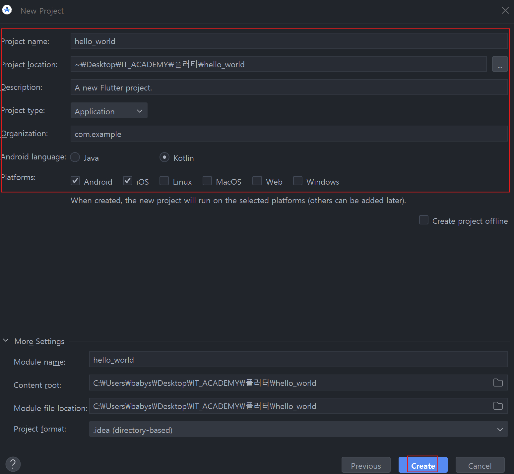
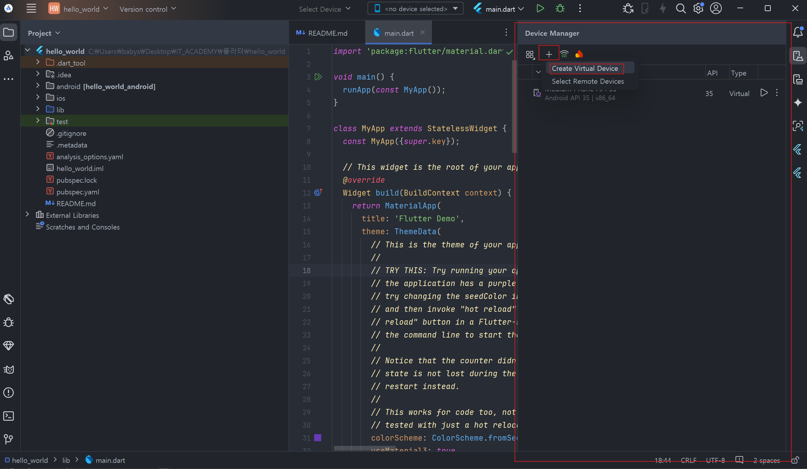

# 5단계 : 플러터 입문
5.1 플러터(Flutter)
---
- 구글이 구현한 크로스 플랫폼 프레임워크(cross platform framework)

- 안드로이드, iOS, 웹사이트, macOS, 윈도우, 리눅스 데스크톱 앱 지원

- 플러터로 개발시 한 소스 코드로 수많은 플랫폼에 대응 가능

  - 개발 비용 절약 및 관리 부담 감소
 
- 플랫폼 간의 이질감이 적은 크로스 플랫폼 프레임워크

  - 스키아(Skia) 엔진이라는 2D 렌더링 엔진과 직접 통신
 
    - 스키아 엔진이 실행되는 플랫폼에서는 똑같은 API 를 사용해서 프로그래밍 가능
   
    - 어떤 플랫폼이든 일관된 UI 제공 가능
   
    - 플랫폼별 UI 디버깅 부담 적음

<br>

#### 💡 플러터 구조
- 임베더(embedder) 계층

  - 하드웨어와 가장 가까운 로우 레벨
 
  - 플러터가 현재 지원하는 6개 플랫폼의 네이티브 플랫폼과 직접 통신
 
  - 운영체제의 자체적 기능을 모듈화해둔 계층
 
    - 모듈들은 각 플랫폼의 네이티브 언어로 작성되어 있음
   
- 엔진(engine) 계층

  - 중간 계층
 
  - 대부분 C++ 로 작성
 
  - 플러터 코어 API 와 스키아 그래픽 엔진, 파일시스템, 네트워크 기능 등 정의
 
- 프레임워크(framework) 계층

  - 마지막 계층(상위)
 
  - 플러터 프레임워크를 사용하는데 필수적인 위젯, 애니메이션, 머티리얼 패키지, 쿠퍼티노 패키지 등

<br>

---

<br>

5.2 Hello Flutter 앱 만들기
---
### 01. 안드로이드 스튜디오에서 프로젝트 생성
#### 1. GUI 환경에서 생성하기
- [New Flutter Project] or [File] → [New] → [New Flutter Project]

- [Flutter] 탭 선택

  - [Flutter SDK Path] 에 플러터를 다운받은 폴더 위치 입력
 
    - 일반적으로 자동 인식
   
  - 완료 후 [Next]
 
- 프로젝트 이름, 언어, 프로젝트 위치 등 설정 후 [Create]

  - Android : Kotlin
 
  - iOS : Swift

- Description : 프로젝트 설명

- Project Type : 프로젝트 종류

  - Application 이 일반 플러터 프로젝트

- Organization : 프로젝트의 번들 아이디(bundle id)

  - 앱을 마켓에 출시할 때 식별하는 값
 
  - 일반적으로 도메인을 거꾸로 작성
 
    - ex) silverywaves.ai → ai.silverywaves.[앱이름]
   
- [Project] 탭 활성화 후 탭이 [Project] 로 설정되어 있는지 확인

  - 안드로이드 스튜디오는 일반적으로 안드로이드 개발시 사용하기 때문에 [Android] 설정 가능성 有

<br>

|-|
|-|
||
||
||
||

<br>

#### 2. CLI 환경에서 프로젝트 생성하기
> 안드로이드 스튜디오는 플러터 프로젝트 생성을 위한 UI 만 제공
>> CLI 로도 플러터 프로젝트 생성 가능
 
- 윈도우나 macOS 터미널을 열어 원하는 폴더로 이동

- 명령어 입력하여 프로젝트 생성

- 플러터 프로젝트 이름은 소문자나 언더스코어로 시작해야 함

> 터미널
```
  flutter create <DIRECTORY>    // <DIRECTORY>에 프로젝트 이름 입력
```

<br>

### 02. 가상 머신 테스트 환경
> 실제 기기 없이 안드로이드 애뮬레이터와 iOS 시뮬레이터에서 테스트 하는 방법

#### 1. 안드로이드 애뮬레이터 생성하기
```
  - 프로젝트를 실행할 수 있는 안드로이드 애뮬레이터 생성
  
  - 안드로이드 애뮬레이터
    : 실제 안드로이드 기기가 없어도 컴퓨터에서 안드로이드 기기를 테스트해볼 수 있는 프로그램
```

- 안드로이드 스튜디오 오른쪽 끝의 Device Manager 아이콘 클릭

- [Create Device] 버튼 클릭하여 애뮬레이터 생성 화면 실행

- [Phone] 탭에서 [Pixel 2] 선택 후 [Next]

- OS 선택

  - 안드로이드 운영체제는 버전을 숫자로 표현
 
    - 높을수록 최신 버전
   
- 원하는 애뮬레이터 이름 설정 후 [show Advanced Settings]

- 화면을 아래로 스크롤하여 [Memory and Storage] 항목 중 [Internal Storage]를 8GB 로 설정 후 Finish

  - 앱을 설치할 충분한 용량 추가
 
- [Device Manager] 돌아가면 안드로이드 애뮬레이터 생성되어 있음

  - 재생 버튼 클릭시 실행

<br>

|-|
|-|
||
||
||
||
||
||
||

<br>

#### 2. iOS 시뮬레이터 실행하기
- MacOS 환경에서만 실행 가능

  - Xcode 설치 잘 했다면 iOS 시뮬레이터는 자동 설치

- [Open iOS Simulator] 클릭하면 시뮬레이터 실행

- 실행된 iOS 시뮬레이터 선택 후 [RUN] 버튼 클릭하면 시뮬레이터 앱 실행

<br>

### 03. 'Hello Flutter' 출력하기
- 플러터 프로젝트 생성하면 항상 같은 샘플 프로젝트가 <프로젝트 폴더>/lib 폴더 아래 main.dart 파일에 생성

- main() 함수

  - 플러터 프로젝트가 실행되는 도입부
 
  - 플러터 프로젝트 실행시 가장 먼저 실행
 
  - main() 함수 안에 runApp() 함수 실행시켜 플러터 프로젝트 시작
 
    - 에뮬레이터 실행하고 실행된 애뮬레이터 선택 후 [실행]

|-|
|-|
||
||

<br>

> main.dart
```dart
  // 머티리얼 디자인과 관련된 기능을 불러오는 코드
  // material.dart 파일을 불러와야 플러터에서 기본 제공해주는 위젯 사용 가능
  import 'package:flutter/material.dart';
  
  void main(){
    runApp(
      MaterialApp(              // 머티리얼 디자인 위젯
        home: Scaffold(         // Scaffold 위젯
          body: Text(           // Text 위젯
            'Hello Flutter',    // 마지막 매개변수 끝에 콤마 추가
          ),
        ),
      ),
    );
  }
```
- runApp() 함수에 MaterialApp 위젯 추가 후 그 안에 Scaffold 위젯 추가 (기본설정)

  - MaterialApp : 머티리얼 디자인(material design) 기반 위젯들을 사용하게 해주는 위젯
 
  - Scaffold : MaterialApp 위젯 다음으로 위치하는 위젯
 
    - 화면 전체 차지하며 레이아웃 도와주고 UI 관련 특수 기능 제공
   
      - 화면에 알림과 같은 스낵바 실행
     
      - 화면의 위에 앱바 추가하거나 아래에 탭바 추가하는 기능

- 마지막 매개변수 끝에 , 기호 추가하는 코딩 표준 존재

  - 기호가 없어도 에러 발생하진 않음
 
  - 코드 자동 정리 실행시 , 기호 기준으로 줄 나눔
 
  - 다음 매개변수가 없더라도 마지막 매개변수 끝에 , 기호 추가

<br>

> 실행 결과

|-|
|-|
||

<br>

### 04. Center 위젯으로 중앙 정렬
> main.dart
```dart
  import 'package:flutter/material.dart';
  
  void main(){
    runApp(
      const MaterialApp(
        home: Scaffold(
          body: Center(
            child: Text(
              'Hello Flutter',
            ),
          )
        ),
      ),
    );
  }
```

<br>

> 실행 결과

|-|
|-|
||

<br>

---

<br>

5.3 실제 단말 테스트 환경 구축
---
- 실제 안드로이드, 아이폰 기기에서도 앱 테스트 가능

<br>

### 01. 안드로이드 실제 기기 사용하기
- USB or 와이파이 무선 방식

  - 실제 기기에서 개발자 옵션 활성화 후 실행
 
<br>

#### 1. 개발자 옵션 활성화 : USB 와 무선 연결 공통 작업
- 개발자 옵션 및 USB 디버깅 사용 설정

  - [설정] → [휴대전화 정보] → [소프트웨어 정보] → [빌드 번호] 7번 탭하기
 
- USB 디버깅 활성화 여부 확인

  - [설정] → [시스템] → [고급] → [개발자 옵션] → [USB 디버깅]

<br>

#### 2. USB 연결
> 안드로이드 실제 기기로 USB 디버깅 하려면 Android 4.1(API 16) 이상의 안드로이드 버전 사용

- 안드로이드 스튜디오에서 Google USB Driver 설치

  - 메인 메뉴 → [Tools] → [SDK Manager]
 
  - [Languages & Frameworks] → [Android SDK] → [Google USB Driver] → [OK] 

- USB 로 안드로이드 핸드폰과 컴퓨터 연결

  - 권한 요청이 뜨면 권한 허가
 
- 안드로이드 스튜디오 실행 기기 선택 탭에서 연결된 핸드폰 선택 후 실행


|-|
|-|
||

<br>

#### 3. 와이파이를 이용한 무선 디버깅
- [안드로이드 와이파이 연결 공식 문서](https://developer.android.com/studio/command-line/adb)

<br>

---

<br>

🚨 핵심 요약
- 플러터는 **Embedder, Engine, Framework** 세 개의 계층으로 이루어져 있음

  - **Embedder** 계층 : 네이티브 플랫폼과 통신하는 역할
 
  - **Engine** 계층 : 플러터 프레임워크 중심이 되는 기능들 제공
 
  - **Framework** 계층 : 위젯과 애니메이션 등 플러터 개발자들이 실질적으로 사용하는 기능들 제공

- **Center** 위젯을 사용하면 위젯을 중앙에 배치 가능

- **Text** 위젯을 사용하면 화면에 글자 작성 가능

<br>

