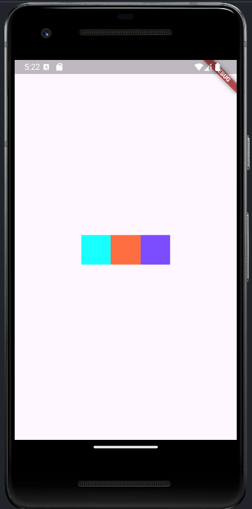

# 6단계 : 기본 위젯
- 플러터는 화면에 그려지는 모든 요소가 위젯으로 구성됨

<br>

6.1 위젯
---
- Everythind is a Widget

  - 플러터 소개 문구 (모든 것은 위젯이다)
 
- 현재 주어진 상태(state, 데이터) 기반으로 어떤 UI 구현할지 정의

- 자식을 하나만 갖는 위젯

  - 대체로 child 매개변수 입력받음
 
  - Container 위젯

    - 자식을 담는 컨테이너 역할
   
    - 배경색, 너비, 높이, 테두리 등 디자인 지정 가능
   
  - GestureDetector 위젯
 
    - 플러터에서 제공하는 제스처 기능을 자식 위젯에서 인식하는 위젯
   
    - 탭, 드래그, 더블클릭 등 제스처 기능이 자식 위젯에 인식됐을 때 함수 실행
   
  - SizedBox 위젯
 
    - 높이와 너비를 지정하는 위젯
   
    - Container 위젯과 다르게 디자인적 요소는 적용 불가
   
    - const 생성자로 선언 가능 ⇒ 퍼포먼스 측면에서 더 효율적

- 자식을 여럿 갖는 위젯

  - children 매개변수를 입력받음
 
  - 리스트로 여러 위젯 입력 가능
 
    - Column 위젯
   
      - children 매개변수에 입력된 모든 위젯들을 세로로 배치
     
    - Row 위젯
   
      - children 매개변수에 입력된 모든 위젯들을 가로로 배치
     
    - ListView 위젯
   
      - 리스트 구현시 사용
     
      - children 매개변수에 다수의 위젯 입력 가능
     
      - 입력된 위젯이 화면을 벗어나게 되면 스크롤 가능
     
- child 와 children 매개변수에 지속적으로 하위 위젯 입력시 트리 위젯 계층

  - UI 를 위젯 트리로 그릴 수 있어야 플러터 앱 프로그래밍 가능

- [플러터에서 기본으로 제공하는 위젯들](https://flutter.dev/docs/development/ui/widgets)

<br>

|-|
|-|
||

<br>

### 01. Children, Child 차이점
- 플러터는 위젯 아래에 계속 위젯이 입력되는 형태

  - 위젯 트리를 구성하여 UI 제작
 
- Child 매개변수, Children 매개변수는 위젯에 하위 위젯 추가시 사용

  - 둘 중 하나만 제공(동시에 입력받는 위젯은 존재 X)


> lib/06/01.dart
```dart
  import 'package:flutter/material.dart';
  
  void main() {
    runApp(
      MaterialApp(
        home: Scaffold(
          body: Center(
            // 하나의 위젯만 가운데 정렬 가능
            child: Text('우리의 새벽은 낮보다 뜨겁다'),
          ),
        ),
      ),
    );
  }
```

> 실행 결과

|-|
|-|
||

<br>

> lib/06/02.dart
```dart
  import 'package:flutter/material.dart';
  
  void main() {
    runApp(
      MaterialApp(
        debugShowCheckedModeBanner: false,
        home: Scaffold(
          body: SizedBox(
            width: double.infinity,
            child: Column(
              mainAxisAlignment: MainAxisAlignment.center,
  
              // 여러 위젯을 Column 위젯에 입력 가능
              children: [
                Text('우리의'),
                Text('새벽은'),
                Text('낮보다'),
                Text('뜨겁다'),
              ],
            ),
          ),
        ),
      ),
    );
  }
```
- children 매개변수는 리스트를 입력받고 리스트 안에는 원하는 만큼 위젯 입력 가능

> 실행 결과

|-|
|-|
||

<br>

---

<br>

6.2 위젯 실습용 템플릿 작성
---
- 위젯들을 화면에 구현하기 위한 기본 코드 템플릿

  - child 매개변수에 예제 작성

> lib/06/03.dart
```dart
  import 'package:flutter/material.dart';
  
  void main(){
    runApp(
      MyApp()
    );
  }
  
  class MyApp extends StatelessWidget {
    @override
    Widget build(BuildContext context) {
      return MaterialApp(
        home: Scaffold(
          body: Center(
            child: Text('토리'),  // 여기에 예제 코드 작성하기
          ),
        ),
      );
    }
  }
```

<br>

---

<br>

6.3 텍스트 관련 위젯
---
- 화면에 글자를 보여주려면 글자를 렌더링할 수 있는 위젯 사용

  - Text 위젯
 
    - 글자를 적고 스타일링하는 위젯
   
    - 첫 번째 포지셔널 파라미터에 원하는 문자열 작성
   
    - style 이라는 네임드 파라미터를 사용해 스타일 지정

> lib/06/04.dart
```dart
  import 'package:flutter/material.dart';
  
  void main(){
    runApp(
        MyApp()
    );
  }
  
  class MyApp extends StatelessWidget {
    @override
    Widget build(BuildContext context) {
      return MaterialApp(
        home: Scaffold(
          body: Center(
            child: Text(
              // 작성하고 싶은 글
              '우리의 새벽은 낮보다 뜨겁다',
              // 글자에 스타일 적용
              style: TextStyle(
                // 글자 크기
                fontSize: 16.0,
                // 글자 굵기
                fontWeight: FontWeight.w700,
                // 글자 색상
                color: Colors.blue,
              ),
            ),
          ),
        ),
      );
    }
  }
```

> 실행 결과

|-|
|-|
||

<br>

#### 💡 플러터는 RichText 위젯과 Paragraph 같은 클래스도 제공
- [참고](https://docs.flutter.dev/development/ui/widgets/text)

<br>

#### 💡 예제 실행시 발생하는 워닝
- use key in widget constructors(위젯 생성자에 키 값을 포함하라)

- prefer const with constant constructors(const 생성자를 사용할 수 있으면 const 생성자를 사용하라)

- 워닝은 프로그램을 실행하는 데 문제는 없지만 변경해주면 성능 향상 or 코드 관리 유리


<br>

---

<br>

6.4 제스처 관련 위젯
---
- 제스처 : 사용자가 키보드로 글자를 입력하는 행위 외의 모든 입력

  - ex) 화면을 한 번 탭, 두 번 탭, 길게 누르는 행동 등
 
- GestureDetector 위젯은 모든 제스처를 매개변수로 제공

- 제스처 관련 위젯은 하위 위젯에 탭이나 드래그처럼 특정 제스처가 입력됐을 때 인지하고 콜백 함수 실행

- Button, IconButton, GestureDetector, FloatingActionButton 등

<br>

### 01. Button 위젯
- 플러터 머티리얼 패키지에서 기본 제공하는 버튼

- TextButton, OutlinedButton, ElevatedButton

  - 버튼을 누르면 색이 변경되는 리플 효과 지원
 
<br>

|TextButton|OutlinedButton|ElevatedBotton|
|:-:|:-:|:-:|
|텍스트만 있는 버튼|테두리가 있는 버튼|입체적으로 튀어나온 배경이 들어간 버튼|
||||

<br>

> lib/06/05.dart
```dart
  import 'package:flutter/material.dart';
  
  void main(){
    runApp(
        MyApp()
    );
  }
  
  class MyApp extends StatelessWidget {
    @override
    Widget build(BuildContext context) {
      return MaterialApp(
        home: Scaffold(
          body: Center(
            child: TextButton(
              // 클릭 시 실행
              onPressed: () {},
              // 스타일 지정
              style: TextButton.styleFrom(
                // 주색상 지정
                foregroundColor: Colors.pink,
              ),
              // 버튼에 넣을 위젯
              child: Text('텍스트 버튼'),
            ),
          ),
        ),
      );
    }
  }
```

> 실행 결과

|-|
|-|
||

<br>

> lib/06/06.dart
```dart
  import 'package:flutter/material.dart';
  
  void main(){
    runApp(
        MyApp()
    );
  }
  
  class MyApp extends StatelessWidget {
    @override
    Widget build(BuildContext context) {
      return MaterialApp(
        home: Scaffold(
          body: Center(
            child: OutlinedButton(
              // 클릭 시 실행할 함수
              onPressed: () {},
              // 버튼 스타일
              style: OutlinedButton.styleFrom(
                foregroundColor: Colors.pink,
              ),
              // 버튼에 들어갈 위젯
              child: Text('아웃라인드 버튼'),
            ),
          ),
        ),
      );
    }
  }
```

> 실행 결과

|-|
|-|
||

<br>

> lib/06/07.dart
```dart
  import 'package:flutter/material.dart';
  
  void main(){
    runApp(
        MyApp()
    );
  }
  
  class MyApp extends StatelessWidget {
    @override
    Widget build(BuildContext context) {
      return MaterialApp(
        home: Scaffold(
          body: Center(
            child: ElevatedButton(
              // 클릭 시 실행할 함수
              onPressed: () {},
              // 버튼 스타일링
              style: ElevatedButton.styleFrom(
                backgroundColor: Colors.pink,
              ),
              // 버튼에 들어갈 위젯
              child: Text('엘리베이티드 버튼'),
            ),
          ),
        ),
      );
    }
  }
```

> 실행 결과

|-|
|-|
||

<br>

### 02. IconButton 위젯
- 아이콘을 버튼으로 생성하는 위젯

- icon 매개변수에 보여주고 싶은 아이콘을 넣을 수 있음

- onPressed 매개변수에 IconButton 을 누르면 실행할 콜백 함수 제공 가능

- 아이콘은 글리프(glyph) 기반의 아이콘 사용 가능

- Icons 클래스를 통해 플러터에서 제공하는 기본 아이콘들 사용 가능

> lib/06/08.dart
```dart
  import 'package:flutter/material.dart';
  
  void main(){
    runApp(
        MyApp()
    );
  }
  
  class MyApp extends StatelessWidget {
    @override
    Widget build(BuildContext context) {
      return MaterialApp(
        home: Scaffold(
          body: Center(
            child: IconButton(
              onPressed: () {},
              icon: Icon(
                // 플러터에서 기본으로 제공하는 아이콘
                Icons.home,
              ),
            ),
          ),
        ),
      );
    }
  }
```
- [제공되는 아이콘 목록](https://fonts.google.com/icons)

> 실행 결과

|-|
|-|
||

<br>

### 03. GestureDetector 위젯
- 손가락으로 하는 여러 가지 입력을 인지하는 위젯

  - 앱은 모든 입력은 손가락으로 함

> lib/06/09.dart
```dart
  import 'package:flutter/material.dart';
  
  void main(){
    runApp(
        MyApp()
    );
  }
  
  class MyApp extends StatelessWidget {
    @override
    Widget build(BuildContext context) {
      return MaterialApp(
        home: Scaffold(
          body: Center(
            child: GestureDetector(
              // 한 번 탭했을 때 실행 함수
              onTap: () {
                // 출력 결과는 안드로이드 스튜디오의 [Run] 탭에서 확인 가능
                print('on tap');
              },
              // 두 번 탭했을 때 실행할 함수
              onDoubleTap: () {
                print('on double tap');
              },
              // 길게 눌렀을 때 실행할 함수
              onLongPress: () {
                print('on long press');
              },
              // 제스처를 적용할 위젯
              child: Container(
                decoration: BoxDecoration(
                  color: Colors.pinkAccent,
                ),
                width: 100.0,
                height: 100.0,
              ),
            ),
          ),
        ),
      );
    }
  }
```

> 실행 결과

|-|
|:-:|
||
||

<br>

#### 💡 GestureDetector 위젯에서 제공하는 중요한 제스처 매개변수

|매개변수|설명|
|-|-|
|onTap|한 번 탭했을 때 실행되는 함수 입력|
|onDoubleTap|두 번 연속으로 탭했을 때 실행되는 함수 입력|
|onLongPress|길게 누르기가 인식됐을 때 실행되는 함수 입력|
|onPanStart|수평 또는 수직으로 드래그가 시작됐을 때 실행되는 함수 입력|
|onPanUpdate|수평 또는 수직으로 드래그 하는 동안 드래그 위치가 업데이트될 때마다 실행되는 함수 입력|
|onPanEnd|수평 또는 수직으로 드래그가 끝났을 때 실행되는 함수 입력|
|onHorizontalDragStart|수평으로 드래그를 시작했을 때 실행되는 함수 입력|
|onHorizontalDragUpdate|수평으로 드래그 하는 동안 드래그 위치가 업데이트될 때마다 실행되는 함수 입력|
|onHorizontalDragEnd|수평으로 드래그가 끝났을 때 실행되는 함수 입력|
|onVerticalDragStart|수직으로 드래그를 시작했을 때 실행되는 함수 입력|
|onVerticalDragUpdate|수직으로 드래그 하는 동안 드래그 위치가 업데이트될 때마다 실행되는 함수 입력|
|onVerticalDragEnd|수직으로 드래그가 끝났을 때 실행되는 함수 입력|
|onScaleUpdate|확대가 시작됐을 때 실행되는 함수 입력|
|onScaleUpdate|확대가 진행되는 동안 확대가 업데이트될 때마다 실행되는 함수 입력|
|onScaleEnd|확대가 끝났을 때 실행되는 함수 입력|

<br>

### 04. FloatingActionButton 위젯
- Material Design 에서 추구하는 버튼 형태

- 안드로이드 앱 화면의 오른쪽 아래 동그란 플로팅 작업 버튼 구현 가능

  - FloatingActionButton, Scaffold 같이 사용

> lib/06/10.dart
```dart
  import 'package:flutter/material.dart';
  
  void main() {
    runApp(
      FloatingActionButtonExample()
    );
  }
  
  class FloatingActionButtonExample extends StatelessWidget {
    @override
    Widget build(BuildContext context) {
      return MaterialApp(
        home: Scaffold(
          floatingActionButton: FloatingActionButton(
            // 클릭했을 때 실행할 함수
            onPressed: () {},
            child: Text('클릭'),
          ),
          body: Container(),
        ),
      );
    }
  }
```

> 실행 결과

|-|
|-|
||

<br>

---

<br>

6.5 디자인 관련 위젯
---
- 배경을 추가하거나 간격을 추가하거나 패딩을 추가하는 등 디자인적 요소를 적용할 때 사용

<br>

### 01. Container 위젯
- 다른 위젯을 담는 데 사용

- 위젯의 너비와 높이를 지정하거나, 배경이나 테두리를 추가할 때 많이 사용

- Container 위젯은 다른 위젯처럼 child 매개변수 사용 가능

> lib/06/11.dart
```dart
  import 'package:flutter/material.dart';
  
  void main(){
    runApp(
        MyApp()
    );
  }
  
  class MyApp extends StatelessWidget {
    @override
    Widget build(BuildContext context) {
      return MaterialApp(
        home: Scaffold(
          body: Center(
            child: Container(
              // 스타일 적용
              decoration: BoxDecoration(
                // 배경색 적용
                color: Colors.pinkAccent,
                // 테두리 적용
                border: Border.all(
                  // 테두리 길이
                  width: 16.0,
                  // 테두리 색상
                  color: Colors.lightBlueAccent,
                ),
                // 모서리 둥글게 만들기
                borderRadius: BorderRadius.circular(
                  16.0,
                ),
              ),
            ),
          ),
        ),
      );
    }
  }
```

> 실행 결과

|-|
|-|
||

<br>

### 02. SizedBox 위젯
- 일반적으로 일정 크기의 공간을 공백으로 두고 싶을 때 사용

- Container 위젯을 사용해도 만들 수 있지만 SizedBox 는 const 생성자 사용했을 때 퍼포먼스에서 이점

> lib/06/12.dart
```dart
  import 'package:flutter/material.dart';
  
  void main(){
    runApp(
        MyApp()
    );
  }
  
  class MyApp extends StatelessWidget {
    @override
    Widget build(BuildContext context) {
      return MaterialApp(
        home: Scaffold(
          body: Center(
            child: SizedBox(
              // 높이 지정
              height: 200.0,
  
              // 너비 지정
              width: 200.0,
  
              // SizedBox 는 색상이 없으므로 크기 확인 용도로 Container 추가
              child: Container(
                color: Colors.greenAccent,
              ),
            ),
          ),
        ),
      );
    }
  }
```

> 실행 결과

|-|
|-|
||

<br>

### 03. Padding 위젯
- child 위젯에 여백을 제공할 때 사용

- Padding 위젯의 상위 위젯과 하위 위젯 사이의 여백 둘 수 있음

- Padding 위젯의 padding 매개변수는 EdgeInsets 라는 값을 입력해야 함

  - EdgeInsets 클래스는 다양한 생성자 제공

- child 매개변수에 Padding 을 적용하고 싶은 위젯 입력 가능

- 패딩은 적용된 위젯이 차지하는 크기 내부에서 간격이 추가됨

  - 위젯의 바깥에 간격을 추가해주는 마진(margin) 기능도 있으나, 플러터에서 자주 사용 X
 
    - 마진은 따로 위젯 존재 X
   
    - Container 위젯에 추가 가능

> lib/06/13.dart
```dart
  import 'package:flutter/material.dart';
  
  void main(){
    runApp(
        MyApp()
    );
  }
  
  class MyApp extends StatelessWidget {
    @override
    Widget build(BuildContext context) {
      return MaterialApp(
        home: Scaffold(
          body: Center(
            child: Container(
                color: Colors.greenAccent,
                child: Padding(
                // 상하, 좌우로 모두 16픽셀만큼 패딩 적용
                padding: EdgeInsets.all(
                  16.0,
                ),
                child: Container(
                  color: Colors.amberAccent,
                  width: 50.0,
                  height: 50.0,
                ),
              ),
            ),
          ),
        ),
      );
    }
  }
```

> 실행 결과

|-|
|-|
||

<br>

> lib/06/14.dart
```dart

```

> 실행 결과

|-|
|-|
||

<br>

#### 💡 EdgeInsets 클래스 생성자 종류
|생성자|설명|
|-|-|
|EdgeInsets.all(16.0)|상하좌우 매개변수에 입력된 패딩을 균등하게 적용|
|EdgeInsets.symmetric(horizontlal: 16.0, verticla: 16.0)|가로와 세로 패딩을 따로 적용<br>Horizontal 매개변수에 가로로 적용할 패딩 입력, Vertical 매개변수에 세로로 적용할 패딩 입력|
|EdgeInsets.only(top: 16.0, bottom: 16.0, left: 16.0, right: 16.0)|위아래, 좌우 패딩을 따로 적용<br>top, bottom, left, right 매개변수에 각각 위아래, 좌우 패딩 입력|
|EdgeInsets.fromLTRB(16.0, 16.0, 16.0, 16.0)|위아래, 좌우 패딩을 따로 적용<br>포지셔널 파라미터를 좌, 위, 우, 아래 순서로 입력|

<br>

### 04. SafeArea
- 플러터는 가용되는 화면을 모두 사용하기 때문에 노치가 있는 핸드폰에서 노치에 위젯들이 가릴 수 있음

- SafeArea 위젯 사용시 기기별로 예외 처리 하지 않고도 안전한(Safe) 화면에서만 위젯 노출 가능

> lib/06/15.dart
```dart
  import 'package:flutter/material.dart';
  
  void main() {
    runApp(
      MaterialApp(
        home: Scaffold(
          body: SafeArea(
            // 원하는 부위만 따로 적용 가능
            // true : 적용 / false : 미적용
            top: true,
            bottom: true,
            left: true,
            right: true,
            child: Container(
              color: Colors.lightGreenAccent,
              height: 300.0,
              width: 300.0,
            ),
          ),
        ),
      ),
    );
  }
```

> 실행 결과

|SafeArea 적용|SafeArea 미적용|
|:-:|:-:|
|||

<br>

---

<br>

6.6 배치 관련 위젯
---
- 하위 위젯을 가로 또는 세로로 배치하거나 위젯 위에 위젯을 겹칠 때 사용

<br>

### 01. Row 위젯
- Column 과 함께 위젯을 가로세로로 배치하는 데 사용

  - Row 는 가로로 위젯을 배치하는 데 사용
 
    - Row 위젯의 crossAxisAlignment 매개변수를 테스트하려면 위젯들을 배치할 수 있는 공간 확보 필요

- 하나의 child 위젯을 입력받는 위젯들과 다르게 여러 개의 child 위젯 입력받을 수 있는 children 매개변수 노출

- Row 는 가로가 주축, 세로가 반대축이 되고 Column 의 경우 반대

  - Row 와 Column 에 존재하는 개념
  
    - 주축(main axis)
   
    - 반대축(cross aixs)
   
  - 주축과 반대축을 어떻게 조합하냐에 따라 Row 와 Column 위젯을 이용해 다양한 배치 가능

<br>

|Row 위젯의 주축과 반대축|Column 위젯의 주축과 반대축|
|:-:|:-:|
|||
 
<br>

> lib/06/16.dart
```dart
  import 'package:flutter/material.dart';
  
  void main() {
    runApp(RowWidgetExample());
  }
  
  class RowWidgetExample extends StatelessWidget {
    @override
    Widget build(BuildContext context) {
      return MaterialApp(
        home: Scaffold(
          body: SizedBox(
            // 반대축에서 이동할 공간을 제공하기 위해 높이를 최대한으로 설정
            height: double.infinity,
            child: Row(
              // 주축 정렬 지정
              mainAxisAlignment: MainAxisAlignment.start,
  
              // 반대축 정렬 지정
              crossAxisAlignment: CrossAxisAlignment.center,
  
              // 넣고 싶은 위젯 입력
              children: [
                Container(
                  height: 50.0,
                  width: 50.0,
                  color: Colors.cyanAccent,
                ),
  
                // SizedBox 는 일반적으로 공백을 생성할 때 사용
                const SizedBox(
                  width: 12.0,
                ),
  
                Container(
                  height: 50.0,
                  width: 50.0,
                  color: Colors.deepOrangeAccent,
                ),
  
                const SizedBox(
                  width: 12.0,
                ),
  
                Container(
                  height: 50.0,
                  width: 50.0,
                  color: Colors.deepPurpleAccent,
                ),
              ],
            ),
          ),
        ),
      );
    }
  }
```

> 실행 결과

|-|
|-|
||

<br>

#### 💡 MainAxisAlignment 옵션 (CrossAxisAlignment.center 기준)
|옵션|설명|예제|
|-|-|:-:|
|MainAxisAlignment.start|시작에 정렬||
|MainAxisAlignment.center|중앙에 정렬||
|MainAxisAlignment.end|끝에 정렬||
|MainAxisAlignment.spaceBetween|자식 위젯의 간격을 균등하게 정렬||
|MainAxisAlignment.spaceAround|자식 위젯의 간격을 균등하게 배정하고<br>왼쪽 끝과 오른쪽 끝을 위젯 사이의 거리의 반만큼 배정해 정렬||
|MainAxisAlignment.spaceEvenly|자식 위젯의 간격을 균등하게 배치하고<br>왼쪽 끝과 오른쪽 끝도 균등하게 배치||

<br>

#### 💡 CrossAxisAlignment 옵션 (MainAxisAlignment.center 기준)
|옵션|설명|예제|
|-|-|:-:|
|CrossAxisAlignment.start|시작에 정렬||
|CrossAxisAlignment.center|중앙에 정렬||
|CrossAxisAlignment.end|끝에 정렬||
|CrossAxisAlignment.stretch|반대축 최대한으로 늘려서 정렬||

<br>

### 02. Column 위젯


