# 7단계 : 앱 개발 지식
- 플러터 개발자로서 알고 있으면 좋은 지식
  
- [실습 프로젝트 바로가기](https://github.com/SVW-App-Develop/Hello_World.git)

<br>

7.1 앱 만들기 프로세스
---
- 현업에서 앱 만들기 프로세스

  - 기획 → UI 구상 → 구현 → 테스트
 
  - UI 구상시 프로토타입을 만들어볼 수 있는 피그마(Figma), 어도비(Adobe) XD, 플러터 플로우(Flutter Flow) 프로그램 사용
 
  - 구현시 폴더 구조를 잘 잡아야 협업이 편하고 유지보수 용이함

<br>

#### 💡 프로토타입용 프로그램
|이름|설명|
|:-:|-|
|피그마|UI 디자인에 특화돼 있는 프로그램<br>모바일, 태블릿, 웹 등의 UI 를 간단하게 구현하고 CSS나 플러터 코드로 받아볼 수 있는 기능 제공|
|어도비 XD|어도비에서 구현한 UI 디자인 툴<br>피그마와 사실상 똑같은 시장을 타기팅하고 있고 비슷한 기능을 제공|
|플러터 플로우|위 두 개의 툴과는 다른 결의 기능 제공<br>플러터에 특화된 UI 구현 툴이며 웹에서 UI 디자인시 플러터 앱을 통째로 반환<br>코드를 전혀 작성하지 않아도 되는 노코드(No Code) 솔루션|

<br>

#### 💡 폴더 구조
|폴더명|설명|
|:-:|-|
|screen|스크린 전체에 해당되는 위젯들을 모아두는 폴더|
|component|스크린을 구성하는 데 공통으로 사용될 만한 요소의 위젯들을 모아두는 폴더|
|model|모델들을 따로 모아두는 폴더|
|const|상수들을 모아두는 폴더|

<br>

- 연습용 앱 만들기 프로세스

  - 기획(프로젝트 개요) → 사전 지식(필요한 지식 학습) → 사전 준비(프로젝트 생성 및 설정) → 레이아웃 구상 → 구현 → 테스트

<br>

---

<br>

7.2 플러그인 추가 방법
---
- 오픈 소스 프로젝트들은 불러와서 원하는 프로젝트에 추가하면 개발 속도를 비약적으로 높을 수 있음

  - 카메라, 블루투스, GPS 등 다양한 플러그인을 불러와 사용 가능

- 플러터 프로젝트 생성시 자동으로 생성되는 pubspec.yaml 파일에 원하는 플러그인 추가 후 [pub get]

  - 플러그인뿐만 아니라 pubspec.yaml 에서 설정한 모든 요소를 현재 프로젝트에 적용시킬 수 있음

> pubspec.yaml
```dart
  # 플러그인을 여기에 등록
  dependencies:
    flutter:
      sdk: flutter
  
    cupertino_icons: ^1.0.8
    webview_flutter: 2.3.1    # 웹뷰 플러그인 추가
```

> 실행 결과

|-|
|-|
|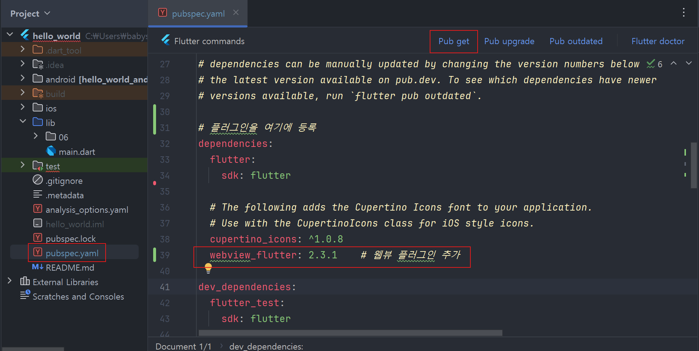|

<br>

---

<br>

7.3 주변 장치 종류
---
- 플러터 프레임워크는 다양한 하드웨어 기능을 제공해줌

  - 스마트폰에서 장치를 손쉽게 사용 가능
 
  - ex) 움직임을 측정하는 센서 및 GPS 기능, 카메라, 블루투스나 와이파이 같은 네트워크 기능 등

<br>

#### 💡 플러터에서 지원하는 대표적인 주변 장치
|기능|설명|관련 플러그인|관련 위치|
|:-:|-|:-:|:-:|
|센서|핸드폰의 움직이는 속도를 측정하는 Accelerometer,<br>핸드폰의 회전을 측정하는 Gyroscope,<br>자기장을 측정하는 Magnetometer 등 사용 가능|sensors_plus|[11장](../03/11)|
|GPS|GPS 권한 관리, GPS 상의 핸드폰 위치 업데이트 받기,<br>위도 경도를 기반으로 거리 계산하기 등 위치 서비스 기능 사용 가능|geolocator|[14장](../03/14)|
|카메라|카메라 권한 관리, 카메라가 찍고 있는 화면을 핸드폰에 보여주고,<br>사진 또는 영상 촬영 가능|camera|[13장](../03/13)|
|블루투스|주변 블루투스 기기 탐색, 연결, 통신 가능|flutter_blue|-|
|와이파이|와이파이 ON/OFF, 연결 상태 및 와이파이 정보 가져오고,<br>특정 와이파이에 연결 가능|wifi_iot|-|

<br>

---

<br>

7.4 연습용 앱 만들기 : 스플래시 스크린 앱
---
- 앱이 로딩되는 동안 보이는 스플래스 스크린 구현

  - 위젯을 화면에 배치하는 Row 위젯, Column 위젯 사용
 
- [실습 프로젝트 바로가기](https://github.com/SVW-App-Develop/Splash_Screen.git)

<br>

### 01. 사용자 정의 위젯 만들기 : 스테이트리스 위젯
- 위젯의 형태

  - 스테이트풀(stateful)
 
    - 위젯 내부에서 값이 변경되었을 때 위젯 자체에서 다시 렌더링 실행 가능
 
  - 스테이트리스(stateless)
 
    - 위젯 내부에서 값이 변경되어도 위젯 자체적으로는 다시 렌더링 불가

> main.dart
```dart
  import 'package:flutter/material.dart';
  
  // MaterialApp 위젯과 Scaffold 위젯 기본 제공한 뒤 화면 중앙에 Splash Screen 글자 넣기
  // => MaterialApp 이 항상 최상단에 입력되고 그 다음으로 Scaffold 앱이 입력됨
  
  void main() {
    runApp(
      // SplashScreen 위젯을 첫 화면으로 지정
      SplashScreen()
    );
  } // runApp() 에 SplashScreen 위젯을 매개변수로 제공해주었더니, 앱 화면에서 SplashScreen 의 build() 함수의 코드 실행 결과가 보임
  
  // StatelessWidget 선언
  class SplashScreen extends StatelessWidget {  // StatelessWidget 이라는 클래스를 사용자 정의 위젯(SplashScreen 클래스)이 상속받음
    @override
    Widget build(BuildContext context){   // build() 함수 필수적으로 오버라이드 => build() 함수가 위젯의 UI 결정
      // 위젯의 UI 구현
      return MaterialApp(     // 항상 최상단에 입력되는 위젯
        home: Scaffold(       // 항상 두 번째로 입력되는 위젯
          body: Center(       // 중앙 정렬 위젯
            // 글자를 화면에 보여주는 위젯
            child: Text('Splash Screen'),
          ),
        ),
      );
    }
  }
```

> 실행 결과

|-|
|-|
|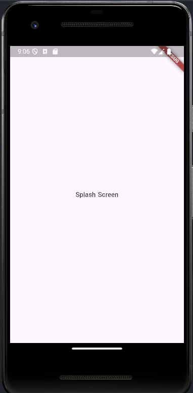|

<br>

### 02.배경색 바꾸기 : Container 와 BoxDecoration 위젯
- 배경 관련 UI 변경할 때 Container 위젯 가장 많이 사용

> main.dart
```dart
  import 'package:flutter/material.dart';
  
  void main() {
    runApp(
        SplashScreen()
    );
  }
  
  class SplashScreen extends StatelessWidget {
    @override
    Widget build(BuildContext context){
      return MaterialApp(
        home: Scaffold(
          body: Container(    // 컨테이너 위젯
            // 컨테이너를 디자인하는 클래스
            decoration: BoxDecoration(
              color: Colors.deepOrangeAccent,   // 색상
            ),
            child: Center(
              child: Text('Splash Screen'),
            ),
          ),
        ),
      );
    }
  }
```
- Container 는 decoration 이라는 네임드 파라미터 제공

  - decoration 매개변수에는 BoxDecoration 클래스 사용
 
    - BoxDecoration 매개변수를 통해 배경색, 테두리 색, 테두리 두께 등 컨테이너의 여러 UI 요소 지정
   
- 일반적으로 프로그래밍시 색상은 헥스 코드(hex code, #FEFEFE 등) 사용

  - Colors 클래스를 이용하면 헥스 코드 없이 쉽게 기본 색상 중에 원하는 색상 고를 수 있음
 
- 핫 리로드(hot reload)

  - 코드 작성 후 [메뉴] → [File] → [Save All] or [Ctrl]/[Cmd] + [S] 로 저장하면 실행 버튼 안눌러도 앱 화면 변경

> 실행 결과

|-|
|-|
|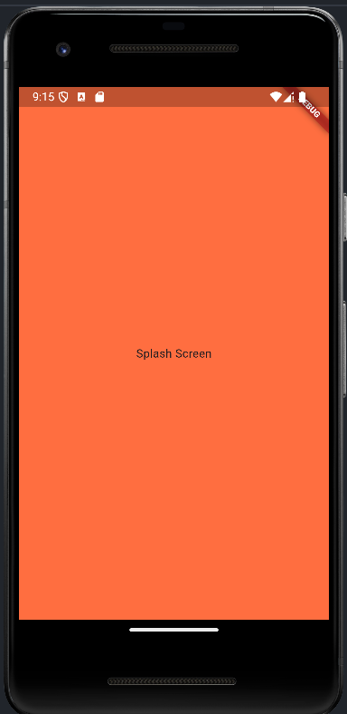|

<br>

### 03. 이미지 출력하기 : Image 위젯
- 이미지를 보여줄 Image 위젯 사용

  - **기본 Image 생성자**는 ImageProvider 라는 또 다른 위젯에서 이미지를 그림
 
  - **Image.asset 생성자**는 앱에 저장된 asset 파일로 이미지를 그림
 
  - **Image.network 생성자**는 URL 을 통해 이미지 그림
 
  - **Image.file 생성자**는 파일을 통해서 이미지 그림
 
  - **Image.memory 생성자**는 메모리에서 직접 이미지를 그림

<br>

#### 🟡 Image.asset 생성자 사용

- 프로젝트 폴더 위에서 마우스 우클릭 후 [New] → [Directory]

  - 팝업창에 assets 를 입력해 [assets] 폴더 생성
 
    - [assets] 폴더에 이미지를 드래그 앤 드롭해서 저장
   
- [assets] 폴더에 이미지 파일을 추가했지만 화면에 불러오려면 추가 작업 필요

  - 이미지를 담을 [assets] 폴더를 [pubspec.yaml] 파일에 지정
 
  - [pubspec.yaml] : 플러터 프로젝트가 처음 생성되면서 자동으로 생성되는 파일
 
    - 플러터 프로젝트의 모든 설정이 담긴 파일
 
    - 프로젝트에서 사용할 폰트, 이미지, 외부 플러그인 등을 지정하는 데 사용

- flutter.assets 키에 [assets] 폴더 지정

  - [assets:] 주석 처리되어있는데 해제하고 그 아래에 원하는 폴더 지정
 
  - YAML 에서 - 기호는 리스트값 의미 ⇒ 원하는 만큼 - 로 시작하는 값들 계속 추가 가능
 
- 설정을 변경했으므로 asset 파일을 프로젝트에 추가 및 새 플러그인 내려받는 등 추가 작업 필요

  - 플러터에서는 [pub get] 기능을 제공해 위 작업 자동 처리
 
    - 파일이 수정되었을 때 에디터 위에 자동으로 나타남
   
- [pub get] 기능 실행 후 앱 재실행해야 새로 바뀐 설정 적용됨

|-|
|-|
|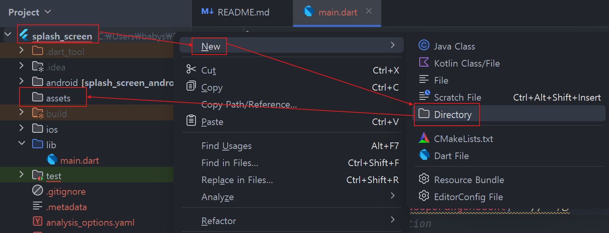|
|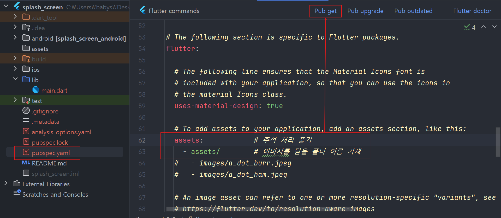|

<br>

> main.dart
```dart
  import 'package:flutter/material.dart';
  
  void main() {
    runApp(
        SplashScreen()
    );
  }
  
  class SplashScreen extends StatelessWidget {
    @override
    Widget build(BuildContext context){
      return MaterialApp(
        home: Scaffold(
          body: Container(
            decoration: BoxDecoration(
              color: Colors.orangeAccent,
            ),
            child: Center(
              // Text 위젯을 Image 위젯으로 변경
              // child: Text('Splash Screen'),
              child: Image.asset(
                'assets/logo.png',
              ),
            ),
          ),
        ),
      );
    }
  }
```
- Image.asset 은 매개변수 하나를 받음

  - 파일 위치(경로) 기재
 
- 배경색을 더 어울리는 색으로 변경하기 위해 헥스 코드 사용

  - Colors 대신 Color 클래스 사용
    - 프로젝트에서 사용할 폰트, 이미지, 외부 플러그인 등을 지정하는 데 사용

- flutter.assets 키에 [assets] 폴더 지정

  - [assets:] 주석 처리되어있는데 해제하고 그 아래에 원하는 폴더 지정
 
  - YAML 에서 - 기호는 리스트값 의미 ⇒ 원하는 만큼 - 로 시작하는 값들 계속 추가 가능
 
- 설정을 변경했으므로 asset 파일을 프로젝트에 추가 및 새 플러그인 내려받는 등 추가 작업 필요

  - 플러터에서는 [pub get] 기능을 제공해 위 작업 자동 처리
 
    - 파일이 수정되었을 때 에디터 위에 자동으로 나타남
   
- [pub get] 기능 실행 후 앱 재실행해야 새로 바뀐 설정 적용됨

|-|
|-|
||
||

<br>

> main.dart
```dart
  import 'package:flutter/material.dart';
  
  void main() {
    runApp(
        SplashScreen()
    );
  }
  
  class SplashScreen extends StatelessWidget {
    @override
    Widget build(BuildContext context){
      return MaterialApp(
        home: Scaffold(
          body: Container(
            decoration: BoxDecoration(
              color: Color(0xFFFFB8A2),
            ),
            child: Center(
              // Text 위젯을 Image 위젯으로 변경
              // child: Text('Splash Screen'),
              child: Image.asset(
                'assets/logo.png',
              ),
            ),
          ),
        ),
      );
    }
  }
```
- Image.asset 은 매개변수 하나를 받음

  - 파일 위치(경로) 기재
 
- 배경색을 더 어울리는 색으로 변경하기 위해 헥스 코드 사용

  - Colors 대신 Color 클래스 사용
  
    - 첫 번째 위치 매개변수에 헥스 코드를 제공해 색상 표현

  - 6자리 헥스 코드의 앞에 16진수를 의미하는 0x, 불투명도 100%를 의미하는 'FF' 추가 후 헥스 코드를 '#' 없이 입력

> 실행 결과

|-|
|-|
|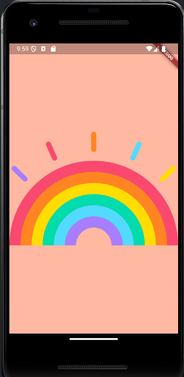|

<br>

#### 💡 yaml 파일
- 현대 프로그래밍에서 설정값을 지정할 때 흔히 사용되는 구조

- JSON 과 비슷하게 키/값이 쌍

  - : 기호를 기준으로 왼쪽이 키, 오른쪽이 값
 
- 탭 개수로 키/값의 깊이 정함

<br>

#### 💡 CLI 에서 pub get
- 편집기 아래에 있는 [Terminal] 탭에서 아래 명령어 실행

```
  flutter pub get
```

<br>

### 04. 위젯 정렬하기 : Row & Column 위젯
- 플러터팀이 만들어 제공하는 애니메이션 위젯 사용

  - LinearProgressIndicator
 
    - 일자 형태로 로딩 애니메이션이 실행되는 위젯
 
  - CircularProgressIndicator
 
    - 동그라미 형태로 로딩 애니메이션이 실행되는 위젯
   
- 중앙 정렬 : Center 위젯은 child 에 하나의 위젯만 받을 수 있음

  - Row 와 Column 위젯은 children 매개변수에 리스트로 원하는 만큼 위젯 추가 가능
 
    - Row 와 Column 위젯을 이용해 로고와 로딩 애니메이션 중앙 정렬 가능 

<br>

#### 1. 로고와 로딩 애니메이션을 세로로 가운데 정렬

> main.dart
```dart
  import 'package:flutter/material.dart';
  
  void main() {
    runApp(
        SplashScreen()
    );
  }
  
  class SplashScreen extends StatelessWidget {
    @override
    Widget build(BuildContext context){
      return MaterialApp(
        home: Scaffold(
          body: Container(
            decoration: BoxDecoration(
              color: Color(0xFFFFB8A2),
            ),
            child: Column(
              children: [
                // 여러 위젯을 입력할 수 있는 children 매개변수
                Image.asset(
                  'assets/logo.png',
                ),
                CircularProgressIndicator(),
              ],
            ),
          ),
        ),
      );
    }
  }
```
- Center 위젯을 Column 위젯으로 변경하고 children 매개변수에 Image 위젯과 CircularProgressIndicator 입력
 
- Column 은 children 매개변수를 사용하니 리스트 안에 위젯들을 보여주고 싶은 순서대로 입력해야 함

  - Center 위젯과 다르게 Column 위젯을 사용해서 화면 맨 위에 로고 위치

> 실행 결과

|-|
|-|
|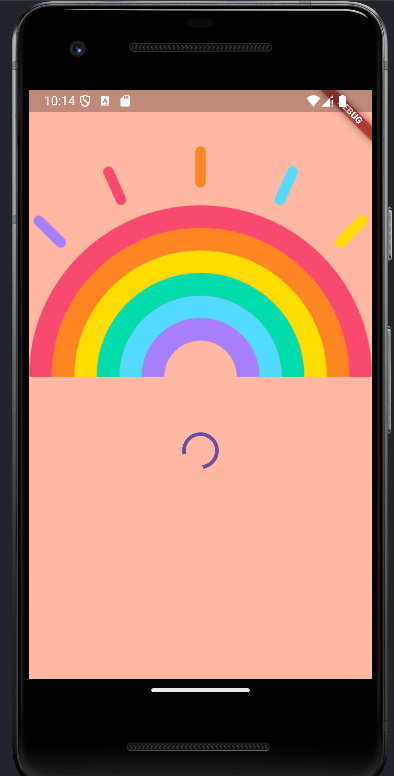|

<br>

#### 2. children 에 포함된 위젯들 재배치 : mainAxisAlignment 매개변수
> main.dart
```dart
  import 'package:flutter/material.dart';
  
  void main() {
    runApp(
        SplashScreen()
    );
  }
  
  class SplashScreen extends StatelessWidget {
    @override
    Widget build(BuildContext context){
      return MaterialApp(
        home: Scaffold(
          body: Container(
            decoration: BoxDecoration(
              color: Color(0xFFFFB8A2),
            ),
            child: Column(
              // 가운데 정렬 추가
              mainAxisAlignment: MainAxisAlignment.center,
              children: [
                Image.asset(
                  'assets/logo.png',
                ),
                CircularProgressIndicator(),
              ],
            ),
          ),
        ),
      );
    }
  }
```
- mainAxisAlignment 매개변수에는 MainAxisAlignment 라는 enum 값이 들어감

  - 가운데를 의미하는 MainAxisAlignment.center 적용

> 실행 결과

|-|
|-|
|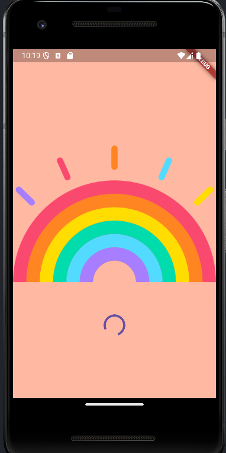|

<br>

#### 3. 로고 이미지 크기 조절
- 이미지 크기 조절에는 Image 위젯의 width(너비), height(높이) 매개변수 사용

> main.dart
```dart
  import 'package:flutter/material.dart';
  
  void main() {
    runApp(
        SplashScreen()
    );
  }
  
  class SplashScreen extends StatelessWidget {
    @override
    Widget build(BuildContext context){
      return MaterialApp(
        home: Scaffold(
          body: Container(
            decoration: BoxDecoration(
              color: Color(0xFFFFB8A2),
            ),
            child: Column(
              mainAxisAlignment: MainAxisAlignment.center,
              children: [
                Image.asset(
                  'assets/logo.png',
                  width: 200.0,   // 너비 추가
                ),
                CircularProgressIndicator(),
              ],
            ),
          ),
        ),
      );
    }
  }
```
- 배경도 함께 작아짐

  - Column 은 세로로 최대한 크기를 차지하지만 가로로는 최소한 크기만 차지하는 특성 때문
 
  - 현재 Column 위젯 안에 Image 위젯과 CircularProgressIndicator 위젯만 존재
    
    - 둘 중 더 큰 위젯인 Image 위젯이 가로 200 픽셀만큼 차지하고 있기 때문
   
    - Column 위젯도 가로 200 픽셀만 차지함

- 해결 방법

  - Row 위젯은 Column 위젯과 반대로 작동(가로로는 최대 크기 차지, 세로로는 최소 크기 차지)
 
    - Row 위젯으로 Column 위젯 감싸면 왼쪽부터 위젯 정렬
   
    - 가운데 정렬을 위해 MainAxisAlignment.center 추가해줘야 함

> 실행 결과

|-|
|-|
|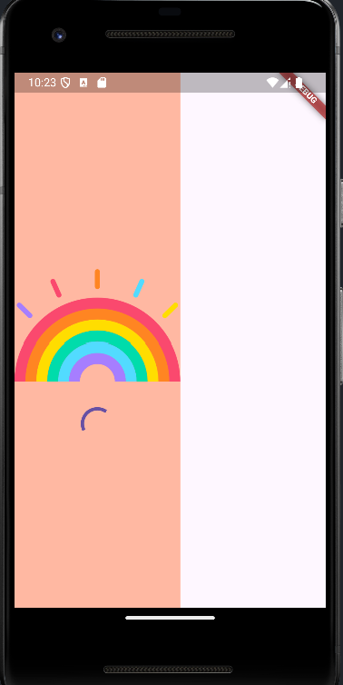|

<br>

> main.dart
```dart
  import 'package:flutter/material.dart';
  
  void main() {
    runApp(
        SplashScreen()
    );
  }
  
  class SplashScreen extends StatelessWidget {
    @override
    Widget build(BuildContext context){
      return MaterialApp(
        home: Scaffold(
          body: Container(
            decoration: BoxDecoration(
              color: Color(0xFFFFB8A2),
            ),
            child: Row(   // Row 위젯으로 Column 위젯 감싸기
              mainAxisAlignment: MainAxisAlignment.center,  // 중앙 정렬
              children: [
                Column(
                  mainAxisAlignment: MainAxisAlignment.center,
                  children: [
                    Image.asset(
                      'assets/logo.png',
                      width: 200.0,   // 너비 추가
                    ),
                    CircularProgressIndicator(),
                  ],
                ),
              ],
            ),
          ),
        ),
      );
    }
  }
```

> 실행 결과

|-|
|-|
|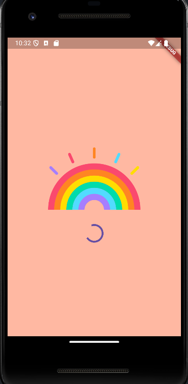|

<br>

#### 4. 로딩 위젯(CircularProgressIndicator) 색상 변경
- 로딩 위젯(CircularProgressIndicator, LinearProgressIndicator)의 색상 매개변수

  - backgroundColor
 
    - 위젯의 배경 색상
 
  - valueColor
 
    - 실제로 애니메이션으로 움직이는 부분의 색상
   
    - 색상이 애니메이션되어야 하기 때문에 Colors 클래스 직접 넣을 수 없음
   
      - AlwaysStoppedAnimation 클래스에 감싸서 색상 제공

> main.dart
```dart
  import 'package:flutter/material.dart';
  
  void main() {
    runApp(
        SplashScreen()
    );
  }
  
  class SplashScreen extends StatelessWidget {
    @override
    Widget build(BuildContext context){
      return MaterialApp(
        home: Scaffold(
          body: Container(
            decoration: BoxDecoration(
              color: Color(0xFFFFB8A2),
            ),
            child: Row( 
              mainAxisAlignment: MainAxisAlignment.center,
              children: [
                Column(
                  mainAxisAlignment: MainAxisAlignment.center,
                  children: [
                    Image.asset(
                      'assets/logo.png',
                      width: 200.0,  
                    ),
                    CircularProgressIndicator(
                      // 애니메이션으로 움직이는 부분 색상 변경
                      valueColor: AlwaysStoppedAnimation(
                        Colors.white,
                      ),
                    ),
                  ],
                ),
              ],
            ),
          ),
        ),
      );
    }
  }
```

> 실행 결과

|-|
|-|
|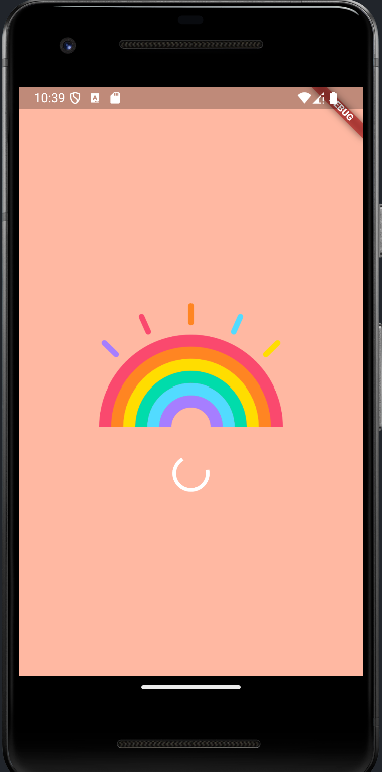|

<br>

---

<br>

🚨 핵심 요약
---
- 플러터는 **머티리얼 디자인** 사용

  - 프로젝트의 위젯 트리 가장 상단에 MaterialApp 위젯, Svaffold 위젯 사용

- **Container** 위젯에는 배경색 적용 가능

- **Image** 위젯은 화면에 이미지를 보여줄 수 있음

- **flutter pub get** 실행시 **pubspec.yaml** 의 변경 사항을 프로젝트에 적용 가능

- **Column** 위젯 이용시 다수의 위젯 세로 배치 가능

- **Row** 위젯 이용시 다수의 위젯 가로 배치 가능

<br>


