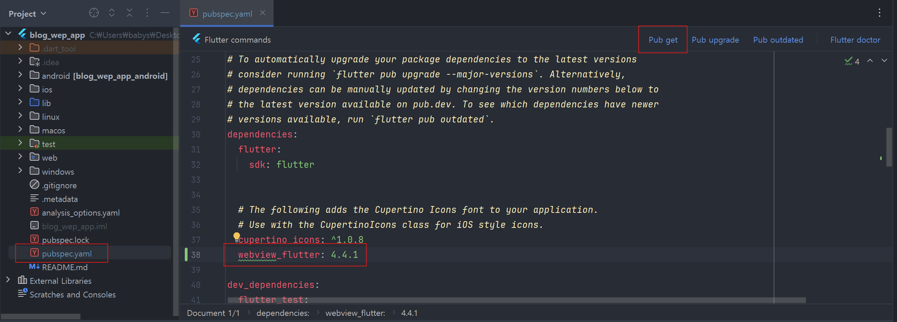
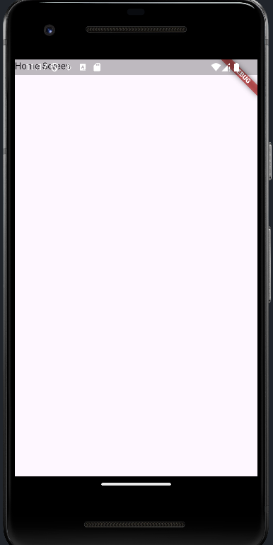
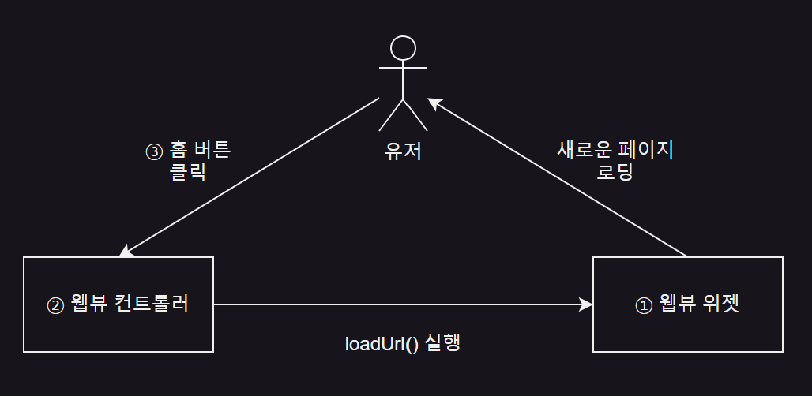
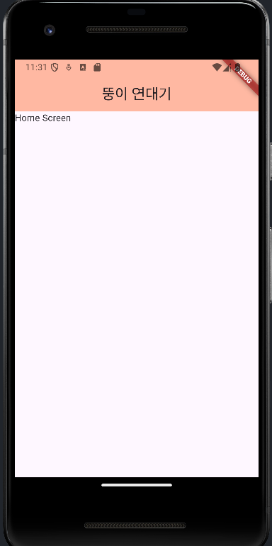
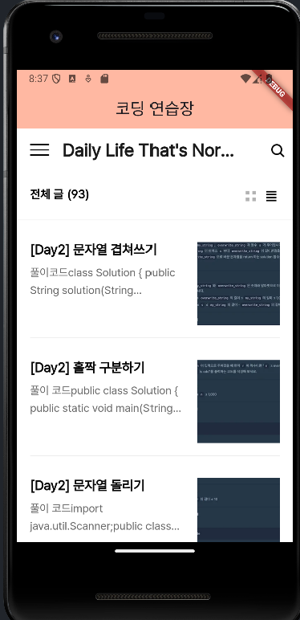

# 8단계 : 블로그 웹 앱
- 콜백 함수, 웹뷰, 네이티브 설정

  - 웹뷰 : 웹사이트의 URL 을 입력하면 해당 웹사이트를 화면에 보여주는 역할
 
    - 네이티브 UI 가 아니라 약간의 이질감은 있지만 웹사이트를 쉽게 앱으로 구현 가능
   
  - 앱바(AppBar) : 머티리얼 디자인 요소
 
    - 앱 맨 위에 페이지 이름이나 앱 이름을 적어둔 형태의 UI 를 그려주는 위젯

<br>

|개요|설명|
|-|-|
|**프로젝트명**|blog_web_app|
|**개발환경**|플러터 SDK : 3.24.3|
|**미션**|웹뷰를 사용해서 웹사이트를 앱으로 포장하기|
|**기능**|웹뷰를 사용해서 앱에서 웹사이트 실행하기|
|**조작법**|앱을 실행하면 웹사이트 실행|
|**핵심 구성요소**|- StatelessWidget<br><br>- 앱바<br><br>- 웹뷰<br><br>- IconButton|
|**플러그인**|webciew_flutter : 4.4.1|

<br>

8.1 사전 지식
---
### 01. 콜백(callback) 함수
- 일정 작업이 완료되면 실행되는 함수

  - 함수를 정의해두면 바로 실행되지 않고 특정 조건이 성립될 때 실행

> ex
```dart
  WebViewController controller = WebViewController()
    ..setNavigationDelegate(NavigationDelegate(
    // 로딩 완료 후 실행되는 함수
      onPageFinished: (String url){
        print('url');
      }
    )
  )
```
- onPageFinished() : 웹뷰에서 페이지 로딩이 완료된 뒤에 실행되는 콜백 함수

  - 첫 번째 매개변수 : 로딩된 페이지의 URL 반환
 
  - 페이지 로딩 후 실행하고 싶은 작업이 있다면 함수 내부에 코드 정의
 
- 웹뷰 위젯(WebViewWidget) 의 콜백 함수

  - onPageFinished()
 
  - onWebViewCreated()
 
  - onPageStarted()
 
  - onProgress()

<br>

### 02. 웹뷰 위젯
- 프레임워크에 내장된 브라우저를 앱의 네이티브 컴포넌트(component)에 임베딩(embedding)하는 기능

  - 앱에서 웹 브라우저 기능을 구현해주는 기술

- 단점

  - 네이티브 컴포너트에 비해 속도가 느림
 
  - 애니메이션이 부자연스러움
 
- 장점

  - 기존에 만든 웹사이트를 손쉽게 활용 가능
 
- 웹뷰 구현시 사용할 웹뷰 위젯은 controller 파라미터에 WebViewController 객체 입력

  - 웹뷰 컨트롤러 : 웹뷰 위젯을 제어하는데 필요한 기능 제공

<br>

#### 💡 웹뷰 위젯의 속성
|속성|설명|
|:-:|-|
|setJavascriptMode|웹뷰에서 자바스크립트 실행 허용 여부 결정<br><br>- JavascriptMode.unrestricted : 자바스크림트를 제한 없이 실행 가능<br><br>- JavascriptMode.disabled : 자바스크립트 실행 불가|
|setBackgroundColor|배경색 지정 가능|
|loadRequest|새로운 URL 로 이동|
|setNavigationDelegate|NavigationDelegate 객체 입력 필수이며, 해당 객체에 다양한 콜백 함수 포함<br><br>- onProgress : 새로운 페이지를 열어서 로딩이 될 때마다 실행되는 함수<br>&nbsp;&nbsp;&nbsp;&nbsp;&nbsp;&nbsp;&nbsp;&nbsp;&nbsp;&nbsp;&nbsp;&nbsp;&nbsp;&nbsp;&nbsp;&nbsp;&nbsp;&nbsp;&nbsp;&nbsp;&nbsp;&nbsp;&nbsp; 매개변수로 로딩의 진행도를 0~1 사이 값으로 받음<br><br>- onPageStarted : 새로운 페이지로 이동하면 실행되는 콜백 함수<br>&nbsp;&nbsp;&nbsp;&nbsp;&nbsp;&nbsp;&nbsp;&nbsp;&nbsp;&nbsp;&nbsp;&nbsp;&nbsp;&nbsp;&nbsp;&nbsp;&nbsp;&nbsp;&nbsp;&nbsp;&nbsp;&nbsp;&nbsp;&nbsp;&nbsp;&nbsp;&nbsp;&nbsp; 이동하고 있는 페이지의 URL 을 콜백 함수의 매개변수로 입력받음<br><br>- onPageFinished : 새로운 페이지로 이동이 완료되면 실행되는 콜백 함수<br>&nbsp;&nbsp;&nbsp;&nbsp;&nbsp;&nbsp;&nbsp;&nbsp;&nbsp;&nbsp;&nbsp;&nbsp;&nbsp;&nbsp;&nbsp;&nbsp;&nbsp;&nbsp;&nbsp;&nbsp;&nbsp;&nbsp;&nbsp;&nbsp;&nbsp;&nbsp;&nbsp;&nbsp;&nbsp;&nbsp; 로딩 완료된 웹페이지의 URL 을 매개변수로 입력받음|

<br>

### 03. 안드로이드와 iOS 네이티브 설정
- 플러터도 각 네이티브 플랫폼으로 코드가 컴파일되므로 최소한의 네이티브 설정 필요

  - ex) 인터넷 권한, https 프로토콜에 관한 권한 설정, 카메라, 사진첩, 푸시(push) 권한 등
  
    - 보안에 민감한 사항이나 하드웨어 접근시 네이티브 설정

- 네이티브 설정이 필요한 플러그인은 보통 플러그인 홈페이지에 설정법 기재되어 있음

- 네이티브 설정이 필요한 경우는 일반적으로 해당 플러그인의 pub.dev 소개 페이지에서 확인 가능

<br>

---

<br>

8.2 사전 준비
---
### 01. pubspec.yaml 설정
- pubspec.yaml 파일 : 플러터 프로젝트와 관련된 설정을 하는 파일

  - 프로젝트에서 사용할 이미지 및 폰트를 지정하거나 사용할 오픈 소스 프로젝트들을 명시할 때 사용
 
- webview_flutter 플러그인을 pubspec.yaml 파일에 추가하고 [pub get] 실행

```dart
  webview_flutter: 4.4.1
```

|-|
|-|
||

<br>

#### 💡 주요 pub 명령어
|명령어|설명|
|-|-|
|flutter pub get|pubspec.yaml 파일에 등록한 플러그인들을 내려받음|
|flutter pub add [플러그인 이름]|pubspec.yaml 에 플러그인 추가<br>명령어의 끝에 플러그인 이름 추가|
|flutter pub upgrade|pubspec.yaml 에 등록된 플러그인들을 모두 최신 버전으로 업데이트|
|flutter pub run|현재 프로젝트 실행<br>명령어를 실행하면 어떤 플랫폼에서 실행할지 선택 가능|

<br>

### 02. 권한 및 네이티브 설정
- 웹뷰를 사용하기 위한 네이티브 설정

  - 인터넷 사용 권한 추가 및 https 프로토콜 권한 설정

  <br>

<details>
<summary>🟡 안드로이드 설정</summary>

- android/app/src/main/AndroidManifest.xml : 안드로이드 설정 파일

  - 안드로이드 앱에 필요한 각종 권한 설정
 
- 웹뷰를 실행할 때 인터넷을 사용해야 하니 인터넷 권한 추가

> android/app/src/main/AndroidManifest.xml
```dart
  <manifest xmlns: android="http://schemas.android.com/apk/res/android"
    package="com.example.blog_web_app">
    <uses-permission android:name="android.permission.INTERNET" />
  ...생략...
  </manifest>
```

<br>

- android/app/build.gradle 파일 : 안드로이드의 빌드 툴인 그레들(gradle) 설정 파일

  - 모듈 파일, 의존성이나 버전 정보 관리

  - android/build.gradle 은 다른 파일이니 주의
 
    - 프로젝트 파일, 주로 클래스패스나 레포지토리 정보 입력

> android/app/build.gradle
```dart
  android{
    compileSdkVersion 33    // 버전 수정
    ...생략...
    defaultConfig {
      applicationId "com.example.blog_web_app"
      minSdkVersion 20      // 버전 수정
      targetSdkVersion flutter.targetSdkVersion
      versionCode flutterVersionCode.toInteger()
      versionName flutterVersionName
    }
    ...생략...
  }
```
- android.compileSdkVersion, android.defaultConfig.minSdkVersion 변경

  - minSdkVersion : 안드로이드 운영체제의 최소 SDK 버전 설정할 수 있는 위치
 
    - webbiew_flutter 플러그인을 사용하려면 안드로이드 최소 버전 20 이상으로 설정
 
  - compileSdkVersion : 앱을 빌드할 때 사용할 SDK 버전
 
    - 앱은 compileSdkVersion 이하 버전의 기능 모두 지원
   
- 네이티브 설정 관련 정보는 보통 각 플러그인의 pub.dev 페이지에서 확인 가능

  - [webview_flutter 플러그인](https://pub.dev/packages/webview_flutter)

- 현대 웹사이트는 대부분 https 프로토콜 사용

  - 아직 http 프로트콜 사용하는 웹사이트 존재
 
    - 안드로이드와 iOS 에서는 모두 기본적으로 http 웹사이트 사용 불가로 설정되어 있음
   
      - 이 설정 해제하려면 아래 코드 추가
     
      - http 프로토콜 허용할 필요 없으면 추가할 필요 X
     
> android/app/src/main/AndroidManifest.xml
```dart
  <manifest xmlns:android="http://schemas.android.com/apk/res/android"
    package="com.example.bolg_web_app">
    <uses-permission android:name="android.permission.INTERNET" .>
    <application
      android:label="blog_web_app"
      android:name="${applicationName}"
      android:icon="@mipmap/ic_launcher"
      android:usesCleartextTraffic="true">
      ...생략...
    </application>
  </manifest>
```

<br>

#### 💡 자주 사용하는 안드로이드 권한 코드
|코드|설명|
|-|-|
|INTERNET|인터넷 사용 권한|
|CAMERA|카메라 사용 권한|
|WRITE_EXTERNAL_STORAGE|앱 외부에 파일을 저장할 수 있는 권한|
|READ_EXTERNAL_STORAGE|앱 외부의 파일을 읽을 수 있는 권한|
|VIBRATE|진동을 일으킬 수 있는 권한|
|ACCESS_FINE_LOCATION|GPS 와 네트워크를 모두 사용해서 정확한 현재 위치 정보를 가져올 수 있는 권한|
|ACCESS_COARSE_LOCATION|네트워크만 사용해서 대략적인 위치 정보를 가져올 수 있는 권한|
|ACCESSS_BACKGROUND_LOCATION|앱이 배경에 있을 때 위치 정보를 얻을 수 있는 권한|
|BILLING|인앱 결제를 할 수 있는 권한|
|CALL_PHONE|전화기 앱을 사용하지 않고 전화를 할 수 있는 권한|
|NETWORK_STATE|네트워크 상태를 가져올 수 있는 권한|
|RECORD_AUDIO|음성을 녹음할 수 있는 권한|

<BR>

#### 💡 compileSdkVersion, minSdkVersion 명시적 지정 시기
```
  플러터 프로젝트를 진행하다보면 안드로이드의 compileSdkVersion, minSdkVersion 변경 상황 흔하게 발생

  프로젝트마다 설정 버전이 다른데 프로젝트별로 이런 차이가 나는 이유는 사용하는 플러그인 때문

  의존하고 있는 플러그인의 compileSdkVersion, minSdkVersion 이 현재 프로젝트의 설정값보다 높으면

    현재 프로젝트에도 그에 상응하는 compileSdkVersion, minSdkVersion 사용해줘야 함

  어떤 버전을 사용해야 하는지는 보통 오픈 소스 프로젝트의 Readme 파일 or 설정 페이지에 설명되어 있음

  앱을 컴파일할 때 나타나는 에러 메시지에서 버전 정보 확인 가능
```

</details>

<br>

<details>
  <summary>🟡 iOS 설정</summary>

<br>

- ios/Runner/Info,plist 파일 열기

  - iOS 앱의 런타임을 설정하는 파일
 
  - 플러터 프로젝트 생성시 자동으로 필수 키 생성

  - Info.plist 에서도 http 프로토콜 사용하는 설정 추가
 
> Info.plist
```dart
  <?xml version="1.0" encoding="UFT-8"?>
  <!DOCTYPE plist PUBLIC "-//Apple//DTD PLIST 1.0/EN" "http://www.apple.com/DTDs/PropertyList-1.0.dtd">
  <plist version="1.0">
    <dict>
      ...생략...
      <!-- 추가한 코드 -->
      <key>NSAppTransportSecurity</key>
      <dict>
        <key>NSAllowsLocalNetworking</key>
        <true />
        <key>NSAllowsArbitraryLoadsInWebContent</key>
        <true />
      </dict>
    </dict>
  </plist>
```
- NSAppTransportSecurity : http 프로토콜을 허용하는 키값

- Info.plist 에 개발자가 입력할 값들은 대부분 앱에서 이미지, 카메라 등 권한 요청 할 때 보여줄 메시지 정의

> 권한 메시지 사용 예제
```dart
  <key>NSAppleMusicUsageDescription</key>
  <string>음악을 재생하는 권한이 필요합니다.</string>
```

<br>

#### 💡 Info.plist 에 자주 추가하게 되는 키값
|키값|설명|
|-|-|
|NSCalendarsUsageDescription|달력 사용 권한 메시지|
|NSCameraUsageDescription|카메라 사용 권한 메시지|
|NSContactsUsageDescription|연락처 사용 권한 메시지|
|NSLocationUsageDescription|위치 정보 사용 권한 메시지|
|NSPhotoLibraryUsageDescription|사진 접근 권한 메시지|
|NSFaceIDUsageDescription|FaceID 사용 권한 메시지|
|NSMicrophoneUsageDescription|마이크 사용 권한 메시지|
|NSMotionUsageDescription|Accelerometer 사용 권한 메시지|
|NSSiriUsageDescription|Siri 사용 권한 메시지|

- [나머지 키에 관련된 정보](https://developer.apple.com/library/archive/documentation/General/Reference/InfoPlistKeyReference/Introduction/Introduction.html)

</details>

<br>

### 03. 프로젝트 초기화
- 원하는 코드나 특정 파일을 쉽게 찾을 수 있게 하기 위해 폴더와 파일 정리 필요

  - 화면과 관련된 모든 위젯을 [screen] 폴더에 모아두기

- [lib] 폴더 → 마우스 우클릭 → [screen] 폴더 생성

  - [screen] 폴더 → 마우스 우클릭 → 앱의 기본 홈 화면으로 사용할(사용자 지정 위젯) 홈 스크린(HomeScreen) 위젯을 생성할 home_screen.dart 파일 생성
 
- home_screen.dart 파일에 HomeScreen 이라는 StatelessWideget 생성

  - 해당 위젯은 블로그 웹 앱을 실행했을 때 가장 먼저 실행되는 홈 화면

> lib/screen/home_screen.dart
```dart
  import 'package:flutter/material.dart';
  
  class HomeScreen extends StatelessWidget {
    
    // const 생성자
    // => 생성자 앞에 const 키워드 추가하면 const 인스턴스 생성 가능
    // => 한 번 생성된 const 인스턴스 위젯은 재활용되어서 하드웨어 리소스를 적게 사용
    const HomeScreen({Key? key}) : super(key : key);
    
    @override
    Widget build(BuildContext context){
      return Scaffold(
        body: Text('Home Screen')
      );
    }
  }
```

- main.dart 파일에 자동 생성된 기존 코드를 지우고 HomeScreen() 호출

  - MaterialApp 위젯 : 플러터 앱의 최상위 위젯
 
    - 앱이 처음 실행됐을 때 보여줄 화면을 home 매개변수에 입력 가능

> lib/main.dart
```dart
  import 'package:blog_wep_app/screen/home_screen.dart';
  import 'package:flutter/material.dart';
  
  void main(){
    runApp(
      MaterialApp(
        home: HomeScreen(),   // HomeScreen() 불러와 앱의 첫 화면으로 설정
      ),
    );
  }
```

|-|
|-|
||

<br>

#### 💡 import 로 임포트할 때 경로
- 프로젝트가 커지면 main.dart 외 다른 파일 사용

  - 어느 한 파일에서 다른 파일의 위젯이나 변수 등을 불러와서 사용 ⇒ import 키워드
 
  - Private 으로 선언된 속성들은 불러오기 제외

> 형식
```dart
  // import 키워드 뒤에 'package:[프로젝트이름]/[lib 폴더로부터의 위치]/파일명.dart'
  //                   'package:[플러그인 이름]/[플러그인 이름].dart'

  import 'package:blog_web_app/screen/hom_screen.dart'
```

<br>

---

<br>

8.3 레이아웃 구상
---
- 앱바 : 제목과 홈 버튼을 렌더링하는 역할

- 웹뷰 : 지정한 URL 의 내용(웹페이지)을 보여줌

<br>

---

<br>

8.4 구현
---
- 구현할 프로그램의 작동 흐름

  - 앱바 구현 → 웹뷰 → 웹뷰 컨트롤러 → 홈 버튼 구현
 
|-|
|-|
||

<br>

### 01. 앱바 구현
- HomeScreen 위젯은 블로그 웹 앱이 실행되면서 가장 먼저 보이는 위젯

  - 앱바 추가, 제목 추가, 배경색 설정
 
> lib/screen/home_screen.dart
```dart
  import 'package:flutter/material.dart';
  import 'package:webview_flutter/webview_flutter.dart';
  
  class HomeScreen extends StatelessWidget {
    WebViewController webViewController = WebViewController();
  
    HomeScreen({Key? key}) : super(key : key);
  
    @override
    Widget build(BuildContext context){
      return Scaffold(
        // 앱바 위젯 추가
        appBar: AppBar(
  
          // 배경색 지정
          backgroundColor: Color(0xFFFFB8A2),
  
          // 앱 타이틀 설정
          title: Text('뚱이 연대기'),
  
          // 가운데 정렬
          centerTitle: true,    // false 입력시 왼쪽 정렬
        ),
        body: Text('Home Screen'),
      );
    }
  }
```
- AppBar 위젯은 일반적으로 Scaffold 위젯의 appBar 매개변수로 넣어줌

> 실행 결과

|-|
|-|
||

<br>

### 02. 웹뷰 구현
> lib/screen/home_screen.dart
```dart
  import 'package:flutter/material.dart';
  
  // 웹뷰 플러그인 불러오기
  import 'package:webview_flutter/webview_flutter.dart';
  
  class HomeScreen extends StatelessWidget {
  
    HomeScreen({Key? key}) : super(key : key);
  
    @override
    Widget build(BuildContext context){
      return Scaffold(
        appBar: AppBar(
  
          backgroundColor: Color(0xFFFFB8A2),
  
          title: Text('코딩 연습장'),
  
          centerTitle: true,
        ),
        body: WebViewWidget(  // 웹뷰 위젯 추가
          controller: webViewController,  // 에러 발생
        ),
      );
    }
  }
```
- import 키워드를 사용해 웹뷰 플러그인 불러오기

- body 에 WebViewWidget 입력

  - 웹뷰 위젯 : 화면에 웹뷰를 렌더링해주는 역할
 
- WebViewWidget 을 제어할 수 있는 controller 파라미터 입력

- controller: webViewController 에서 생긴 에러는 webViewController 가 아직 선언되지 않아 발생

<br>

### 03. 웹뷰 컨트롤러 설정
- 웹뷰 위젯을 제어하는 역할

- 웹뷰 컨트롤러의 함수를 실행해서 웹뷰 위젯의 다양한 설정 제어 및 웹사이트 이동 가능

> lib/screen/home_screen.dart
```dart

```

> 실행 결과

|-|
|-|
||

<br>


