# 9단계 : 전자액자
- 위젯 생명주기, PageView, Timer, SystemChrome, StatefulWidget

  - PageView 위젯 : 가로 또는 세로로 스와이프해 화면에 보이는 위젯을 변경
 
  - Timer : 일정 기간을 기다리거나 주기적으로 반복 작업을 실행하는 데 사용
 
- [실습 프로젝트 바로가기](https://github.com/SVW-App-Develop/Image_Carousel.git)

<br>

|개요|설명|
|-|-|
|**프로젝트명**|image_carousel|
|**개발환경**|플러터 SDK : 3.24.3|
|**미션**|자동으로 이미지를 순차적으로 보여주는 전자액자 만들기|
|**기능**|- 좌우로 스와이프해서 이미지 변경 가능<br><br>- 특정 시간이 지나면 자동으로 롤링<br><br>- 이미지 화면에 꽉 차게 하기<br><br>- 상태바 색상 변경하기|
|**조작법**|- 앱 실행시 이미지 자동으로 롤링<br><br>- 좌우로 스와이프해서 이미지 변경 가능|
|**핵심 구성요소**|- Image<br><br>- PageView<br><br>- Timer<br><br>- SystemChrome<br><br>- StatefulWidget|
|**플러그인**|-|

<br>

9.1 사전 지식
---
### 01. 위젯 생명주기
- 위젯이 화면에 그려지는 순간부터 삭제되는 순간까지의 주기

#### (1) StatelessWidget

|StatelessWidget 상태 전이|
|-|
|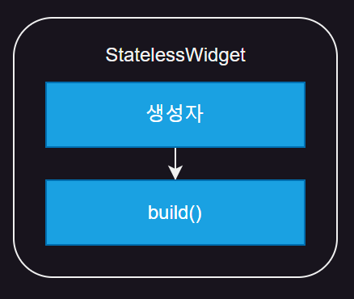|

- 상태가 없는 위젯

- 생명주기
  
  - StatelessWidget 빌드되면 생성자가 실행됨
  
  - 필수로 오버라이드(override)해야하는 build() 함수 실행됨
  
  - build() 함수에 반환한 위젯이 화면에 렌더링

- 모든 위젯은 Widget 클래스 상속하고, Widget 클래스는 불변(immutable) 특성을 가짐

  - 불변 : 클래스를 한 번 생성하고 나면 속성 변경 불가
 
- 위젯의 속성을 변경해야 할 경우

  - ex) 생성자에 새로운 매개변수가 입력되는 경우
 
    - build() 함수에서 매개변수 값을 사용하고 있다면 변경된 매개변수를 기반으로 build() 함수 재실행 필요
   
    - 스테이트리스 위젯은 불변이라 한 번 생성된 인스턴스의 build() 함수는 재실행 X
   
  - 인스턴스를 아예 새로 생성한 후 기존 인스턴스를 대체해서 변경 사항을 화면에 반영

<br>

#### (2) StatefulWidget
- StatefulWidget = 위젯(Widget) & 스테이트(State)

  - 클래스 2개로 구성되어 있고 생명주기 복잡

-   외부에서 위젯 생성자의 매개변수를 변경해주면 위젯이 새롭게 생성

  - build()가 실행되기까지 과정은 StatelessWidget 과 같음
 
- 위젯 내부에서 자체적으로 build() 함수를 재실행헤야 하는 상황

  - StatefulWidget 사용

<br>

#### *(2-1) 상태 변경이 없는 생명주기*
- 위젯이 화면에 나타나며 생성되고 화면에서 사라지며 삭제되는 과정

- 중간에 위젯의 상태가 변경되지 않음

|-|
|-|
|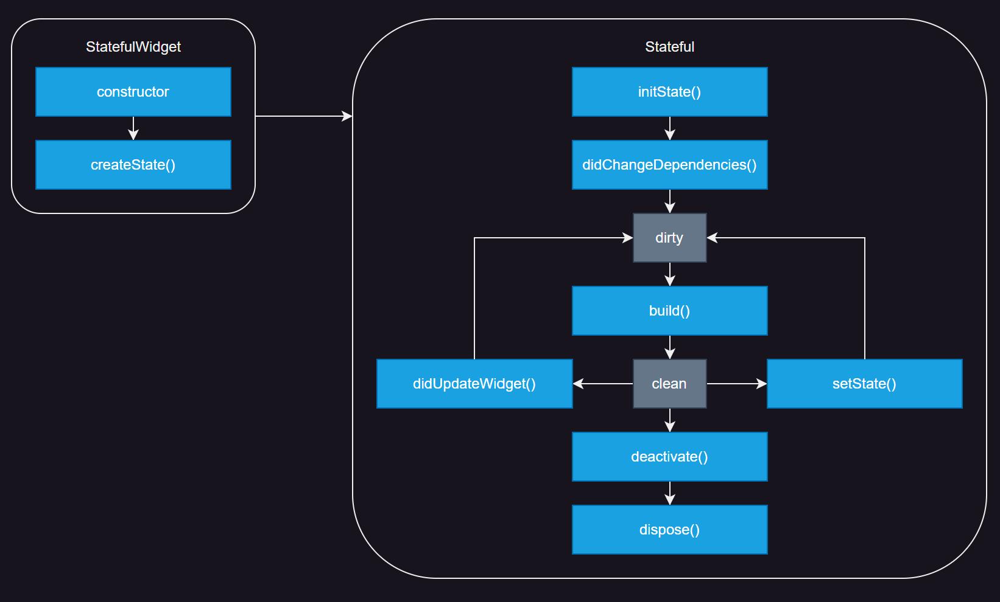|

- StatefulWidget 생성자 실행

- createState() 함수 실행

  - 필수로 오버라이드해야 하는 함수
 
  - StatefulWidget 과 연동되는 State 생성
 
- State 생성되면 initState() 실행

  - State 가 생성되는 순간에만 단 한 번 실행되고 절대 다시 실행되지 않음
 
- didChangeDependencies() 실행

  - initState() 와 다르게 BuildContext 제공됨
 
  - State 가 의존하는 값이 변경되면 재실행됨
 
- State 상태가 dirty 로 설정됨

  - build() 가 재실행되야 하는 상태
 
- build() 함수가 실행되고 UI 반영됨

- build() 실행이 완료되면 상태가 clean 상태로 변경됨

  - 화면에 변화가 없으면 이 상태 유지
 
- 위젯이 위젯 트리에서 사라지면 deactivate() 실행됨

  - State 가 일시적 또는 영구적으로 삭제될 때 실행됨
 
- dispose() 실행

  - 위젯이 영구적으로 삭제될 때 실행
 
<br>

#### *(2-2) StatefulWidget 생성자의 매개변수가 변경됐을 때 생명주기*
- StatefulWidget 도 StatelessWidget 처럼 하나의 클래스

  - 매개변수 입력받기 가능
 
- 위젯이 생성된 후 삭제 되기 전 매개변수가 변경되면 다음 생명주기 실행

|-|
|-|
||

- StatefulWidget 생성자 실행

- State 의 didUpdateWidget(0 함수 실행

- State 가 dirty 상태로 변경됨

- build() 실행

- State 상태가 clean 으로 변경됨

<br>

#### *(2-3) State 자체적으로 build()를 재실행할 때 생명주기*
- StatelessWidget : 생성될 때 build() 함수가 한 번 실행되고 나면 절대 다시 실행 X

- StatefulWidget : StatefulWidget 클래스와 State 클래스로 구성되어 있음

  - State 클래스는 setState() 함수를 실행해서  build() 함수를 자체적으로 재실행 가능
 
|-|
|-|
||

- setState() 실행

- State 가 dirty 상태로 변경됨

- build() 실행

- State 상태가 clean 으로 변경됨

<br>

### 02. Timer
- 특정 시간이 지난 후에 일회성 또는 지속적으로 함수 실행

- Timer.periodic() 사용해 주기적으로 콜백 함수 실행 가능

  - 매개변수 2개 입력받음
 
```dart
  Timer.periodic(
    Duration(secondsL 3),  // 주기
    (Timer timer) {},      // 콜백 함수
  );
```
- 콜백 함수를 실행할 주기 지정

  - Duration 에 days, hours, minutes, seconds, milliseconds, microseconds 매개변수 이용해 주기 지정 가능
 
- 주기가 지날 때마다 실행할 콜백 함수 작성

  - 매개변수에 현재 실행중인 Timer 객체 제공
 
- Timer 생성자 : Timer(), Timer.periodic()

> Timer 생성자

|생성자|설명|
|:-:|-|
|Timer()|- Timer 의 기본 생성자<br>- 첫 번재 매개변수 : 대기 기간을 Duration 으로 입력<br>- 두 번째 매개변수 : 기간이 끝난 후 실행할 콜백 함수 입력<br><br>```# 3초 후에 hello 라는 문자열 출력```<br>```Timer(Duration(seconds: 3), (Timer timer){print('hello')})```|
|Timer.periodic()|- Timer 의 유일한 네임드 생성자<br>- 주기적으로 콜백 함수를 실행할 때 사용<br>- 매개변수 입력 순서는 기본 생성자와 같음<br><br>```# 3초마다 hello 라는 문자열 출력```<br>```Timer.periodic(Duration(seconds: 3), (Timer timer){print('hello')})```|

<br>

---

<br>

9.2 사전 준비
---
### 01. 이미지 추가
- 에셋(asset) : 프로젝트에서 사용되는 파일들을 의미함

  - ex) 동영상, 이미지, 음악 파일 등
 
- 앱에서 슬라이딩할 이미지들을 내려받고 프로젝트에 등록

<br>

|-|
|-|
|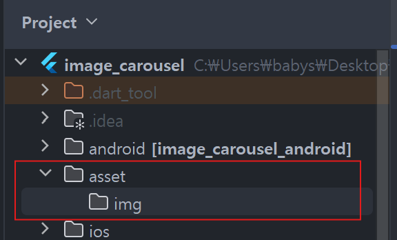|

- Project 에서 [image_carousel] 폴더 아래에 [asset] 폴더 생성

  - 그 아래 [img] 폴더 생성
 
- img 폴더 안에 원하는 그림 파일 넣기

<br>

### 02. pubspec.yaml 설정
- 추가된 에셋을 pubspec.yaml 에 등록

  - pubspec.yaml : 프로젝트의 의존성과 에셋을 등록하는 파일
 
- 프로젝트에서 사용할 에셋 파일을 등록해줄 때는 pubspec.yaml 파일의 중간쯤에 있는 flutter 키에 작성

  - assets 키 먼저 작성 후 사용할 에셋이 있는 위치(asset/img/) 기재
 
- [pub get] 실행시 등록한 에셋을 프로젝트에서 사용 가능

> pubspec.yaml
```dart
  flutter:
  
    # The following line ensures that the Material Icons font is
    # included with your application, so that you can use the icons in
    # the material Icons class.
    uses-material-design: true
    assets:           # 에셋 등록 키
      - asset/img/    # 에셋으로 등록할 폴더 위치
```

<br>

### 03. 프로젝트 초기화
- [lib] 폴더에 [screen] 폴더 생성

  - 앱의 기본 홈 화면으로 사용할 HomeScreen 위젯을 생성할 home_screen.dart 생성
 
    - HomeScreen 이라는 StatelessWidget 생성
   
    - lib/main.dart 파일에도 HomeScreen 을 홈 위젯으로 등록

> lib/screen/home_screen.dart
```dart
  import 'package:flutter/material.dart';
  
  class HomeScreen extends StatelessWidget {
  // 'HomeScreen'이라는 이름의 StatelessWidget 클래스 정의
  // StatelessWidget : 상태(데이터)의 변화 없이 화면을 렌더링하는 위젯

    const HomeScreen({Key? key}) : super(key: key);
    // 생성자 함수로 'HomeScreen'을 초기화
    // `Key`는 Flutter에서 위젯의 고유 식별자 역할, 여기서는 선택적 매개변수로 사용
    
    @override
    Widget build(BuildContext context){
    // 'build' 메서드는 위젯 트리를 생성하는 함수로, 화면에 표시될 UI를 반환
    // `context`는 위젯의 위치 및 환경 정보를 담고 있음

      return Scaffold(
      // 'Scaffold' : 기본적인 화면 구조를 제공하는 Flutter 위젯
      // AppBar, Body, Drawer 등을 쉽게 구성할 수 있게 해줌

        body: Text('Home Screen'),
        // Scaffold의 body 부분에 'Text' 위젯을 사용해 'Home Screen'이라는 텍스트를 화면에 표시
      );
    }
  }
```
- const 키워드

  - 상수 생성자를 의미
 
    - 이 위젯이 불변이고 생성된 후에는 절대로 변하지 않을 경우 const 키워드를 사용하여 메모리 효율성을 높일 수 있음
   
  - 컴파일 타임에 위젯이 미리 만들어지고 캐시되기 때문에 동일한 위젯을 여러 번 생성할 때도 메모리 절약 가능
 
- HomeScreen({Key? key}): 선택적 매개변수

  - 생성자 : 클래스가 인스턴스화될 때 호출되는 함수
 
    - HomeScreen이라는 위젯을 생성할 때 사용됨
   
  - {Key? key} : 선택적 위치 매개변수(optional named parameter)
  
    - 이 위젯의 고유 식별자인 Key를 전달할 수 있도록 함
   
      - Key 는 Flutter에서 위젯을 고유하게 식별하는데 사용
     
        - 위젯 트리가 복잡해지거나 동일한 위젯이 여러 개 사용될 때 Flutter가 효율적으로 트리 구조를 관리하도록 도와줌
       
      - ? 는 해당 매개변수가 nullable 임을 의미
     
        - Key 를 전달하지 않을 수도 있으며, 전달되지 않으면 null 이 될 수 있음
       
- : super(key: key): 부모 클래스의 생성자 호출

  - 콜론(:) 뒤에 나오는 부분은 초기화 리스트
  
    - 부모 클래스의 생성자를 호출하는 역할
   
  - super(key: key) : StatelessWidget 클래스의 생성자에 key 값을 전달
 
    - StatelessWidget : Flutter의 위젯 트리에서 부모 클래스
   
      - 이 클래스도 Key를 받아서 사용
     
    - Key 전달되지 않으면 기본적으로 null 전달

> lib/main.dart
```dart
  import 'package:flutter/material.dart';
  import 'package:image_carousel/screen/home_screen.dart';
  
  void main(){
    runApp(
      MaterialApp(
        home: HomeScreen(),
      ),
    );
  }
```

<br>

---

<br>

9.3 레이아웃 구상
---
- 좌우로 위젯을 스와이프할 수 있는 PageView 하나로 구성

<br>

---

<br>

9.4 구현
---
### 01. 페이지뷰 구현
- PageView : 여러 개의 위젯을 단독 페이지로 생성

  - 가로 또는 세로 스와이프로 페이지를 넘길 수 있게 하는 위젯

> lib/screen/home_screen.dart
```dart
  import 'package:flutter/material.dart';
  
  class HomeScreen extends StatelessWidget {
    const HomeScreen({Key? key}) : super(key: key);
  
    @override
    Widget build(BuildContext context){
      return Scaffold(
        body: PageView(   // PageView 추가
          children: [1, 2, 3, 4, 5]   // 샘플 리스트 생성
            .map(         // 위젯으로 매핑
              (number) => Image.asset('asset/img/image_$number.png')
            ).toList(),
        ),
      );
    }
  }
```
- PageView 위젯은 material 패키지에서 기본으로 제공

  - children 매개변수에 페이지로 생성하고 싶은 위젯들 넣어주기
 
- [1, 2, 3, 4, 5] 리스트 생성

- map() 함수 사용해 image_1.png ~ image_5.png 까지 순서대로 PageView 에 추가

> 실행 결과

|-|
|-|
||

<br>

- 이미지와 핸드폰 크기가 달라 여백 생길 경우

  - 여러 비율의 화면에 대응할 수 있게 이미지 핏을 조절해 전체 화면 설정
 
    - BoxFit.cover 설정
   
      - Image 위젯에서의 매개변수 fit 은 이미지를 부모 위젯에 어떻게 채워넣을지 정의

> lib/screen/home_screen.dart
```dart
  import 'package:flutter/material.dart';
  
  class HomeScreen extends StatelessWidget {
    const HomeScreen({Key? key}) : super(key: key);
  
    @override
    Widget build(BuildContext context){
      return Scaffold(
        body: PageView(
          children: [1, 2, 3, 4, 5]
            .map( 
              (number) => Image.asset('asset/img/image_$number.png',
                                      fit: BoxFit.cover,)   // BoxFit.cover 설정
            ).toList(),
        ),
      );
    }
  }
```

> 실행 결과

|-|
|-|
|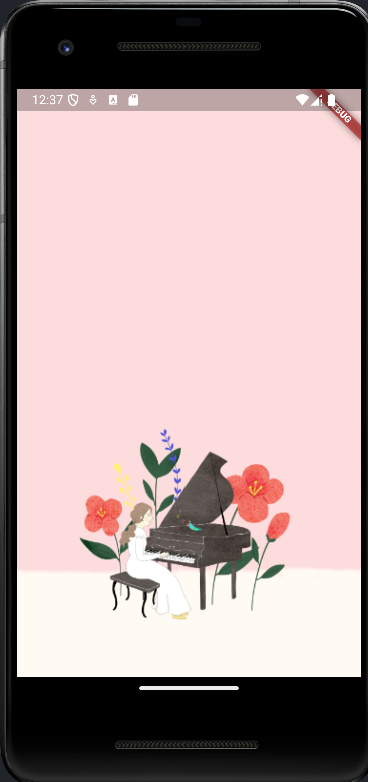|

<br>

#### 💡 BoxFit 속성
|속성|설명|이미지|
|-|-|:-:|
|BoxFit.contain|이미지가 잘리지 않는 선에서 최대한 크게 늘림<br>이미지가 위치한 부모 위젯이 이미지 크기와 완전 같지 않다면 세로 또는 가로로 여백 발생|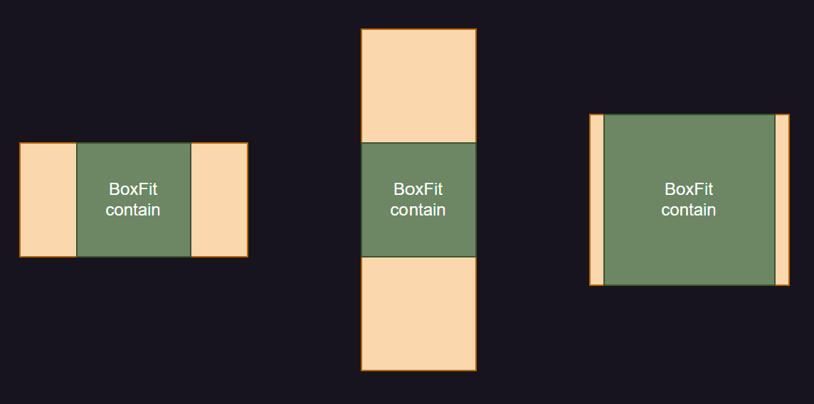|
|BoxFit.cover|부모 위젯 전체를 덮는 선에서 최소한 크기로 조절<br>이미지가 부모 위젯 전체를 덮기 때문에 여백은 생기지 않지만 가로 또는 세로로 이미지가 잘릴 수 있음|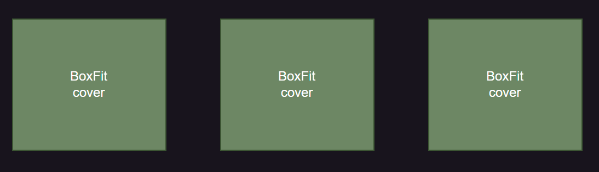|
|BoxFit.fill|이미지의 비율을 무시하고 부모 위젯의 이미지 비율대로 이미지 크기 조절<br>이미지의 비율과 부모 위젯의 비율이 다르다면 이미지가 변형돼 보일 수 있음|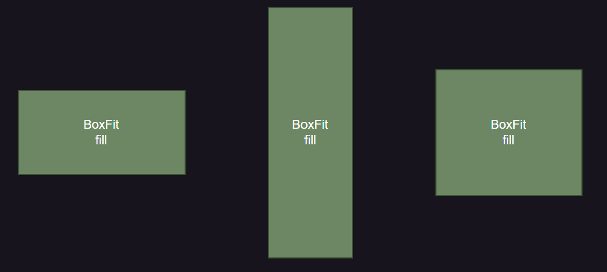|
|BoxFit.fitHeight|이미지 비율을 유지한 채로 부모 위젯의 높이에 이미지의 높이 맞춤<br>이미지가 가로로 잘리거나 여백 생길 수 있음|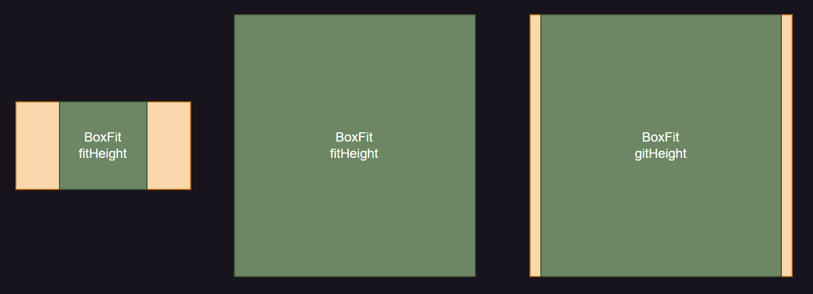|
|BoxFit.fitWidth|이미지의 비율을 유지한 채로 부모 위젯의 넓이에 이미지의 넓이를 맞춤<br>이미지가 세로로 잘리거나 여백 생길 수 있음|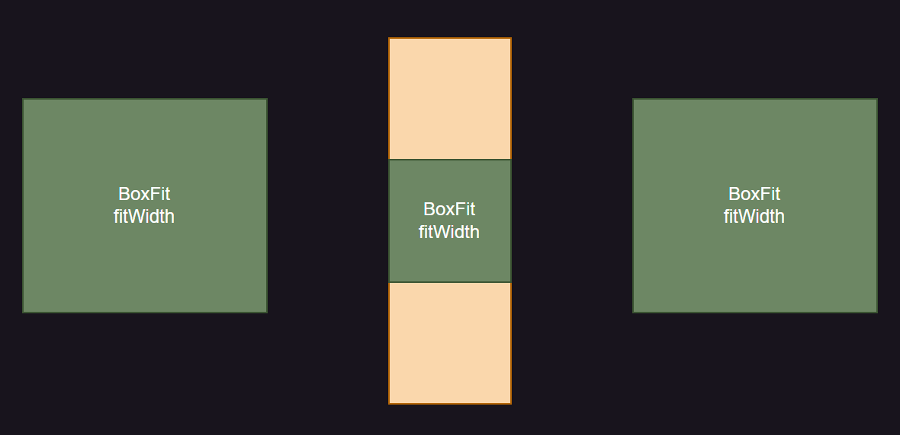|
|BoxFit.none|원본 이미지 크기와 비율을 그대로 사용|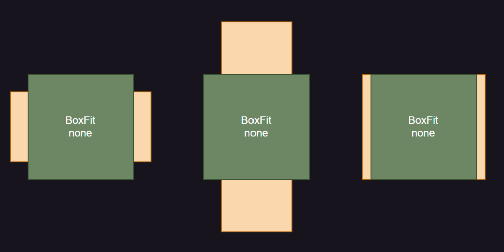|
|BoxFit.scaleDown|BoxFit.none 의 설정에 이미지를 중앙 정렬하고 부모 위젯이 이미지보다 작으면 이미지 크기를 줄여서 부모 위젯에 맞춤|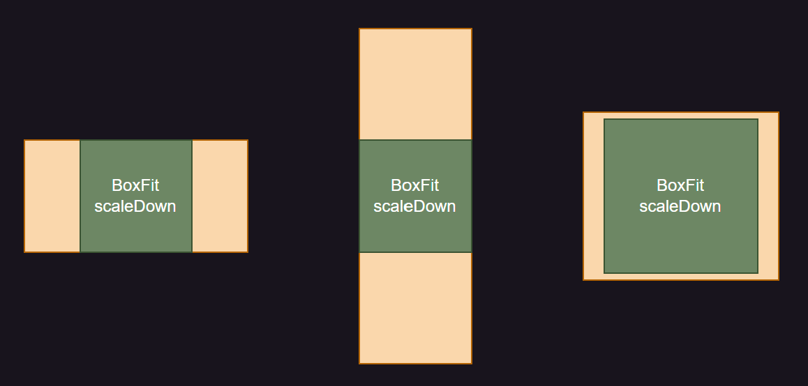|

<br>

### 02. 상태바 색상 변경
- 상태바 : 앲 ㅣㄹ행 중 핸드폰 배터리, 시간, 와이파이 연결 상태 등을 보여주는 영역

- HomeScreen 위젯의 build() 메서드에 상태바 아이콘들의 색상을 변경하는 코드 추가

> lib/screen/home_screen.dart
```dart
  import 'package:flutter/material.dart';
  import 'package:flutter/services.dart';
  
  class HomeScreen extends StatelessWidget {
    const HomeScreen({Key? key}) : super(key: key);
  
    @override
    Widget build(BuildContext context){
      // 상태바 색상 변경
      SystemChrome.setSystemUIOverlayStyle(SystemUiOverlayStyle.dark);
      return Scaffold(
        body: PageView(
          children: [1, 2, 3, 4, 5]
            .map(
              (number) => Image.asset('asset/img/image_$number.png',
                                      fit: BoxFit.cover,)   // BoxFit.cover 설정
            ).toList(),
        ),
      );
    }
  }
```
- SystemChrome 클래스 : 시스템 UI 그래픽 설정을 변경하는 기능 제공

  - SystemChrome.setSystemUIOverlayStyle() : 상태바의 색상 변경 가능
 
    - 매개변수 값 : SystemUiOverlayStyle.dart(검정색), SystemUiOverlayStyle.light(흰색)

> 실행 결과

|-|
|-|
|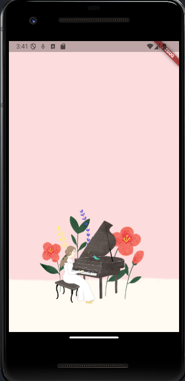|

<br>

#### 💡 SystemChrome 함수
|함수|설명|
|-|-|
|setEnabledSystemUIMode()|앱의 풀스크린 모드 지정<br>ex) 핸드폰 상단의 시간이나 배터리 잔량이 보이지 않게 가릴 수 있음|
|setPreferredOrientations()|앱을 실행하는 방향 지정<br>가로, 가로 좌우 반전, 세로, 세로 좌우 반전 옵션 등|
|setSystemUIChangeCallback()|시스템 UI 가 변경되면 콜백 함수 실행|
|setSystemUIOverlayStyle()|시스템 UI 색상 변경|

<br>

### 03. 타이머 추가
- Timer 클래스로 액자가 자동으로 롤링되는 기능 추가

  - 일정 기간마다 자동으로 페이지 변경

- Timer 추가하려면 HomeScreen 을 StatelessWidget 이 아닌 StatefulWidget 으로 변경해야 함

  - StatelessWidget 그대로 사용시 Timer 등록 가능 위치가 build() 함수 뿐
 
    - build() 에 Timer 등록시 위젯이 새로 생성될 때마다(build 함수가 불릴 때마다) 매번 새로운 Timer 생성
   
      - 메모리 누수(memory leak) 발생
     
  - StatefulWidget 생명주기에서 initState() 사용시 State 생성될 때 딱 한 번만 Timer 생성 가능

> lib/screen/home_screen.dart
```dart
  import 'package:flutter/material.dart';
  import 'package:flutter/services.dart';
  import 'dart:async';    // async 패키지 불러오기
  
  // StatefulWidget 정의
  class HomeScreen extends StatefulWidget {
    const HomeScreen({Key? key}) : super(key: key);
  
    @override
    State<HomeScreen> createState() => _HomeScreenState();
  }
  
  // _HomeScreenState 정의
  class _HomeScreenState extends State<HomeScreen>{
    // initState() 함수 등록
    @override
    void initState(){
      super.initState();    // 부모 initState() 실행
  
      Timer.periodic(       // Timer.periodic() 등록
        Duration(seconds: 3),
          (timer) {
            print('실행!');
          }
      );
    }
  
    @override
    Widget build(BuildContext context){
      SystemChrome.setSystemUIOverlayStyle(SystemUiOverlayStyle.dark);
  
      return Scaffold(
        body: PageView(
          children: [1, 2, 3, 4, 5]
            .map(
              (number) => Image.asset('asset/img/image_$number.png',
                                      fit: BoxFit.cover,)   // BoxFit.cover 설정
            ).toList(),
        ),
      );
    }
  }
```
- StatefulWidget 은 StatefulWidget 클래스를 상속해서 정의 가능

  - 생명주기에 따라 createState() 함수 정의해야 하며 State 반환
 
- _HomeScreenState 클래스는 먼저 생성한 StatefulWidget 클래스를 매개변수로 받는 State 클래스 상속

  - build() 함수는 State 에서 정의

- initState() 함수에 Timer 등록

  - 플러터에 기본으로 제공되는 async 패키지를 불러와야 Timer 사용 가능
 
  - initState() 함수를 오버라이드하면 StatefulWidget 생명주기에서의 initState() 함수 사용 가능
 
  - 모든 initState() 함수는 부모의 initState() 함수를 실행해줘야 함
 
  - 3초마다 실행되는 Timer 등록
 
- initState()에 작성한 코든는 핫 리로드 반영 X

  - State 가 생성될 때 딱 한 번만 실행되기 때문
 
    - 이미 StatefulWidget 으로 코드를 전환하는 과정에서 State 생성
   
  - initState()에 추가한 사항을 반영하려면 앱 재실행

> 실행 결과

|-|
|-|
|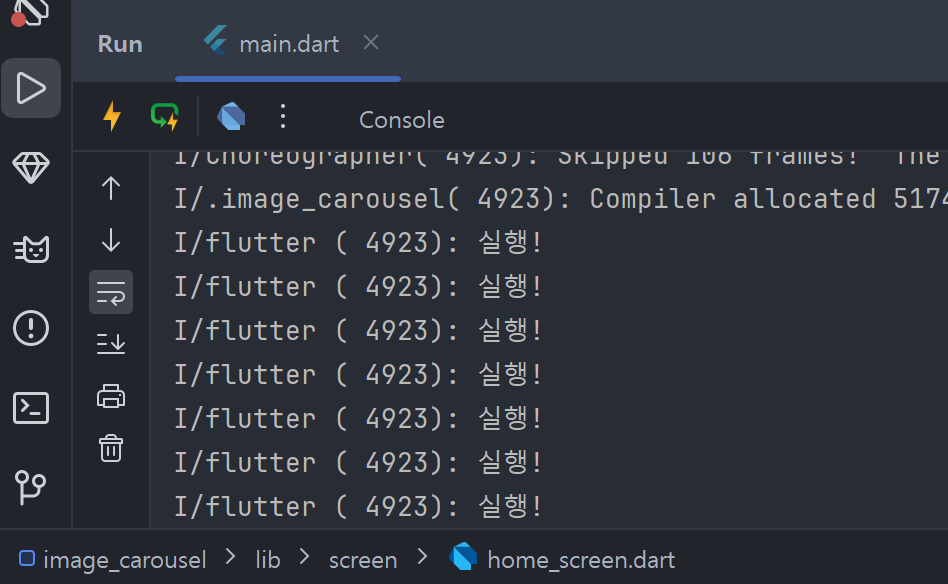|

- 3초마다 '실행!'이라는 글자가 콘솔에 출력

<br>
 
- PageView 는 PageContoller 를 사용해 PageView 조작 가능

  - PageController 를 State 에 선언하고 PageView 에 매개변수로 입력

- 사용할 pageController 변수 정의

- PageView 의 controller 매개변수에 PageController 타입의 값을 넣어주면 해당 컨트롤러로 PageView 조작 가능

- Timer.periodic() 의 콜백 함수를 변경해서 주기적으로 PageView 의 페이지 변경

> lib/screen/home_screen.dart
```dart
  import 'package:flutter/material.dart';
  import 'package:flutter/services.dart';
  import 'dart:async';
  
  class HomeScreen extends StatefulWidget {
    const HomeScreen({Key? key}) : super(key: key);
  
    @override
    State<HomeScreen> createState() => _HomeScreenState();
  }
  
  class _HomeScreenState extends State<HomeScreen>{
    // PageController 생성
    final PageController pageController = PageController();
  
    @override
    void initState(){
      super.initState();
  
      Timer.periodic(
        Duration(seconds: 3),
          (timer) {
            // print('실행!');
  
            // 현재 페이지 가져오기
            int? nextPage = pageController.page?.toInt();
  
            if(nextPage == null){   // 페이지 값이 없을 때 예외 처리
              return;
            }
  
            if(nextPage == 4){      // 첫 페이지와 마지막 페이지 분기 처리
              nextPage = 0;
            } else {
              nextPage++;
            }
            pageController.animateToPage(   // 페이지 변경
              nextPage,
              duration: Duration(milliseconds: 500),
              curve: Curves.ease,
            );
          }
      );
    }
  
    @override
    Widget build(BuildContext context){
      SystemChrome.setSystemUIOverlayStyle(SystemUiOverlayStyle.light);
  
      return Scaffold(
        body: PageView(
          controller: pageController, // PageController 등록
          children: [1, 2, 3, 4, 5]
            .map(
              (number) => Image.asset('asset/img/image_$number.png',
                                      fit: BoxFit.cover,)
            ).toList(),
        ),
      );
    }
  }
```
- pageController.page 게터를 사용해 PageView 의 현재 페이지를 가져올 수 있음

  - 페이지가 변경 중인 경우 소수점으로 표현돼서 double 로 값이 반환됨
 
  - animateToPage() 함수를 실행할 때 정수값을 넣어줘야 하니 미리 toInt() 사용해 변환
 
- 만약 페이지가 null 이라면 무엇도 하지 않음

- 페이지의 값이 4면 첫 번째 페이지부터 다시 시장

  - 아니면 페이지에 1을 더해서 다음 페이지로 이동
 
- PageController 의 animateToPage() 함수를 사용해서 PageView 의 현재 페이지 변경 가능

  - 첫 번째 매개변수 : 이동할 페이지가 정수로 입력되어 duration 매개변수는 이동할 때 소요될 시간 지정 가능
 
  - curve 매개변수 : 페이지가 변경되는 애니메이션의 작동 방식 지정 가능
 
    - 플러터에서는 수십 개의 curve 기본 설정 제공, 공식 홈페이지에서 확인 가능
   
- initState() 함수 변경했으니 앱을 재실행해서 새로 Timer.periodic() 등록

  - 3초마다 페이지 자동 롤링
 
  - 마지막 페이지에 다다르면 처음으로 되돌아감

> 실행 결과

|3초마다|이미지 변경|
|-|-|
|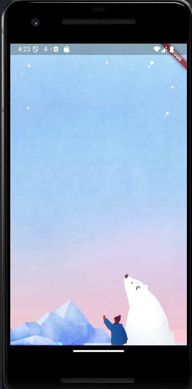|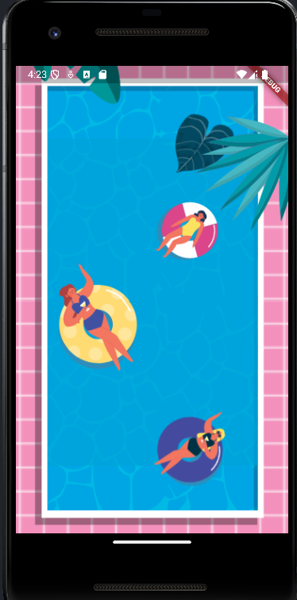|

<br>

### 04. 시스템에 저장된 이미지를 가져와서 롤링하도록 변경
> lib/screen/home_screen.dart
```dart

```

> 실행 결과

|-|
|-|
||

<br>

### 05. 네트워크 이미지 출력
> lib/screen/home_screen.dart
```dart

```

> 실행 결과

|-|
|-|
||

<br>


### 06. png 말고 다른 파일 형식도 읽게 변경
> lib/screen/home_screen.dart
```dart

```

> 실행 결과

|-|
|-|
||

<br>

### 07. 구글 드라이브나, 구글 포토에 있는 사진 가져오기
> lib/screen/home_screen.dart
```dart

```

> 실행 결과

|-|
|-|
||

<br>

---

<br>

🚨 핵심 요약
- **StatelessWidget** : 상태 관리가 필요 없을 때 사용

  - 하나의 클래스로 이루어짐
 
  - build() 함수는 생명주기 동안 단 한 번만 실행됨
 
- **StatefulWidget** : 상태 관리가 필요할 때 사용

  - **StatefulWidget** 클래스와 **State** 클래스로 이루어짐
 
  - 생명주기 동안 build() 함수가 여러 번 실행될 수 있음
 
- **PageView 위젯** 이용시 스와이프로 페이지를 변경하는 UI 쉽게 구현 가능

- **Timer.periodic()** 이용해 특정 함수를 주기적으로 실행 가능

- **PageController** 사용해 PageView 조작 가능

- **StatefulWidget** 의 initState() 에 코드 작성시 State 가 생성될 때 딱 한 번만 실행

- **SystemChrome.setSystemUIOverlayStyle** 사용해 상태바의 색상을 흰색이나 검정색으로 변경 가능

<br>


