# 10단계 : D-Day
- 상태 관리, CupertinoDatePicker, Dialog, DateTime

  - StatefulWidget 이용한 상태 관리
 
    - setState() 함수를 사용한 상태 관리
   
  - 쿠퍼티노(cupertino) 위젯
 
    - 다이얼로그(dialog) 및 데이터픽커(datepicker) 를 Cupertino 위젯을 사용해 구현
 
- 플러터의 두 가지 디자인 시스템

  - Marterial 위젯 : 구글의 머티리얼 디자인 기반
 
  - Cuperino 위젯 : iOS 스타일의 디자인

- [실습 프로젝트 바로가기](https://github.com/SVW-App-Develop/U_And_I.git)

<br>

|개요|설명|
|-|-|
|**프로젝트명**|u_and_i|
|**개발환경**|플러터 SDK : 3.24.3|
|**미션**|날짜를 지정하고 해당 날짜로부터 며칠이 지났는지 알려주는 앱 만들기|
|**기능**|- 사용자가 직접 원하는 날짜 선택<br><br>- 날짜 선택 시 실시간으로 화면의 D-Day 및 만난 날 업데이트|
|**조작법**|1. 가운데 하트 클릭해서 날짜 선택 기능 실행<br><br>2. 연도, 월, 일을 스크롤해서 원하는 날짜 선택<br><br>3. 배경을 눌러서 날짜 저장하기 및 되돌아오기|
|**핵심 구성요소**|- Cupertino Widget<br><br>- CupertinoDatePicker<br><br>- Dialog<br><br>- StatefulWidget 상태 관리|
|**플러그인**|-|

<br>

---

<br>

10.1 사전 지식
---
### 01. setState() 함수
- State 를 상속하는 모든 클래스는 setState() 함수 사용 가능

- setState() 함수 실행 과정

  - StatefulWidget 렌더링 끝나고 클린(clean) 상태
 
    - 그 어떤 상태 변경 툴을 사용하든 클린 상태에서 상태를 변경해야 함
   
  - setState() 실행해 원하는 속성들 변경
 
  - 속성이 변경되고 위젯의 상태가 더티(dirty)로 설정
 
  - build() 함수 재실행
 
  - State 가 클린 상태로 되돌아옴

- setState() 실행 방법

  - 첫 번째 매개변수 : 상태(변수) 값을 변경하는 로직(콜백 함수) 작성
 
    - 콜백 함수에 변경하고 싶은 속성들 입력
   
      - 콜백 함수 비동기 작성 불가
     
```dart
  setState((){    // 실행
    number++;
  });
```

<br>

### 02. showCupertinoDialog() 함수
- 다이얼로그를 실행하는 함수

  - iOS 스타일로 다이얼로그 실행
 
  - 실행 시 모든 애니메이션과 작동이 iOS 스타일로 적용
 
- 배리어(barrier) : 플러터에서 다이얼로그 위젯 외에 흐림 처리가 된 부분

  - barrierDismissible: true
 
    - 배리어를 눌렀을 때 다이얼로그가 닫힘
   
  - barrierDismissible: false
 
    - 배리어를 눌렀을 때 다이얼로그가 닫히지 않음

```dart
  import 'package:flutter/cupertino.dart';    // Cupertino 패키지 임포트 필수
  
  showCupertinoDialog(    // Cupertino 다이얼로그 실행
    context: context,     // BuildContext 입력 (모든 showDialog() 형태 함수들은 BuildContext 입력 필수)
    barrierDismissible: true,   // 외부 탭해서 다이얼로그 닫을 수 있게 하기
    builder: (BuildContext context) {   // 다이얼로그에 들어갈 위젯
      return Text('Dialog');
    },
  );
```

<br>

---

<br>

10.2 사전 준비
---
### 01. 이미지, 폰트 추가
- [asset] 폴더 아래 [font], [img] 폴더 생성

  - 적용할 이미지와 폰트를 각 폴더에 복사

<br>

### 02. pubspec.yaml 설정
- 에셋 파일 : flutter 키의 assets 키에 입력

- 폰트 파일 : flutter 키의 fonts 키에 입력

> pubspec.yaml
```dart
  flutter:
  
    # The following line ensures that the Material Icons font is
    # included with your application, so that you can use the icons in
    # the material Icons class.
    uses-material-design: true
    assets:
      - asset/img/    # 이미지를 프로젝트에 포함시키기
        
    fonts:
      - family: parisienne    # family 키에 폰트 이름 지정 가능
        fonts:
          - asset: asset/font/Parisienne-Regular.ttf   # 등록할 폰트 파일 위치
            
      - family: sunflower
        fonts:
          - asset: asset/font/Sunflower-Bold.ttf
          - asset: asset/font/Sunflower-Light.ttf
            weight: 500   
          - asset: asset/font/Sunflower-Medium.ttf
            weight: 700
            # weight : 폰트 두께. 같은 폰트라도 다른 두께를 표현하는 파일은 weight 값을 따로 표현해야 함
            #          100 ~ 900 사이 100 단위로 사용 가능, 숫자가 높을수록 두꺼운 값
            #          FontWeight 클래스 값과 같음(weight: 500 = FontWeight.w500)
```

|-|
|-|
|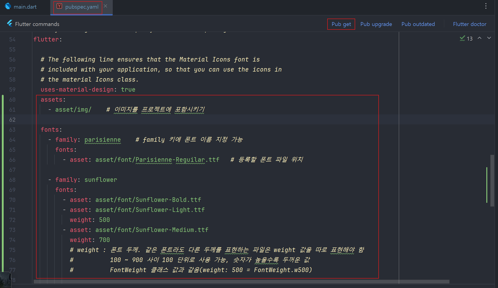|

<br>

### 03. 프로젝트 초기화
- [lib] 폴더에 [screen] 폴더 생성 후 home_screen.dart 생성

  - 앱의 기본 홈 화면으로 사용할 HomeScreen 위젯(StatelessWidget) 생성

> lib/screen/home_screen.dart
```dart
  import 'package:flutter/material.dart';
  
  class HomeScreen extends StatelessWidget {
    const HomeScreen({Key? key}) : super(key: key);
    
    @override
    Widget build(BuildContext context) {
      return Scaffold(
        body: Text('Home Screen'),
      );
    }
  }
```

<br>

- lib/main.dart 파일에도 마찬가지로 HomeScreen 을 홈 위젯으로 등록

> lib/main.dart
```
  import 'package:flutter/material.dart';
  import 'package:u_and_i/screen/home_screen.dart';
  
  void main() {
    runApp(
      MaterialApp(
        home: HomeScreen(),
      ),
    );
  }
```

<br>

---

<br>

10.3 레이아웃 구상
---
- Scaffold 위젯의 body 매개변수에 _DDay 위젯과 _CoupleIamge 위젯 두 가지를 위아래로 나눠 구현

- 홈스크린 말고도 CupertinoDialog 추가 구현

  - 중앙 하트 아이콘 클릭시 CupertinoDialog 실행되는 구조


<br>

---

<br>

10.4 구현
---
- UI 구현, 상태 관리 구현, 날짜 선택 기능 구현 순서로 진행

  - UI 먼저 작업해서 앱 전체의 틀을 잡고 상태 관리를 설정해서 날짜 데이터를 관리할 기반 잡기
 
  - 날짜 선택 기능을 추가해서 선택한 날짜에 따라 D-Day 계산 기능 구현

<br>

### 01. 홈 스크린 UI 구현
#### (1) 위젯을 두 위젯으로 나눠서 화면 구성

- HomeScreen 위쪽 반 : _DDay 위젯

- HomeScreen 아래쪽 반 : _CoupleImage 위젯

  - 이름 첫 글자가 언더스코어면 다른 파일에서 접근 불가
 
    - 파일 불러오기 했을 때 불필요한 값들이 한 번에 불러와지는 것 방지

> lib/screen/home_screen.dart
```dart
  import 'package:flutter/material.dart';
  
  // HomeScreen 위젯
  class HomeScreen extends StatelessWidget {
    const HomeScreen({Key? key}) : super(key: key);
  
    @override
    Widget build(BuildContext context) {
      return Scaffold(
        body: Text('Home Screen'),
      );
    }
  }
  
  // HomeScreen 위쪽을 구현할 _DDay 위젯 생성
  class _DDay extends StatelessWidget {
    @override
    Widget build(BuildContext context) {
      return Text('DDay Widget');
    }
  }
  
  // HomeScreen 아래쪽을 구현할 _CoupleImage 위젯 생성
  class _CoupleImage extends StatelessWidget {
    @override
    Widget build(BuildContext context) {
      return Text('Couple Image Widget');
    }
  }
```

<br>

#### (2) 두 위젯을 위아래로 서로 반씩 차지하게 배치

- HomeScreen 위젯에 Column 위젯을 사용해 두 위젯이 위아래에 놓이게 배치

> lib/screen/home_screen.dart
```dart
  import 'package:flutter/material.dart';
  
  class HomeScreen extends StatelessWidget {
    const HomeScreen({Key? key}) : super(key: key);
  
    @override
    Widget build(BuildContext context) {
      return Scaffold(
        body: SafeArea(     // 시스템 UI 피해서 UI 그리기
          top: true,
          bottom: false,
          child: Column(
            // 위아래 끝에 위젯 배치
            mainAxisAlignment: MainAxisAlignment.spaceBetween,
  
            // 반대축 최대 크기로 늘릭
            crossAxisAlignment: CrossAxisAlignment.stretch,
            children: [
              _DDay(),
              _CoupleImage(),
            ],
          ),
        ),
      );
    }
  }
  
  class _DDay extends StatelessWidget {
    @override
    Widget build(BuildContext context) {
      return Text('DDay Widget');
    }
  }
  
  class _CoupleImage extends StatelessWidget {
    @override
    Widget build(BuildContext context) {
      return Text('Couple Image Widget');
    }
  }
```
- 아이폰의 노치에 대비해 위에는 SafeArea 적용, 자연스러운 이미지 구현을 위해 아래는 미적용

- MainAxisAlignment.spaceBetween 사용해 위아래 각각 끝에 두 위젯 위치

> 실행 결과

|-|
|-|
|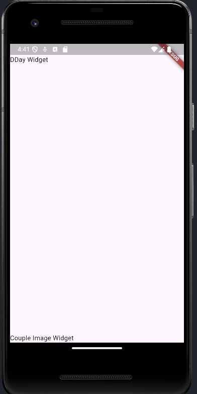|

<br>

#### (3) 배경색 및 이미지 적용
- MediaQuery.of(context) 사용하면 화면 크기와 관련된 각종 기능 사용 가능

  - size 게터를 불러오면 화면 전체의 너비(width)와 높이(height) 쉽게 가져올 수 있음
 
    - 화면의 전체 높이를 2로 나누면 화면 높이의 반만큼 차지하게 설정 가능

> lib/screen/home_screen.dart
```dart
  import 'package:flutter/material.dart';
  
  class HomeScreen extends StatelessWidget {
    const HomeScreen({Key? key}) : super(key: key);
  
    @override
    Widget build(BuildContext context) {
      return Scaffold(
        backgroundColor: Colors.pink[100],  // 핑크 배경색 적용
        body: SafeArea(
          top: true,
          bottom: false,
          child: Column(
            mainAxisAlignment: MainAxisAlignment.spaceBetween,
  
            crossAxisAlignment: CrossAxisAlignment.stretch,
            children: [
              _DDay(),
              _CoupleImage(),
            ],
          ),
        ),
      );
    }
  }
  
  class _DDay extends StatelessWidget {
    @override
    Widget build(BuildContext context) {
      return Text('DDay Widget');
    }
  }
  
  class _CoupleImage extends StatelessWidget {
    @override
    Widget build(BuildContext context) {
      return Center(    // 이미지 중앙 정렬
        child: Image.asset('asset/img/middle_image.png',
          // 화면의 반만큼 높이 구현
          height: MediaQuery.of(context).size.height /2,
        ),
      );
    }
  }
```

> 실행 결과

|-|
|-|
|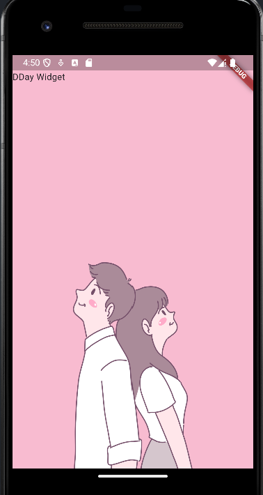|

<br>

<details>
  <summary>💡 .of 생성자</summary>

<br>

- **.of(context)** 로 정의된 모든 생성자

  - 일반적으로 BuildContext 를 매개변수로 받음
  
  - 위젯 트리(widget tree)에서 가장 가까이에 있는 객체의 값 찾아냄

- MediaQuery.of(context) : 현재 위젯 트리에서 가장 가까이에 있는 MedianQuery 값 찾아냄

|-|
|-|
|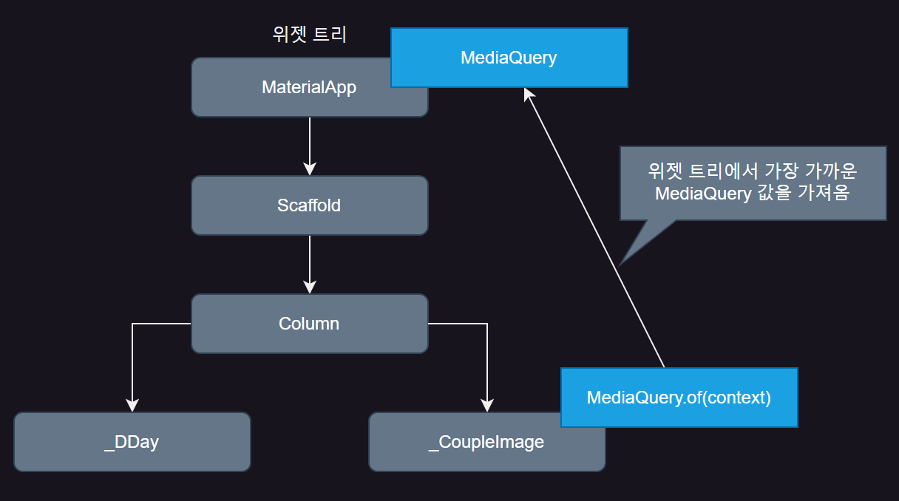|
|- 앱이 실행되면 MaterialApp 이 빌드됨과 동시에 MediaQuery 생성됨<br><br>- 위젯 트리 아래에서 MediaQuery.of(context) 실행시 위젯 트리를 올라가며 가장 가까운 곳에 위치한 MediaQuery 값 가져옴<br><br>- 비슷한 예로 Theme.of(context) / Navigator.of(context) 등|

</details>

<br>

#### (4) _DDay 위젯 구현
- _DDay 위젯은 여러 Text 위젯과 하트 아이콘(IconButton)으로 구성

> lib/screen/home_screen.dart
```dart
  import 'package:flutter/material.dart';
  
  class HomeScreen extends StatelessWidget {
    const HomeScreen({Key? key}) : super(key: key);
  
    @override
    Widget build(BuildContext context) {
      return Scaffold(
        backgroundColor: Colors.pink[100],  // 핑크 배경색 적용
        body: SafeArea(
          top: true,
          bottom: false,
          child: Column(
            mainAxisAlignment: MainAxisAlignment.spaceBetween,
  
            crossAxisAlignment: CrossAxisAlignment.stretch,
            children: [
              _DDay(),
              _CoupleImage(),
            ],
          ),
        ),
      );
    }
  }
  
  class _DDay extends StatelessWidget {
    @override
    Widget build(BuildContext context) {
      return Column(
        children: [
          const SizedBox(height: 16.0),
          Text(   // 최상단 U&I 글자
            'U&I',
          ),
          const SizedBox(height: 16.0),
          Text(   // 두 번째 글자
            '우리 처음 만난 날',
          ),
          Text(   // 임시로 지정한 만날 날짜
            '2024.03.24',
          ),
          const SizedBox(height: 16.0),
          IconButton(   // 하트 아이콘 버튼
            iconSize: 60.0,
            onPressed: () {},
            icon: Icon(
              Icons.favorite,
            ),
          ),
          const SizedBox(height: 16.0),
          Text(   // 만난 후 DDay
            'D+208'
          ),
        ],
      );
    }
  }
  
  class _CoupleImage extends StatelessWidget {
    @override
    Widget build(BuildContext context) {
      return Center(    // 이미지 중앙 정렬
        child: Image.asset('asset/img/middle_image.png',
          // 화면의 반만큼 높이 구현
          height: MediaQuery.of(context).size.height /2,
        ),
      );
    }
  }
```

> 실행 결과

|-|
|-|
|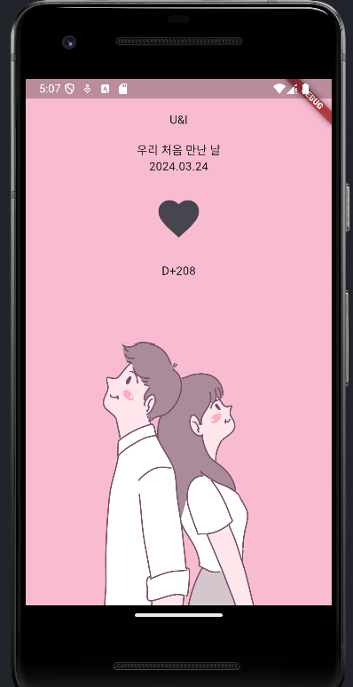|

<br>

#### (5) Text 위젯 스타일링
- Text 위젯 스타일링시 style 매개변수 사용

- 각 Text 위젯의 스타일이 아닌 Text 위젯의 기본 스타일 변경시 테마(theme) 사용

  - 13가지 Text 스타일을 따로 저장하여 프로젝트로 불러와서 사용 가능

- 각 문장들을 스타일별로 나누기

  - 스타일명은 임의적으로 지정 가능

- MaterialApp 의 theme 매개변수

  - ThemeData 클래스(플러터가 기본으로 제공하는 대부분의 위젯 기본 스타일 지정 가능) 입력 가능

<details>
  <summary>💡 ThemeData 매개변수</summary>

<br>

|매개변수|설명|
|-|-|
|fontFamily|기본 글씨체 지정|
|textTheme|Text 위젯 테마 지정|
|tabBarTheme|TabBar 위젯 테마 지정|
|cardTheme|Card 위젯 테마 지정|
|appBarTheme|AppBar위젯 테마 지정|
|floatingActionButtonTheme|FloatingActionButton 위젯 테마 지정|
|elevatedButtonTheme|ElevbatedButton 위젯 테마 지정|
|checkboxTheme|Checkbox 위젯 테마 지정|

- **위젯이름Theme** 규칙을 이용해 특정 위젯의 테마 작업 가능

</details>

<br>

> Flutter 2.5 이후 버전에서 TextTheme의 스타일 이름이 변경

|이전 스타일 이름|변경된 스타일 이름|
|:-:|:-:|
|headline1|displayLarge|
|headline2|displayMedium|
|headline3|displaySmall|
|headline4|headlineLarge|
|headline5|headlineMedium|
|headline6|headlineSmall|
|subtitle1|titleLarge|
|subtitle2|titleMedium|
|bodyText1|bodyLarge|
|bodyText2|bodyMedium|
|caption|bodySmall|
|button|labelLarge|
|overline|labelSmall|

|-|
|-|
|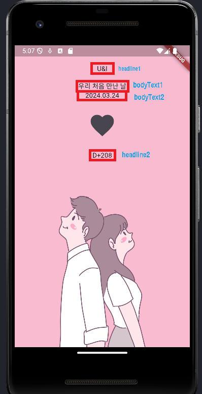|

<br>
- main.dart 파일에 텍스트와 IconButton 테마 정의

> lib/main.dart
```dart
  import 'package:flutter/material.dart';
  import 'package:u_and_i/screen/home_screen.dart';
  
  void main() {
    runApp(
      MaterialApp(
        theme: ThemeData(   // 테마를 지정할 수 있는 클래스
          fontFamily: 'sunflower',    // 기본 글씨체
          textTheme: TextTheme(       // 글자 테마를 적용할 수 있는 클래스
            displayLarge: TextStyle(     // headline1 스타일 정의
              color: Colors.white,    // 글 색상
              fontSize: 80.0,         // 크기
              fontWeight: FontWeight.w700,  // 글 두께
              fontFamily: 'parisienne',     // 글씨체
            ),
            displayMedium: TextStyle(
              color: Colors.white,
              fontSize: 50.0,
              fontWeight: FontWeight.w700,
            ),
            bodyLarge: TextStyle(
              color: Colors.white,
              fontSize: 30.0,
            ),
            bodyMedium: TextStyle(
              color: Colors.white,
              fontSize: 20.0,
            ),
          ),
        ),
        home: HomeScreen(),
      ),
    );
  }
```

<br>

- Text 위젯에 스타일 적용

> lib/screen/home_screen.dart
```dart
  import 'package:flutter/material.dart';
  
  class HomeScreen extends StatelessWidget {
    const HomeScreen({Key? key}) : super(key: key);
  
    @override
    Widget build(BuildContext context) {
      return Scaffold(
        backgroundColor: Colors.pink[100],
        body: SafeArea(
          top: true,
          bottom: false,
          child: Column(
            mainAxisAlignment: MainAxisAlignment.spaceBetween,
  
            crossAxisAlignment: CrossAxisAlignment.stretch,
            children: [
              _DDay(),
              _CoupleImage(),
            ],
          ),
        ),
      );
    }
  }
  
  class _DDay extends StatelessWidget {
    @override
    Widget build(BuildContext context) {
      // 테마 불러오기
      final textTheme = Theme.of(context).textTheme;
  
      return Column(
        children: [
          const SizedBox(height: 16.0),
          Text(
            'U&I',
            style: textTheme.displayLarge,   // headline1 스타일 적용
          ),
          const SizedBox(height: 16.0),
          Text(
            '우리 처음 만난 날',
            style: textTheme.bodyLarge,   // bodyText1 스타일 적용
          ),
          Text(
            '2024.03.24',
            style: textTheme.bodyMedium,   // bodyText2 스타일 적용
          ),
          const SizedBox(height: 16.0),
          IconButton(
            iconSize: 60.0,
            onPressed: () {},
            icon: Icon(
              Icons.favorite,
              color: Colors.red,    // 색상 빨강으로 변경
            ),
          ),
          const SizedBox(height: 16.0),
          Text(
            'D+208',
            style: textTheme.displayMedium,   // headline2 스타일 적용
          ),
        ],
      );
    }
  }
  
  class _CoupleImage extends StatelessWidget {
    @override
    Widget build(BuildContext context) {
      return Center(
        child: Image.asset('asset/img/middle_image.png',
          height: MediaQuery.of(context).size.height /2,
        ),
      );
    }
  }
```

> 실행 결과

|-|
|-|
|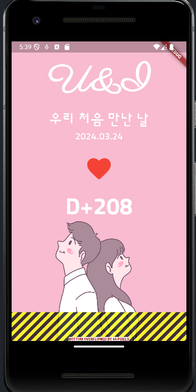|

<br>

#### 💡 다양한 화면의 비율과 해상도에 따른 오버플로 해결
- 핸드폰은 화면 비율과 해상도가 모두 다름

   - 하나의 화면을 기준으로 UI 작업시 다른 크기의 핸드폰에서 같은 UI 배치가 나오지 않는 경우 有

- 오버플로(overflow)

  - ex) 상단의 글자들이 화면의 반 이상을 차지하면 아래쪽 이미지는 남은 공간보다 더 많은 높이를 차지하게 됨
 
  - 해결 방안
 
    - 글자나 이미지의 크기를 임의로 조절
   
    - 이미지가 남는 공간만큼만 차지하도록 코드 작성
   
      - Expanded 위젯 사용

> lib/screen/home_screen.dart
```dart

```

> 실행 결과

|-|
|-|
|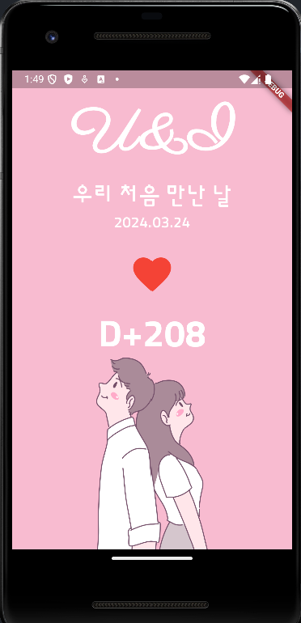|

<br>

### 02. 상태 관리 연습
- StatefulWidget 에서 setState() 함수 사용해 상태 관리

<br>

#### (1) HomeScreen 을 StatefulWidget 으로 변경 및 변수값 선언
> lib/screen/home_screen.dart
```dart
  import 'package:flutter/material.dart';
  
  class HomeScreen extends StatefulWidget {   // StatelessWidget -> StatefulWidget
    const HomeScreen({Key? key}) : super(key: key);
  
    @override
    State<HomeScreen> createState() => _HomeScreenState();  // 추가
  }
  
  class _HomeScreenState extends State<HomeScreen> {    // 추가
    // 상태 관리할 값 : '처음 만난 날' <= 이 날짜를 변수값으로 저장 후 변경하면서 사용
    // 오늘을 기준으로 변수값 선언
    DateTime firstDay = DateTime.now();
    
    @override
    Widget build(BuildContext context) {
      return Scaffold(
        backgroundColor: Colors.pink[100],
        body: SafeArea(
          top: true,
          bottom: false,
          child: Column(
            mainAxisAlignment: MainAxisAlignment.spaceBetween,
  
            crossAxisAlignment: CrossAxisAlignment.stretch,
            children: [
              _DDay(),
              _CoupleImage(),
            ],
          ),
        ),
      );
    }
  }
  
  class _DDay extends StatelessWidget {
    @override
    Widget build(BuildContext context) {
      final textTheme = Theme.of(context).textTheme;
  
      return Column(
        children: [
          const SizedBox(height: 16.0),
          Text(
            'U&I',
            style: textTheme.displayLarge,
          ),
          const SizedBox(height: 16.0),
          Text(
            '우리 처음 만난 날',
            style: textTheme.bodyLarge,
          ),
          Text(
            '2024.03.24',
            style: textTheme.bodyMedium,
          ),
          const SizedBox(height: 16.0),
          IconButton(
            iconSize: 60.0,
            onPressed: () {},
            icon: Icon(
              Icons.favorite,
              color: Colors.red,
            ),
          ),
          const SizedBox(height: 16.0),
          Text(
            'D+208',
            style: textTheme.displayMedium,
          ),
        ],
      );
    }
  }
  
  class _CoupleImage extends StatelessWidget {
    @override
    Widget build(BuildContext context) {
      return Expanded(    // Expanded 추가
        child: Center(
          child: Image.asset('asset/img/middle_image.png',
  
            // Expanded 가 우선순위를 갖게 되어 무시됨
            height: MediaQuery.of(context).size.height /2,
          ),
        ),
      );
    }
  }
```

<br>

#### (2) 날짜 변경될 때마다 firstDay 변수 변경
- 하트 버튼 누르면 날짜 고를 수 있는 UI 노출

- 현재 하트 버튼의 onPressed 매개변수가 _DDay 위젯에 위치

  - _HomeScreenState 에서 버튼이 눌렸을 때 콜백 받을 수 없음
 
- _DDay 위젯에 하트 아이콘 눌렀을 때 실행되는 콜백 함수를 매개변수로 노출해 _HomeScreenState 에서 상태 관리하도록 변경

```dart
  import 'package:flutter/material.dart';
  
  class HomeScreen extends StatefulWidget {
    const HomeScreen({Key? key}) : super(key: key);
  
    @override
    State<HomeScreen> createState() => _HomeScreenState();
  }
  
  class _HomeScreenState extends State<HomeScreen> {
    DateTime firstDay = DateTime.now();
  
    @override
    Widget build(BuildContext context) {
      return Scaffold(
        backgroundColor: Colors.pink[100],
        body: SafeArea(
          top: true,
          bottom: false,
          child: Column(
            mainAxisAlignment: MainAxisAlignment.spaceBetween,
  
            crossAxisAlignment: CrossAxisAlignment.stretch,
            children: [
              _DDay(
                // 5. 하트 눌렀을 때 실행할 함수 전달
                onHeartPressed: onHeartPressed,
              ),
              _CoupleImage(),
            ],
          ),
        ),
      );
    }
    void onHeartPressed() {   // 4. 하트 눌렀을 때 실행할 함수
      print('클릭');
    }
  }
  
  class _DDay extends StatelessWidget {
    // 1. 하트 눌렀을 때 실행할 함수
    final GestureTapCallback onHeartPressed;
  
    _DDay({
      required this.onHeartPressed,   // 2. 상위에서 함수 입력받기
    });
  
    @override
    Widget build(BuildContext context) {
      final textTheme = Theme.of(context).textTheme;
  
      return Column(
        children: [
          const SizedBox(height: 16.0),
          Text(
            'U&I',
            style: textTheme.displayLarge,
          ),
          const SizedBox(height: 16.0),
          Text(
            '우리 처음 만난 날',
            style: textTheme.bodyLarge,
          ),
          Text(
            '2024.03.24',
            style: textTheme.bodyMedium,
          ),
          const SizedBox(height: 16.0),
          IconButton(
            iconSize: 60.0,
            onPressed: onHeartPressed,    // 3. 아이콘 눌렀을 때 실행할 함수
            icon: Icon(
              Icons.favorite,
              color: Colors.red,
            ),
          ),
          const SizedBox(height: 16.0),
          Text(
            'D+208',
            style: textTheme.displayMedium,
          ),
        ],
      );
    }
  }
  
  class _CoupleImage extends StatelessWidget {
    @override
    Widget build(BuildContext context) {
      return Expanded(    // Expanded 추가
        child: Center(
          child: Image.asset('asset/img/middle_image.png',
  
            height: MediaQuery.of(context).size.height /2,
          ),
        ),
      );
    }
  }
```
- IconButton 의 onPressed 매개변수에 입력할 GestureTapCallback 타입의 변수 정의

  - Material 패키지에서 기본으로 제공하는 Typedef
 
  - 버튼의 onPressed, onTap 콜백 함수들이 GestureTapCallback 타입으로 정의되어 있음
 
  - 아무것도 반환하지 않고 아무것도 입력받지 않는 기본 형태의 함수로 정의되어 있음
 
- onHeartPressed 값을 생성자 매개변수를 통해 외부에서 정의받음

- 기존에 정의했던 비어있는 함수 대신에 onHeartPressed 값 넣어주기

- 하트 아이콘 눌렀을 때 실행할 함수 정의

- _DDay 위젯 생성자에 추가된 매개변수 onHeartPressed 에 _HomeScreenState 에 정의한 onHeartPressed 함수 입력

> 실행 결과

|-|-|
|-|-|
||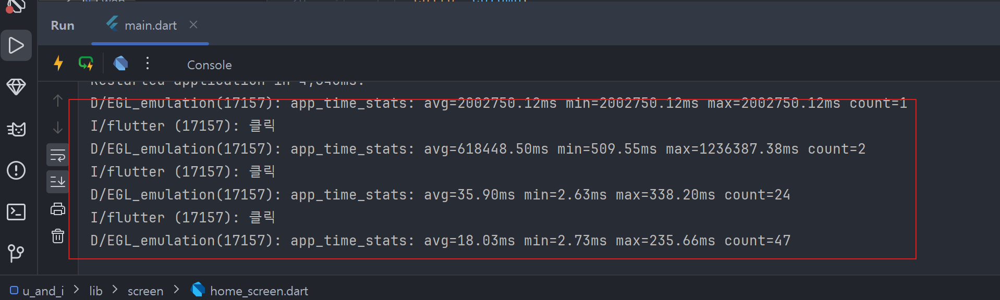|

<br>

#### (3) firstDay 변수와 연동
- _DDay 생성자에 매개변수로 firstDay 값 입력

  - firstDay 변수를 기반으로 날짜와 D-Day 가 렌더링되게 만들기

> lib/screen/home_screen.dart
```dart
  import 'package:flutter/material.dart';
  
  class HomeScreen extends StatefulWidget {
    const HomeScreen({Key? key}) : super(key: key);
  
    @override
    State<HomeScreen> createState() => _HomeScreenState();
  }
  
  class _HomeScreenState extends State<HomeScreen> {
    DateTime firstDay = DateTime.now();
  
    @override
    Widget build(BuildContext context) {
      return Scaffold(
        backgroundColor: Colors.pink[100],
        body: SafeArea(
          top: true,
          bottom: false,
          child: Column(
            mainAxisAlignment: MainAxisAlignment.spaceBetween,
  
            crossAxisAlignment: CrossAxisAlignment.stretch,
            children: [
              _DDay(
                onHeartPressed: onHeartPressed,
                firstDay: firstDay,     // 6. _HomeScreenState 의 firstDay 변수값을 매개변수로 입력
              ),
              _CoupleImage(),
            ],
          ),
        ),
      );
    }
    void onHeartPressed() {
      print('클릭');
    }
  }
  
  class _DDay extends StatelessWidget {
    final GestureTapCallback onHeartPressed;
    final DateTime firstDay;    // 1. 사귀기 시작한 날
  
    _DDay({
      required this.onHeartPressed,
      required this.firstDay,   // 2. 날짜 변수로 입력받기
    });
  
    @override
    Widget build(BuildContext context) {
      final textTheme = Theme.of(context).textTheme;
      final now = DateTime.now();   // 3. 현재 날짜시간
  
      return Column(
        children: [
          const SizedBox(height: 16.0),
          Text(
            'U&I',
            style: textTheme.displayLarge,
          ),
          const SizedBox(height: 16.0),
          Text(
            '우리 처음 만난 날',
            style: textTheme.bodyLarge,
          ),
          Text(
            // '2024.03.24',
            // 4. DateTime 을 년.월.일 형태로 변경
            '${firstDay.year}.${firstDay.month}.${firstDay.day}',
            style: textTheme.bodyMedium,
          ),
          const SizedBox(height: 16.0),
          IconButton(
            iconSize: 60.0,
            onPressed: onHeartPressed,
            icon: Icon(
              Icons.favorite,
              color: Colors.red,
            ),
          ),
          const SizedBox(height: 16.0),
          Text(
            // 'D+208',
            // 5. DDay .계산
            'D+${DateTime(now.year, now.month, now.day).difference(firstDay).inDays + 1}',
            style: textTheme.displayMedium,
          ),
        ],
      );
    }
  }
  
  class _CoupleImage extends StatelessWidget {
    @override
    Widget build(BuildContext context) {
      return Expanded(
        child: Center(
          child: Image.asset('asset/img/middle_image.png',
  
            height: MediaQuery.of(context).size.height /2,
          ),
        ),
      );
    }
  }
```
- 위젯에서 사용할 DateTime 값을 변수로 선언

- firstDay 변수값을 생성자의 매개변수로 외부에서 입력받도록 정의

- 현재 날짜 시간 값을 now 변수에 저장

- DateTime 타입 게터

  - year(년), month(월), day(일), hour(시간), minute(분), second(초), millisecond(밀리초), microsecond(마이크로초), weekday(요일)

- DateTime 생성자에는 매개변수를 사용해서 원하는 날짜시간을 DateTime 값으로 만들수 있음

  - difference() 함수 사용해 두 개의 DateTime 값 비교 가능
 
    - Duration 값 반환
   
    - Duration 값에는 기간을 날짜로 반환하는 inDays 게터 존재
   
    - 오늘 날짜와 firstDay 변수의 기간 차이를 일수로 계산
   
      - 사귀는 첫 날은 1일로 정의하기 때문에 +1 넣어줌
     
- _HomeScreenState 의 firstDay 변수값을 매개변수로 입력

> 실행 결과

|-|
|-|
|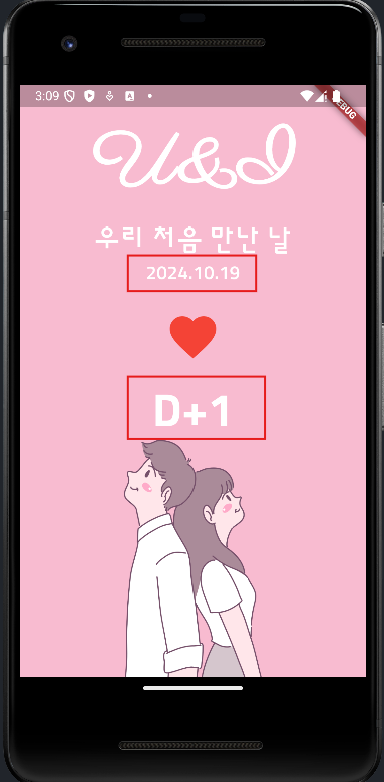|

<br>

#### (4) firstDay 가 하루씩 늘어나는 기능 추가
- setState() 함수 사용

- 상태 관리 테스트로 하트 아이콘 누르면 firstDay 가 하루씩 늘어나는 기능 추가

> lib/screen/home_screen.dart
```dart
  import 'package:flutter/material.dart';
  
  class HomeScreen extends StatefulWidget {
    const HomeScreen({Key? key}) : super(key: key);
  
    @override
    State<HomeScreen> createState() => _HomeScreenState();
  }
  
  class _HomeScreenState extends State<HomeScreen> {
    DateTime firstDay = DateTime.now();
  
    @override
    Widget build(BuildContext context) {
      return Scaffold(
        backgroundColor: Colors.pink[100],
        body: SafeArea(
          top: true,
          bottom: false,
          child: Column(
            mainAxisAlignment: MainAxisAlignment.spaceBetween,
  
            crossAxisAlignment: CrossAxisAlignment.stretch,
            children: [
              _DDay(
                onHeartPressed: onHeartPressed,
                firstDay: firstDay,
              ),
              _CoupleImage(),
            ],
          ),
        ),
      );
    }
  
    void onHeartPressed() {
      // 1. 상태 변경 시 setState() 함수 실행
      setState((){
        // 2. firstDay 변수에서 하루 빼기
        firstDay = firstDay.subtract(Duration(days: 1));
      });
    }
  
  }
  
  class _DDay extends StatelessWidget {
    final GestureTapCallback onHeartPressed;
    final DateTime firstDay;
  
    _DDay({
      required this.onHeartPressed,
      required this.firstDay,
    });
  
    @override
    Widget build(BuildContext context) {
      final textTheme = Theme.of(context).textTheme;
      final now = DateTime.now();
  
      return Column(
        children: [
          const SizedBox(height: 16.0),
          Text(
            'U&I',
            style: textTheme.displayLarge,
          ),
          const SizedBox(height: 16.0),
          Text(
            '우리 처음 만난 날',
            style: textTheme.bodyLarge,
          ),
          Text(
            '${firstDay.year}.${firstDay.month}.${firstDay.day}',
            style: textTheme.bodyMedium,
          ),
          const SizedBox(height: 16.0),
          IconButton(
            iconSize: 60.0,
            onPressed: onHeartPressed,
            icon: Icon(
              Icons.favorite,
              color: Colors.red,
            ),
          ),
          const SizedBox(height: 16.0),
          Text(
            'D+${DateTime(now.year, now.month, now.day).difference(firstDay).inDays + 1}',
            style: textTheme.displayMedium,
          ),
        ],
      );
    }
  }
  
  class _CoupleImage extends StatelessWidget {
    @override
    Widget build(BuildContext context) {
      return Expanded(
        child: Center(
          child: Image.asset('asset/img/middle_image.png',
  
            height: MediaQuery.of(context).size.height /2,
          ),
        ),
      );
    }
  }
```
- setState() 함수 사용 방법

  - 매개변수에 함수 입력 후 함수에 변경하고 싶은 벼수값 지정
 
  - 원하는 만큼 기간을 뺄 수 있는 subtract() 함수 사용해 버튼 누를 때마다 firstDay 값 줄어드는 기능 추가
 
- DateTime : 날짜, 시간을 저장할 수 있는 변수 타입 / Duration : 기간을 정할 수 있는 변수 타입

> 실행 결과

|-|-|
|-|-|
||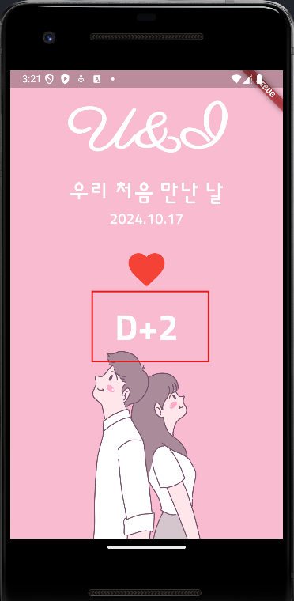|

<br>

### 03. CupertinoDatePicker 로 날짜 선택 구현
#### (1) CupertinoDatePicker 화면 생성 구현
- showCupertinoDialog() 함수 & CupertinoDatePicker 위젯 사용

  - 아이콘 클릭시 날짜 선택 가능

> lib/screen/home_screen.dart
```dart
  import 'package:flutter/material.dart';
  // 1. 쿠퍼티노 (iOS) 위젯 사용하기 위해 필요
  import 'package:flutter/cupertino.dart';
  
  class HomeScreen extends StatefulWidget {
    const HomeScreen({Key? key}) : super(key: key);
  
    @override
    State<HomeScreen> createState() => _HomeScreenState();
  }
  
  class _HomeScreenState extends State<HomeScreen> {
    DateTime firstDay = DateTime.now();
  
    @override
    Widget build(BuildContext context) {
      return Scaffold(
        backgroundColor: Colors.pink[100],
        body: SafeArea(
          top: true,
          bottom: false,
          child: Column(
            mainAxisAlignment: MainAxisAlignment.spaceBetween,
  
            crossAxisAlignment: CrossAxisAlignment.stretch,
            children: [
              _DDay(
                onHeartPressed: onHeartPressed,
                firstDay: firstDay,
              ),
              _CoupleImage(),
            ],
          ),
        ),
      );
    }
  
    void onHeartPressed() {
      showCupertinoDialog(    // 2. 쿠퍼티노 다이얼로그 실행
        context: context,     // 3. 보여줄 다이얼로그 빌드
        builder: (BuildContext context){
          // 4. 날짜 선택하는 다이얼로그
          return CupertinoDatePicker(
            // 5. 시간 제외하고 날짜만 선택
            mode: CupertinoDatePickerMode.date,
            onDateTimeChanged: (DateTime date) {},
          );
        },
      );
    }
  }
  
  class _DDay extends StatelessWidget {
    final GestureTapCallback onHeartPressed;
    final DateTime firstDay;
  
    _DDay({
      required this.onHeartPressed,
      required this.firstDay,
    });
  
    @override
    Widget build(BuildContext context) {
      final textTheme = Theme.of(context).textTheme;
      final now = DateTime.now();
  
      return Column(
        children: [
          const SizedBox(height: 16.0),
          Text(
            'U&I',
            style: textTheme.displayLarge,
          ),
          const SizedBox(height: 16.0),
          Text(
            '우리 처음 만난 날',
            style: textTheme.bodyLarge,
          ),
          Text(
            '${firstDay.year}.${firstDay.month}.${firstDay.day}',
            style: textTheme.bodyMedium,
          ),
          const SizedBox(height: 16.0),
          IconButton(
            iconSize: 60.0,
            onPressed: onHeartPressed,
            icon: Icon(
              Icons.favorite,
              color: Colors.red,
            ),
          ),
          const SizedBox(height: 16.0),
          Text(
            'D+${DateTime(now.year, now.month, now.day).difference(firstDay).inDays + 1}',
            style: textTheme.displayMedium,
          ),
        ],
      );
    }
  }
  
  class _CoupleImage extends StatelessWidget {
    @override
    Widget build(BuildContext context) {
      return Expanded(
        child: Center(
          child: Image.asset('asset/img/middle_image.png',
  
            height: MediaQuery.of(context).size.height /2,
          ),
        ),
      );
    }
  }
```
- Cupertino 패키지 불러오기

- showCupertinoDialog 실행해 하트 아이콘을 누르면 다이얼로그 열어줌

- builder 매개변수에 입력되는 함수에 다이얼로그에 보여주고 싶은 위젯 반환

  - 해당 위젯을 다이얼로그에서 보여줄 수 있음
 
- CupertinoDatePicker 는 Cupertino 패키지에서 기본으로 제공하는 위젯

  - 스크롤을 통해 날짜 정할 수 있음
 
  - 정해진 값을 onDateTimeChanged 콜백 함수의 매개변수로 전달
 
- mode 매개변수는 날짜를 고르는 모드 지정 가능

  - CupertinoDatePickerMode.date : 날짜
 
  - CupertinoDatePickerMode.time : 시간
 
  - CupertinoDatePickerMode.dateAndTime : 날짜와 시간

> 실행 결과

|-|
|-|
|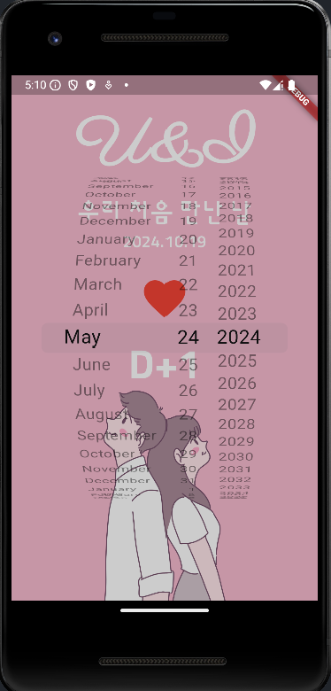|

<br>

#### (2) 디자인 변경
> lib/screen/home_screen.dart
```dart
  import 'package:flutter/material.dart';
  import 'package:flutter/cupertino.dart';
  
  class HomeScreen extends StatefulWidget {
    const HomeScreen({Key? key}) : super(key: key);
  
    @override
    State<HomeScreen> createState() => _HomeScreenState();
  }
  
  class _HomeScreenState extends State<HomeScreen> {
    DateTime firstDay = DateTime.now();
  
    @override
    Widget build(BuildContext context) {
      return Scaffold(
        backgroundColor: Colors.pink[100],
        body: SafeArea(
          top: true,
          bottom: false,
          child: Column(
            mainAxisAlignment: MainAxisAlignment.spaceBetween,
  
            crossAxisAlignment: CrossAxisAlignment.stretch,
            children: [
              _DDay(
                onHeartPressed: onHeartPressed,
                firstDay: firstDay,
              ),
              _CoupleImage(),
            ],
          ),
        ),
      );
    }
  
    void onHeartPressed() {
      showCupertinoDialog(
        context: context,
        builder: (BuildContext context){
          return Align(   // 1. 정렬을 지정하는 위젯
            alignment: Alignment.bottomCenter,  // 2. 아래 중간으로 정렬
            child: Container(
              color: Colors.white,  // 배경색 흰색 지정
              height: 300,          // 높이 300 지정
              child: CupertinoDatePicker(
                mode: CupertinoDatePickerMode.date,
                onDateTimeChanged: (DateTime date) {},
              ),
            ),
          );
        },
        barrierDismissible: true,   // 3. 외부 탭할 경우 다이얼로그 닫기
      );
    }
  }
  
  class _DDay extends StatelessWidget {
    final GestureTapCallback onHeartPressed;
    final DateTime firstDay;
  
    _DDay({
      required this.onHeartPressed,
      required this.firstDay,
    });
  
    @override
    Widget build(BuildContext context) {
      final textTheme = Theme.of(context).textTheme;
      final now = DateTime.now();
  
      return Column(
        children: [
          const SizedBox(height: 16.0),
          Text(
            'U&I',
            style: textTheme.displayLarge,
          ),
          const SizedBox(height: 16.0),
          Text(
            '우리 처음 만난 날',
            style: textTheme.bodyLarge,
          ),
          Text(
            '${firstDay.year}.${firstDay.month}.${firstDay.day}',
            style: textTheme.bodyMedium,
          ),
          const SizedBox(height: 16.0),
          IconButton(
            iconSize: 60.0,
            onPressed: onHeartPressed,
            icon: Icon(
              Icons.favorite,
              color: Colors.red,
            ),
          ),
          const SizedBox(height: 16.0),
          Text(
            'D+${DateTime(now.year, now.month, now.day).difference(firstDay).inDays + 1}',
            style: textTheme.displayMedium,
          ),
        ],
      );
    }
  }
  
  class _CoupleImage extends StatelessWidget {
    @override
    Widget build(BuildContext context) {
      return Expanded(
        child: Center(
          child: Image.asset('asset/img/middle_image.png',
  
            height: MediaQuery.of(context).size.height /2,
          ),
        ),
      );
    }
  }
```
- Align 위젯

  - 자식 위젯(child widget)을 어떻게 위치시킬지 정할 수 있음
 
  - alignment 매개변수에는 Alignment 값 입력
 
- showCupertinoDialog 의 barrierDismissible 매개변수 : 배경 눌렀을 때 행동 지정

  - false : 배경을 눌러도 다이얼로그가 닫히지 않음
 
  - true : 배경을 누르면 다이얼로그가 닫힘

> 실행 결과

|-|
|-|
|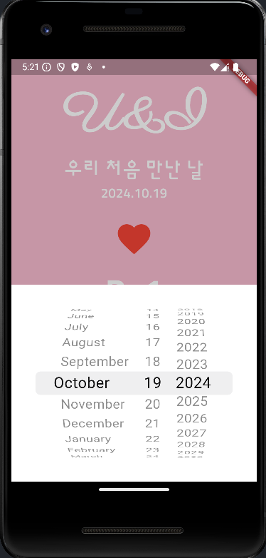|

<br>

#### 💡 Alignment 정렬값
|속성|예제|&nbsp;&nbsp;|속성|예제|
|-|-|-|-|-|
|Alignment.topRight<br>위 오른쪽|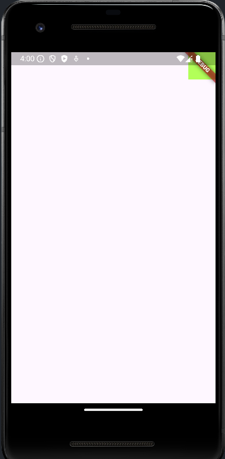|&nbsp;&nbsp;|Alignment.centerLeft<br>중앙 왼쪽|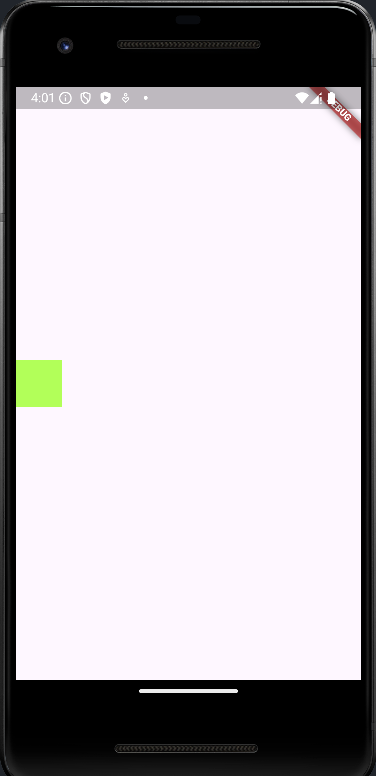|
|Alignment.topCenter<br>위 중앙|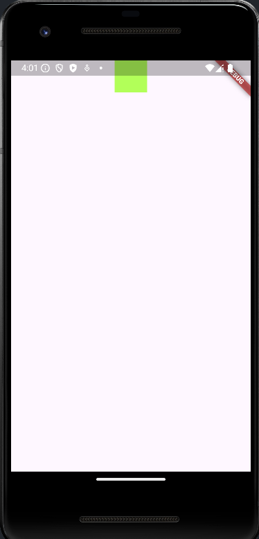|&nbsp;&nbsp;|Alignment.bottomRight<br>아래 오른쪽|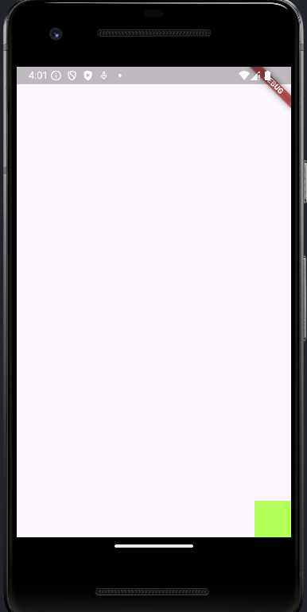|
|Alignment.topLeft<br>위 왼쪽|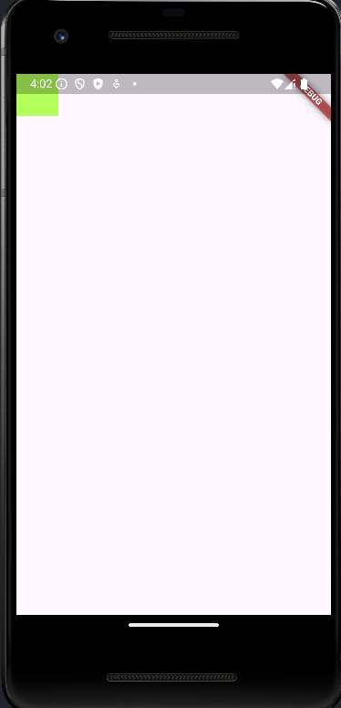|&nbsp;&nbsp;|Alignment.bottomCenter<br>아래 중앙|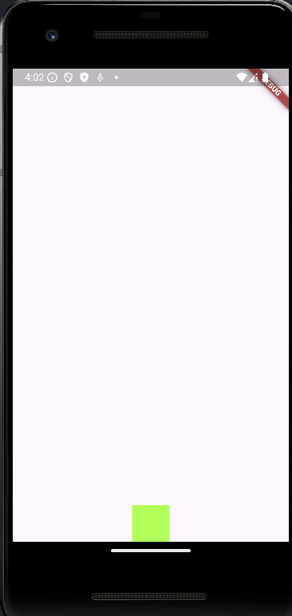|
|Alignment.centerRight<br>중앙 오른쪽|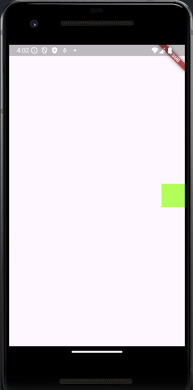|&nbsp;&nbsp;|Alignment.bottomLeft<br>아래 왼쪽|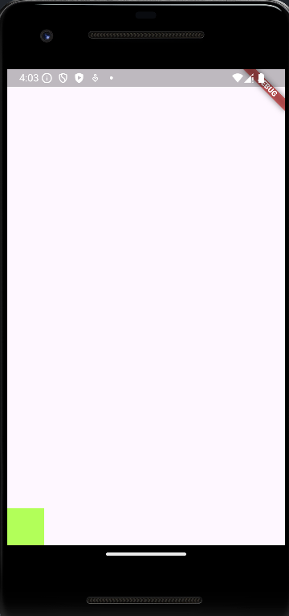|
|Alignment.center<br>중앙||&nbsp;&nbsp;|&nbsp;&nbsp;|&nbsp;&nbsp;|

<br>

### 04. CupertinoDatePicker 변경 값 상태 관리에 적용
- CupertinoDatePicker 날짜 값이 변경될 때마다 firstDay 값 변경

> lib/screen/home_screen.dart
```dart
  import 'package:flutter/material.dart';
  import 'package:flutter/cupertino.dart';
  
  class HomeScreen extends StatefulWidget {
    const HomeScreen({Key? key}) : super(key: key);
  
    @override
    State<HomeScreen> createState() => _HomeScreenState();
  }
  
  class _HomeScreenState extends State<HomeScreen> {
    DateTime firstDay = DateTime.now();
  
    @override
    Widget build(BuildContext context) {
      return Scaffold(
        backgroundColor: Colors.pink[100],
        body: SafeArea(
          top: true,
          bottom: false,
          child: Column(
            mainAxisAlignment: MainAxisAlignment.spaceBetween,
  
            crossAxisAlignment: CrossAxisAlignment.stretch,
            children: [
              _DDay(
                onHeartPressed: onHeartPressed,
                firstDay: firstDay,
              ),
              _CoupleImage(),
            ],
          ),
        ),
      );
    }
  
    void onHeartPressed() {
      showCupertinoDialog(
        context: context,
        builder: (BuildContext context){
          return Align(
            alignment: Alignment.bottomCenter,
            child: Container(
              color: Colors.white,
              height: 300,
              child: CupertinoDatePicker(
                mode: CupertinoDatePickerMode.date,
                // 날짜가 변경되면 실행되는 함수
                onDateTimeChanged: (DateTime date) {
                  setState(() {
                    firstDay = date;
                  });
                },
              ),
            ),
          );
        },
        barrierDismissible: true,
      );
    }
  }
  
  class _DDay extends StatelessWidget {
    final GestureTapCallback onHeartPressed;
    final DateTime firstDay;
  
    _DDay({
      required this.onHeartPressed,
      required this.firstDay,
    });
  
    @override
    Widget build(BuildContext context) {
      final textTheme = Theme.of(context).textTheme;
      final now = DateTime.now();
  
      return Column(
        children: [
          const SizedBox(height: 16.0),
          Text(
            'U&I',
            style: textTheme.displayLarge,
          ),
          const SizedBox(height: 16.0),
          Text(
            '우리 처음 만난 날',
            style: textTheme.bodyLarge,
          ),
          Text(
            '${firstDay.year}.${firstDay.month}.${firstDay.day}',
            style: textTheme.bodyMedium,
          ),
          const SizedBox(height: 16.0),
          IconButton(
            iconSize: 60.0,
            onPressed: onHeartPressed,
            icon: Icon(
              Icons.favorite,
              color: Colors.red,
            ),
          ),
          const SizedBox(height: 16.0),
          Text(
            'D+${DateTime(now.year, now.month, now.day).difference(firstDay).inDays + 1}',
            style: textTheme.displayMedium,
          ),
        ],
      );
    }
  }
  
  class _CoupleImage extends StatelessWidget {
    @override
    Widget build(BuildContext context) {
      return Expanded(
        child: Center(
          child: Image.asset('asset/img/middle_image.png',
  
            height: MediaQuery.of(context).size.height /2,
          ),
        ),
      );
    }
  }
```
- onDateTimeChanged 콜백 함수는 CupertinoDatePicker 위젯에서 날짜가 변경될 때마다 실행

  - 콜백 함수가 실행될 때마다 매개변수로 제공되는 date 값을 firstDay 변수에 저장

> 실행 결과

|-|
|-|
|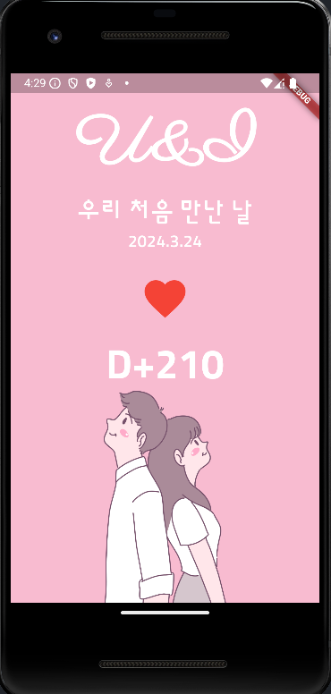|

<br>

---

<br>

🚨 핵심 요약
---
- **DateTime 클래스**로 날짜시간 저장 가능

- DateTime 의 **difference() 함수**를 이용해서 두 날짜 간의 차이 구할 수 있음

- **Duration 클래스**로 기간 저장 가능

- StatefulWidget 에서 **setState() 함수**를 실행해서 build() 함수 재실행시킬 수 있음

- **MediaQuery** 사용해 스크린 크기 정보 받아볼 수 있음

- **Theme** 이용해 위젯들의 기폰 테마 지정 가능

- **showCupertinoDialog** 이용해 iOS 스타일의 다이얼로그 띄우기 가능

- **CupertinoDatePicker** 사용해 iOS 스타일의 위젯으로 날짜 입력받기 가능

<br>


