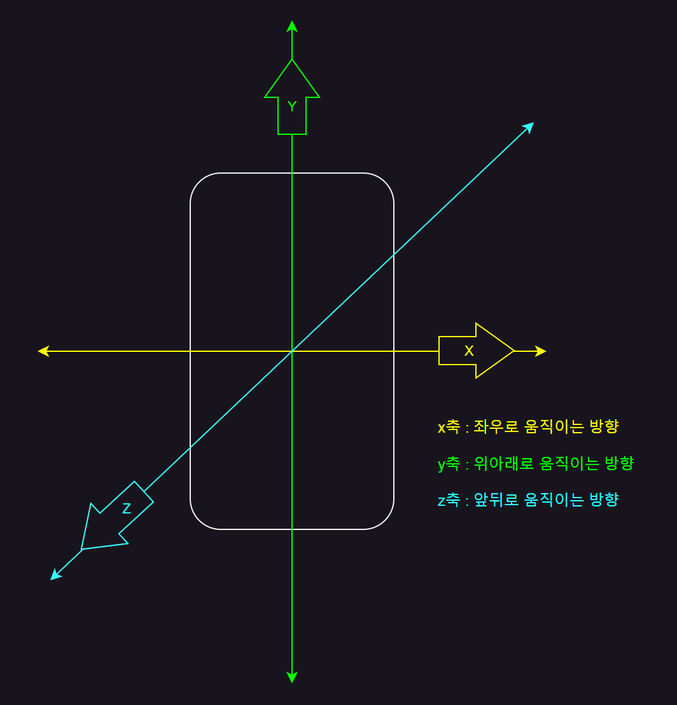
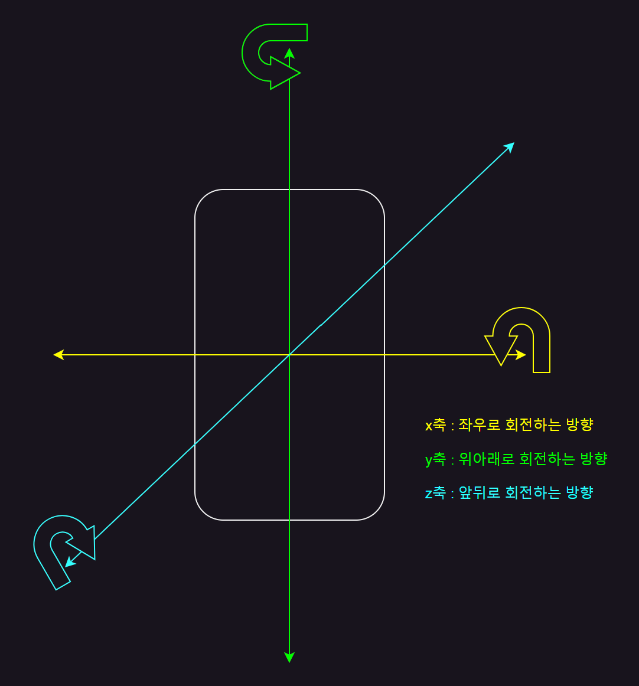
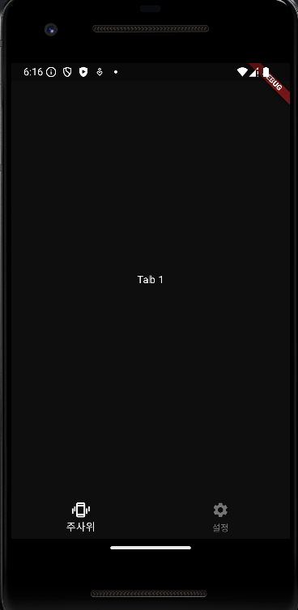
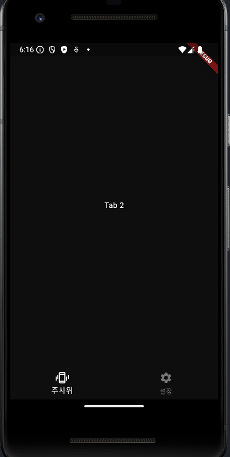
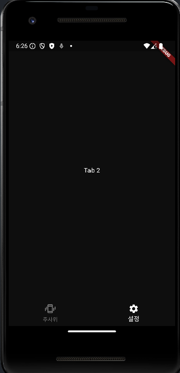
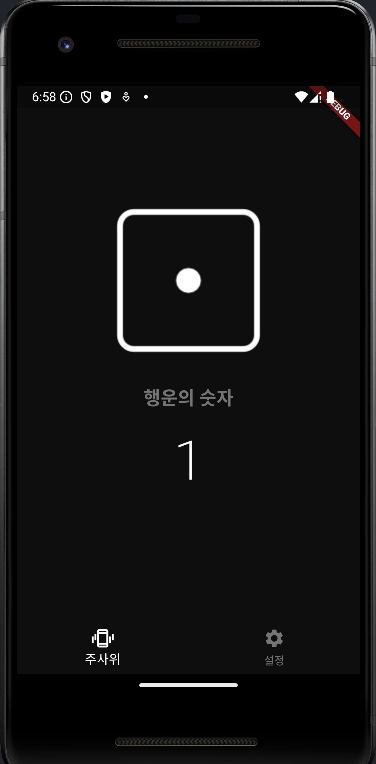
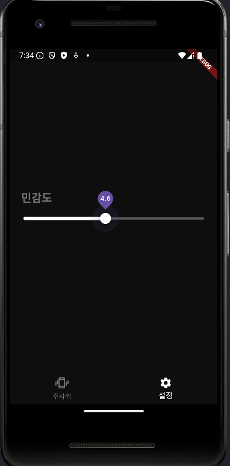

# 11단계 : 디지털 주사위
- 가속도계, 자이로스코프, Sensor_Plus

  - 가속도계 : 특정 방향으로 가속을 하는 정도를 측정하는 기기
 
    - 어느 정도의 가속 수치를 흔드는 핸동으로 인식할지에 대한 기준 중요
   
    - 사용자가 특정 수치를 넘는 강도로 핸드폰을 흔든 순간 인식하는 함수 구현
   
      - 기준을 사용자가 설정하도록 Slider 위젯 이용
     
  - 화면 두 개를 만들어 탭과 스크롤로 이동
 
    - 두 화면을 각각 따로 위젯으로 구현
   
    - BottomNavigationBar 이용

- [실습 프로젝트 바로가기](https://github.com/SVW-App-Develop/Random_Dice.git)

<br>

|개요|설명|
|-|-|
|**프로젝트명**|random_dice|
|**개발환경**|플러터 SDK : 3.24.3|
|**미션**|핸드폰을 흔들면 새로운 주사위를 뽑아주는 앱 만들기|
|**기능**|- BottomNavigation 이용해 탭 형태의 UI 구현<br><br>- 가속도계를 사용해서 흔들기 기능 구현<br><br>- Slider 이용해 흔들기 민감도를 설정하는 기능 구현|
|**조작법**|- 첫 번째 탭에서 핸드폰을 흔들면 주사위의 숫자가 랜덤하게 변경<br><br>- 두 번째 탭에서 슬라이더를 움직이면 흔들기의 민감도 지정 가능|
|**핵심 구성요소**|- 가속도계<br><br>- BottomNavigationBar<br><br>- Slider|
|**플러그인**|- shake: 3.13.x<br><br>- sensors_plus: 3.1.0|

<br>

---

<br>

11.1 사전 지식
---
### 01. 가속도계
- 특정 물체가 특정 방향으로 이동하는 가속도가 어느 정도인지를 숫자로 측정하는 기기

  - 대부분의 핸드폰에 가속도계 장착되어 있음
 
- 3개의 축으로 가속도 측정 가능

  - 움직임 이벤트를 받으면 x, y, z 축의 측정 결과가 모두 double 값으로 반환됨

|가속도계와 x, y, z 축|
|-|
||

<br>

### 02. 자이로스코프(gyroscope)
- x, y, z 축으로의 직선 움직임만 측정 가능한 가속도계의 단점 보완

  - x, y, z 축의 회전 측정 가능
 
- 회전에 대한 이벤트를 받게 되면 x, y, z 축 모두에서의 회전값이 동시에 반환됨

|자이로스코프와 x, y, z 축의 회전|
|-|
||

<br>

### 03. Sensor_Plus 패키지
- 핸드폰의 가속도계와 자이로스코프 센서 간단하게 사용 가능

- 가속도계와 자이로스코프 센서의 데이터는 x, y, z 축의 움직임을 각각 반환

  - 전반적인 핸드폰의 움직임을 측정하려면 정규화(normalization) 필요
 
- shake 패키지 : 미리 정규화 작업은 해둠

  - x, y, z 각 값을 통합해 전반적인 움직임 수치를 계산해서 핸드폰을 흔든 정도를 수치화
 
- sensors_plus 패키지를 이용한 가속도계와 자이로스코프 사용법 숙지하면 유용함

> sensors_plus 패키지를 pubspec.yaml 에 등록 후 코드 사용
```dart
  import 'package:sensors_plus/sensors_plus.dart';
  
  // 중력을 반영한 가속도계 값
  accelerometerEvents.listen((AccelerometerEvent event){
    print(event.x);   // x 축 수치
    print(event.y);   // y 축 수치
    print(event.z);   // z 축 수치
  });
  
  // 중력을 반영하지 않은 순수 사용자의 힘에 의한 가속도계 값
  userAccelerometerEvents.listen((UserAccelerometerEvent event){
    print(event.x);   // x 축 수치
    print(event.y);   // y 축 수치
    print(event.z);   // z 축 수치
  });
  
  gyroscopeEvents.listen((GyroscopeEvent event){
    print(event.x);   // x 축 수치
    print(event.y);   // y 축 수치
    print(event.z);   // z 축 수치
  });
```

<br>

---

<br>

11.2 사전 준비
---
- 프로젝트에서 사용할 상수값들을 미리 정리해두면 개발이 훨씬 수월해짐

  - 프로젝트에서 사용할 색상을 colors.dart 파일에 미리 추가
 
<br>

### 01. 상수 추가

- 프로그래밍 시 반복적으로 사용하는 상수 多

  - 한 번 입력 후 변경하지 않으면 괜찮지만, 이후 일괄 변경하려면 번거로움
 
    - 위 상황 예방을 위해 프로젝트에 반복적으로 사용할 상수는 별도 파일에 정리

<br>

#### (1) [lib] 폴더에 [const] 폴더 추가
- 상수값과 관련된 모든 파일 저장

- [const] 폴더 안에 색상과 관련된 모든 상수값들을 저장할 colors.dart 파일 생성

<br>

#### (2) 프로젝트에서 사용할 색상 정보를 colors.dart 파일에 저장
> lib/const/colors.dart
```dart
import 'package:flutter/material.dart';

const backgroundColor = Color(0xFF0E0E0E);    // 배경색
const primaryColor = Colors.white;            // 주색상
final secondaryColor = Colors.grey[600];      // 보조 색상
```

<br>

#### (3) const 사용 가능 여부
- Colors.grey : const 선언 가능

  - 600 등 키값 입력시 런타임에 색상이 계산되어 const 사용 불가능

<br>

### 02. 이미지 추가
- [asset] 폴더 아래 [img] 폴더 생성

  - 사용할 이미지 복사


<br>

### 03. pubspec.yaml 설정
- 이미지를 읽을 위치를 pubspec.yaml 파일에 추가 후 [Pub get]
```dart
  dependencies:
    flutter:
      sdk: flutter
  
    cupertino_icons: ^1.0.8
    shake: 2.2.0      # 흔들림을 감지하는 플러그인
  
  ...생략...
  
  flutter:
  
    uses-material-design: true
    
    assets:
      - asset/img/        # 이미지 경로 추가
```

<br>

### 04. 프로젝트 초기화
#### (1) HomeScreen 이라는 StatelessWidget 생성
- [lib] 폴더 내 [screen] 폴더 생성

- 앱의 기본 화면으로 사용할 HomeScreen 위젯을 생성할 home_screen.dart 생성

- HomeScreen 위젯 생성

> lib/screen/home_screen.dart
```dart
  import 'package:flutter/material.dart';
  
  class HomeScreen extends StatelessWidget {
    const HomeScreen({Key? key}) : super(key: key);
  
    @override
    Widget build(BuildContext context) {
      return Scaffold(
        body: Text('Home Screen'),
      );
    }
  }
```

<br>

#### (2) HomeScreen 홈 위젯으로 등록
- main 파일에 HomeScreen 을 홈 위젯으로 등록

> lib/main.dart
```dart
  import 'package:flutter/material.dart';
  import 'package:random_dice/screen/home_screen.dart';
  
  void main() {
    runApp(
      MaterialApp(
        home: HomeScreen(),
      ),
    );
  }
```

<br>

### 05. Theme 설정
- 상수를 사용해 테마 적용

  - main 파일의 MaterialApp 위젯 안에 정의

> lib/main.dart
```dart
  import 'package:flutter/material.dart';
  import 'package:random_dice/screen/home_screen.dart';
  import 'package:random_dice/const/colors.dart';
  
  void main() {
    runApp(
      MaterialApp(
        // Theme 설정
        theme: ThemeData(
          scaffoldBackgroundColor: backgroundColor,
          sliderTheme: SliderThemeData(       // Slider 위젯 관련 테마
            thumbColor: primaryColor,         // 노브 색삭
            activeTrackColor: primaryColor,   // 노브가 이동한 트랙 색상
  
            // 노브가 아직 이동하지 않은 트랙 색상
            inactiveTrackColor: primaryColor.withOpacity(0.3),
          ),
          // BottomNavigationBar 위젯 관련 테마
          bottomNavigationBarTheme: BottomNavigationBarThemeData(
            selectedItemColor: primaryColor,      // 선택 상태 색
            unselectedItemColor: secondaryColor,  // 비선택 상태 색
            backgroundColor: backgroundColor,     // 배경색
          ),
        ),
        home: HomeScreen(),
      ),
    );
  }
```

<br>

---

<br>

11.3 레이아웃 구상
---
- BottomNavigationBar 위젯을 사용해 화면 전환

  - 첫 번째 화면(HomeScreen), 두 번째 화면(SettingsScreen)을 TabBarView 이용해 RootScreen 위젯에 위치시킴
 
    - RootScreen 하나에 탭으로 홈 스크린과 설정 스크린을 감싸고 있는 형태

<br>

### 01. 기본 스크린 위젯
- 이번 프로젝트에서 사용할 모든 위젯을 담고 있는 최상위 위젯

- 주사위가 보이는 홈 스크린과 감도를 설정할 수 있는 설정 스크린을 탭으로 담게 됨

  - RootScreen 위젯으로 명명
 
- RootScreen

  - 상단 : TabBarView(선택된 화면 보여줌)
 
  - 하단 : BottomNavigationBar 위젯
 
  - 하단에서 각 탭을 누르거나 상단에서 좌우로 스크롤해 화면 전환 가능
 
<br>

### 02. 홈 스크린 위젯
- HomeScreen 위젯은 하나의 Column 위젯으로 간단하게 구현 가능

- 가장 위에 주사위 이미지 위치(Image 위젯 사용)

- '행운의 숫자' 문구 작성(Text 위젯 사용)

- 각 숫자의 눈 개수 표현(Text 위젯 사용)

<br>

### 03. 설정 스크린 위젯
- SettingsScreen 위젯 가운데 민감도를 정하는 Slider 위젯 위치

  - 사용자가 좌우로 이동해서 직접 흔들기 기능의 민감도 지정 가능
 
- Slider 위젯의 기능을 쉽게 알 수 있도록 Text 위젯으로 레이블 작성

<br>

---

<br>

11.4 구현
---
### 01. RootScreen 위젯 구현
#### (1) root_screen 파일 생성
- RootScreen 위젯 작업의 주요 요소 : BottomNavigationBar & TabBarView

- [lib] 폴더 안 [screen] 폴더 안에 root_screen.dart 파일 생성

<Br>

#### (2) 위젯 반환 함수 작업
- TabBarView 위젯과 BottomNavigationBar 위젯을 반환해줄 renderChildren() 함수, renderBottomNavigation() 함수 작업

> lib/screen/root_screen.dart
```dart
  import 'package:flutter/material.dart';
  
  class RootScreen extends StatelessWidget {
    const RootScreen({Key? key}) : super(key: key);
    
    @override
    Widget build(BuildContext context) {
      return Scaffold(
        body: TabBarView(   // 1. 탭 화면을 보여줄 위젯
          children: renderChildren(),
        ),
        
        // 2. 아래 탭 내비게이션을 구현하는 매개변수
        bottomNavigationBar: renderBottomNavigation(),
      );
    }
    
    List<Widget> renderChildren(){
      return [];
    }
    
    BottomNavigationBar renderBottomNavigation(){
      // 3. 탭 내비게이션을 구현하는 위젯
      return BottomNavigationBar(items: []);
    }
  }
```
- TabBarView 위젯 이용시 각종 Tab 위젯과 쉽게 연동할 수 있는 UI 구현 가능

  - PageView 와 비슷한 기본 애니메이션 제공
 
  - children 매개변수에 각 탭의 화면으로 활용하고 싶은 위젯을 List 로 넣어줌
 
- Scaffold 위젯은 BottomNavigationBar 위치시키는 매개변수 따로 보유

  - bottomNavigation 매개변수에 BottomNavigationBar 넣어주면 쉽게 Tab 조정할 수 있는 UI 를 핸드폰 아래에 배치 가능

- BottomNavigationBar 에 제공될 각 탭은(아이콘과 탭의 레이블) BottomNavigationBar 위젯의 items 매개변수에 제공

<br>

#### (3) 홈 화면 변경
- main 파일에 홈 화면을 RootScreen 위젯으로 변경

  - HomeScreen 은 RootScreen 의 탭 중 하나(첫 번째 탭)로 구현할 계획

> lib/main.dart
```dart
  ...생략...
  import 'package:random_dice/screen/root_screen.dart';  # 임포트
  
  void main() {
    runApp(
      MaterialApp(
        ...생략...
        home: RootScreen(),   // HomeScreen 을 RootScreen 으로 변경
      ),
    );
  }
```

<br>

#### (4) TabBarView 작업
- TabController 필수

  - 초기화하려면 vsync 기능 필요
 
    - State 위젯에 TickderProviderMixin 을 mixin 으로 제공해줘야 사용 가능
   
- TabController 는 위젯이 생성될 때 단 한 번만 초기화되어야 함

  - HomeScreen 위젯을 StatefulWiget 으로 변경 후 initState() 에서 초기화

> lib/screen/root_screen.dart
```dart
  ...생략...  
  class RootScreen extends StatefulWidget {    // StatelessWidget -> StatefulWidget
    const RootScreen({Key? key}) : super(key: key);
  
    @override
    State<RootScreen> createState() => _RootScreenState();
  }
  
  // 1. TickerProviderStateMixin 사용
  class _RootScreenState extends State<RootScreen> with TickerProviderStateMixin {
    TabController? controller;    // 사용할 TabController 선언
    
    @override
    void initState() {
      super.initState();
      
      // 2. 컨트롤러 초기화
      controller = TabController(length: 2, vsync: this);
    }
    
    @override
    Widget build(BuildContext context) {
      return Scaffold(
        body: TabBarView(
          controller: controller,   // 3. 컨트롤러 등록
          children: renderChildren(),
        ),
  
        bottomNavigationBar: renderBottomNavigation(),
      );
    }
    ...생략...
  }
```
- TickerProviderMixin 과 SingleTickerProviderMixin 은 애니메이션의 효율을 올려주는 역할

- TabController

  - length 매개변수에는 탭 개수를 int 값으로 제공
 
  - vsync 에는 TickerProviderMixin 을 사용하는 State 클래스를 this 형태로 넣어주기
 
- 생성된 TabController 는 TabBarView 의 controller 매개변수에 입력

<br>

<details>
  <summary>💡 TickerProviderMixin 과 vsync</summary>

- 애니메이션 효율 담당

  - 플러터 : 기기가 지원하는대로 60FPS(초당 60프레임)부터 120FPS 지원
  
  - TickerProviderMixin : 한 틱(1FPS)마다 애니메이션 실행
 
- 애니메이션 코드를 작성시 실제로 화면에 그릴 수 있는 주기보다 더 자주 렌더링 실행하게 되는 경우

  - TickerProviderMixin 사용하면 비효율적인 상황 방지

- TabController 도 vsync 에 TickerProviderMixin 제공함으로써 렌더링 효율 극대화 가능

</details>

<br>

#### (5) BottomNavigationBar 작업
- items 매개변수 : BottomNavigationBarItem 클래스 사용

  - 각 탭의 정의 제공
 
- label 매개변수 : 이름 지정 가능

> lib/screen/root_screen.dart
```dart
  ...생략...
  class _RootScreenState extends State<RootScreen> with TickerProviderStateMixin {
    ...생략...
    BottomNavigationBar renderBottomNavigation(){
      return BottomNavigationBar(
          items: [
            BottomNavigationBarItem(  // 1. 하단 탭바의 각 버튼 구현
              icon: Icon(
                Icons.edgesensor_high_outlined,
              ),
              label: '주사위',
            ),
            BottomNavigationBarItem(
              icon: Icon(
                Icons.settings,
              ),
              label: '설정',
            ),
          ],
      );
    }
  }
```

<br>

#### (6) 각 탭을 표현해줄 위젯들을 TabBarView 의 children 에 제공
> lib/screen/root_screen.dart
```dart
  ...생략...
    List<Widget> renderChildren(){
      return [
        Container(    // 홈 탭
          child: Center(
            child: Text(
              'Tab 1',
              style: TextStyle(
                color: Colors.white,
              ),
            ),
          ),
        ),
        Container(    // 설정 스크린 탭
          child: Center(
            child: Text(
              'Tab 2',
              style: TextStyle(
                color: Colors.white,
              ),
            ),
          ),
        ),
      ];
    }
  ...생략...
```

> 실행 결과

|기본화면|스와이프|네비게이션 클릭|
|-|-|-|
||||

- TabBarView 스와이프시 화면 전환 O

- BottomNavigationBar 탭 클릭시 화면 전환 X

  - BottomNavigation 누를 때마다 TabBarView 와 연동해야 하기 때문
 
<br>

#### (7) TabBarView 와 BottomNavigation 연동
> lib/screen/root_screen.dart
```dart
  ...생략...
  class _RootScreenState extends State<RootScreen> with TickerProviderStateMixin {
    TabController? controller;
    
    @override
    void initState() {
      super.initState();
      
      controller = TabController(length: 2, vsync: this);
      
      // 1. 컨트롤러 속성이 변경될 때마다 실행할 함수 등록
      controller!.addListener(tabListener);
    }
    
    tabListener() {   // 2. 리스너로 사용할 함수
      setState(() {});
    }
    
    @override
    dispose(){
      controller!.removeListener(tabListener);  // 3. 리스너에 등록한 함수 등록 취소
      super.dispose();
    }
    ...생략...
    BottomNavigationBar renderBottomNavigation() {
      return BottomNavigationBar(
        // 4. 현재 화면에 렌더링되는 탭의 인덱스
        currentIndex: controller!.index,
          onTap: (int index) {    // 5. 탭이 선택될 때마다 실행되는 함수
            setState((){
              controller!.animateTo(index);
            });
          },
          items: [
            ...생략...
      );
    }
  }
```
- TabBarView 에서 바라보고 있는 화면의 인덱스가 변경될 때마다 BottomNavigationBar 다시 그려 어떤 탭이 보여지는지 표시

  - addListener() 함수 : controller 속성 변할 때마다 특정 함수 실행할 수 있도록 콜백 함수 등록 가능
 
    - 콜백 함수에 setState() 실행
   
    - controller 속성 변경될 때마다 build() 재실행
   
    - RootScreen 위젯 생성될 때 단 한 번만 리스너 등록되면 되니 initState() 에서 실행
   
- TabController 속성이 변경될 때마다 실행할 함수

- addListener 사용해 listener 등록시 위젯 삭제될 때 항상 등록된 listener 도 같이 삭제해줘야 함

  - 위젯 삭제시 실행되는 dispose() 함수 오버라이드해서 controller 에 붙은 리스너 삭제
 
- BottomNavigationBar 에서 현재 선택된 상태로 표시해야 하는 BottomNavigationBarItem 의 index

  - TabBarView 와 같은 탭의 인덱스를 바라보게 해줘야 함
 
- BottomNavigationBVarItem 눌릴 때마다 실행되는 함수

  - 매개변수로 눌린 탭의 인덱스 전달
 
    - 탭 눌렀을 때 TabBarView 와 화면 동기화
   
    - animateTo() 함수 사용해 자연스러운 애니메이션으로 지정 탭으로 TabBarView 전환되게 함

> 실행 결과

|주사위|설정|
|-|-|
|||


<br>

### 02. HomeScreen 위젯 구현
#### (1) Column 위젯 하나를 사용해 Image 위젯과 Text 위젯 배치
- 어떤 숫자를 보여줄지는 RootScreen 위젯에서 정하도록 생성자 통해 number 매개변수값 입력받기

> lib/screen/home_screen.dart
```dart
  import 'package:flutter/material.dart';
  import 'package:random_dice/const/colors.dart';
  
  class HomeScreen extends StatelessWidget {
    final int number;
    
    const HomeScreen({required this.number, Key? key,}) : super(key: key);
  
    @override
    Widget build(BuildContext context) {
      return Column(
        mainAxisAlignment: MainAxisAlignment.center,
        children: [
          // 1. 주사위 이미지
          Center(
            child: Image.asset('asset/img/$number.png'),
          ),
          SizedBox(height: 32.0),
          Text(
            '행운의 숫자',
            style: TextStyle(
              color: secondaryColor,
              fontSize: 20.0,
              fontWeight: FontWeight.w700,
            ),
          ),
          SizedBox(height: 12.0),
          Text(
            number.toString(),    // 2. 주사위 값에 해당되는 숫자
            style: TextStyle(
              color: primaryColor,
              fontSize: 60.0,
              fontWeight: FontWeight.w200,
            ),
          ),
        ],
      );
    }
  }
```
- 생성자로 입력받은 number 값에 해당되는 이미지를 화면에 그려줌

- 생성자로 입력받은 number 값에 해당되는 글자를 화면에 그려줌

<br>

#### (2) RootScreen 에 임의로 입력해둔 첫 번째 Container 위젯 대체
- TabBarView 의 첫 번째 화면에 'Tab 1' 대신 1 이라는 number 값 입력해보기

> lib/screen/root_screen.dart
```dart
  import 'package:random_dice/screen/home_screen.dart'
  ...생략...
   List<Widget> renderChildren() {
      return [
        // 첫 번째 Container 삭제
        // Container(
        //   child: Center(
        //     child: Text(
        //       'Tab 1',
        //       style: TextStyle(
        //         color: Colors.white,
        //       ),
        //     ),
        //   ),
        // ),
        // HomeScreen 불러와 입력
        HomeScreen(number: 1),
        Container(
          child: Center(
            child: Text(
              'Tab 2',
              style: TextStyle(
                color: Colors.white,
              ),
            ),
          ),
        ),
      ];
    }
  ...생략...
```

> 실행 결과

|-|
|-|
||

<br>

### 03. SettingScreen 위젯 구현
#### (1) SettingsScreen 위젯 만들기
- [lib] 폴어 내 [screen] 폴더 내 settings_screen.dart 파일 생성

<br>

#### (2) SettingsScreen 배치 및 셋팅
- SettingsScreen : Text 위젯 & Slider 위젯으로 구성

  - Column 위젯을 이용해 세로로 배치
 
- Slider 위젯 : 눌러서 좌우로 움직딜 때 움직인 만큼의 값이 제공되는 콜백 함수 실행

  - 그 값을 저장하고 다시 Slider 에 넣어주는 게 주요 포인트
 
  - Slider 의 현재값과 콜백 함수는 외부로 노출, 나머지 매개변수들은 SettingScreen 에서 관리
 
    - 민감도에 대한 상태는 RootScreen 위젯에서 관리

> lib/screen/settings_screen.dart
```dart
  import 'package:flutter/material.dart';
  import 'package:random_dice/const/colors.dart';
  
  class SettingsScreen extends StatelessWidget {
    final double threshold;   // Slider 현재값
  
    // Slider 변경될 때마다 실행되는 함수
    final ValueChanged<double> onThresholdChange;
    
    const SettingsScreen({Key? key,
      // threshold 와 onThreshold 는 SettingsScreen 에서 입력
      required this.threshold,
      required this.onThresholdChange,
    }) : super(key: key);
    
    @override
    Widget build(BuildContext context) {
      return Column(
        mainAxisAlignment: MainAxisAlignment.center,
        children: [
          Padding(
            padding: const EdgeInsets.only(left: 20.0),
            child: Row(
              children: [
                Text(
                  '민감도',
                  style: TextStyle(
                    color: secondaryColor,
                    fontSize: 20.0,
                    fontWeight: FontWeight.w700,
                  ),
                ),
              ],
            ),
          ),
          Slider(
            min: 0.1,         // 1. 최소값
            max: 10.0,        // 2. 최대값
            divisions: 101,   // 3. 최소값과 최대값 사이 구간 개수
            value: threshold, // 4. 슬라이더 선택값
            onChanged: onThresholdChange,   // 5. 값 변경 시 실행되는 함수
            label: threshold.toStringAsFixed(1),  // 6. 표시값
          ),
        ],
      );
    }
  }
```
- Slider 최소값

  - Slider 위젯을 왼쪽 끝으로 이동시켰을 때 값
 
- Slider 최대값

  - Slider 위젯을 오른쪽 끝으로 이동시켰을 때 값
 
- min 값과 max 값을 나누는 구분 개수

  - 0.1 ~ 10 사이 101개의 구간으로 나눠서 각 구간을 이동할 때마다 0.1씩 현재값 변경
 
- Slider 위젯의 현재값

  - 이 값에 따라 Slider 위젯에서 원의 위치가 정해짐
 
- Slider 위젯의 콜백 함수

  - 사용자의 제스처에 의해 Slider 위젯의 원이 움직이는 만큼 콜백 함수의 매개변수로 이동한 값 제공
 
    - onChanged 매개변수로 입력받은 현재값을 State 에 저장
   
    - 다시 value 매개변수에 같은 값을 입력
   
- label 매개변수 이용시 Slider 위젯 스크롤할 때마다 화면에 표시할 문자 지정 가능

  - Slider 값을 소수점 한 자리까지 표현하도록 코드 작성
 
<br>

#### (3) SettingsScreen 을 RootScreen 에 적용
- Slider 위젯의 현재값과 onChanged 매개변수를 RootScreen 에서 입력받도록 작성

> lib/screen/root_screen.dart
```dart
import 'package:random_dice/screen/settings_screen.dart';
...생략...
class _RootScreenState extends State<RootScreen> with TickerProviderStateMixin {
  TabController? controller;
  double threshold = 2.7;       // 민감도의 기본값 설정
  ...생략...
  List<Widget> renderChildren() {
    return [
      HomeScreen(number: 1),
      // 두 번째 Container 삭제
      // Container(    // 설정 스크린 탭
      //   child: Center(
      //     child: Text(
      //       'Tab 2',
      //       style: TextStyle(
      //         color: Colors.white,
      //       ),
      //     ),
      //   ),
      // ),
      SettingsScreen(    // 두 번째 Container 대체
        threshold: threshold,
        onThresholdChange: onThresholdChange,
      ),
    ];
  }

  // 1. 슬라이더값 변경 시 실행 함수
  void onThresholdChange(double val) {
    setState(() {
      threshold = val;
    });
  }
  ...생략...
```
- Slider 위젯 현재값이 변경될 때마다 threshold 변수에 값 저장

  - setState() 함수 실행해서 build() 함수 재실행
 
  - Slider 위젯은 변경된 threshold 변수의 값을 기반으로 화면에 다시 그려짐

> 실행 결과

|-|
|-|
||

- '설정' 탭의 슬라이더를 좌우로 움직일 때 Slider 위젯 값 변경

- 현재값이 원 위에 표시 (label 매개변수)

<br>

### 04. shake 플러그인 적용
#### (1) 핸드폰 흔들 때마다 새로운 숫자 생성
- HomeScreen 위젯의 number 매개변수에 들어갈 값을 number 변수로 상태 관리

> lib/screen/root_screen.dart
```dart
  ...생략...
  class _RootScreenState extends State<RootScreen> with TickerProviderStateMixin {
    TabController? controller;
    double threshold = 2.7;
    int number = 1;               // 주사위 숫자
    ...생략...
    List<Widget> renderChildren() {
      return [
        HomeScreen(number: number),   // number 변수로 대체
        ...생략...
      ];
    }
    ...생략...
  }
```
- number 변수를 State 에 선언하고 이 변수를 HomeScreen 위젯의 number 매개변수에 입력

  - number 변수의 값을 변경할 때마다 HomeScreen 위젯의 렌더링 결과 변경 가능
 
<br>

#### (2) Shake 플러그인 사용
- RootScreen 구현시 TabController 의 addListener() 함수를 활용해서 탭의 인덱스값이 변경될 때마다 특정 함수 실행

- Shake 플러그인 : 핸드폰 흔들기를 감지할 때마다 실행할 함수 등록

> lib/screen/root_screen.dart
```dart
  import 'dart:math';                    // import 추가
  import 'package:shake/shake.dart';     // import 추가
  ...생략...
  class _RootScreenState extends State<RootScreen> with TickerProviderStateMixin {
    TabController? controller;
    double threshold = 2.7;
    int number = 1;
    ShakeDetector? shakeDetector;    // ShakeDetector 클래스의 변수 선언
    
    @override
    void initState() {
      super.initState();
      
      controller = TabController(length: 2, vsync: this);
      controller!.addListener(tabListener);
      
      shakeDetector = ShakeDetector.autoStart(  // 1. 흔들기 감지 즉시 시작
        shakeSlopTimeMS: 100,               // 2. 감지 주기
        shakeThresholdGravity: threshold,   // 3. 감지 민감도
        onPhoneShake: onPhoneShake,         // 4. 감지 후 실행할 함수
      );
    }
    
    void onPhoneShake() {     // 5. 감지 후 실행할 함수
      final rand = new Random();
      
      setState(() {
        number = rand.nextInt(5) + 1;
      });
    }
    ...생략...
    @override
    dispose(){
      controller!.removeListener(tabListener); 
      shakeDetector!.stopListening();   // 6. 흔들기 감지 중지
      super.dispose();
    }
    ...생략...
  }
```
- ShakeDetector 의 autoStart 생성자를 이용하면 코드가 실행되는 순간부터 흔들기 감지

  - waitForStart 생성자 이용시 코드만 등록해두고 추후에 흔들기 감지 시작하는 코드 따로 실행 가능
 
- 얼마나 자주 흔들기를 감지할지 지정

  - 밀리초 단위로 입력
 
  - 한 번 흔들기 감지시 입력된 시간이 지나기까지 다시 흔들기를 감지하지 않음
 
- 흔들기를 감지하는 민감도 설정

  - 이미 구현한 SettingsScreen 의 Slider 위젯에서 받아옴
 
- 흔들기 감지했을 때 실행되는 함수 등록

- onPhoneShake 매개변수에 등록한 함수

  - 핸드폰을 흔들 때마다 난수를 생성해야 함
 
    - 다트 언어에서 기본으로 제공하는 dart:math 패키지의 Random 클래스 이용
   
    - Random 클래스는 nextInt() 함수 제공
   
      - 첫 번째 매개변수 : 생성될 최대 int 값
     
      - 난수는 최소 0부터 생성
      
        - 0 \~ 5까지 생성되게 매개변수에 5 넣어주고 결과값에 1 더하면 1 \~ 6 사이 난수 생성 가능
       
  - 생성된 난수 미리 만들어둔 number 변수에 setState() 함수로 저장하면 화면에 반영됨

- TabController 에서 removeListener() 함수 실행해서 리스너 제거

  - ShakeDetector 도 dispose() 실행됐을 때
 
    - onPhoneShake 매개변수가 실행되지 않도록 리스너 제거해줘야 함
   
    - ShakeEDetector.autoStart 에서 반환받은 값에 stopListening() 함수 실행해주면 쉽게 리스너 제거 가능

<br>

---

<br>

🚨 핵심 요약
---


<br>


