# 12단계 : 동영상 플레이어
- 화면 회전, 시간 변환, String 패딩

- [실습 프로젝트 바로가기](https://github.com/SVW-App-Develop/Vid_Player.git)

<br>

|개요|설명|
|-|-|
|**프로젝트명**|vid_player &nbsp;&nbsp;&nbsp; *\*주의: video_player 플러그인 이름과 겹치지 않게 작명에 유의* |
|**개발환경**|플러터 SDK : 3.24.3|
|**미션**|핸드폰 갤러리에서 동영상을 골라서 실행할 수 있는 동영상 플레이어 앱 구현|
|**기능**|- 로고나 갤러리 버튼을 눌러서 동영상 고르기<br><br>- 동영상 재생, 중지, 3초 뒤로, 3초 앞으로 기능<br><br>- Slider 위젯 이용해 원하는 동영상 위치로 이동<br><br>- 동영상 화면을 탭하면 동영상을 제어하는 버튼들을 화면에 보여줌|
|**조작법**|- 홈 스크린에서 로고를 눌러 동영상 선택<br><br>- Slider 위젯 조작해 원하는 영상의 위치로 이동<br><br>- 화면을 한 번 탭해서 컨트롤 버튼을 띄운 후 동영상을 30초 앞뒤로 이동<br><br>- 갤러리 아이콘 버튼을 눌러서 새로운 동영상 실행|
|**핵심 구성요소**|- Stack<br><br>- Positioned<br><br>- VideoPlayer<br><br>- ImagePicker<br><br>- LinearGradient|
|**플러그인**|- video_player: 2.8.1<br><br>- image_picker: 1.0.4|

<br>

---

<br>

12.1 사전 지식
---
### 01. iOS 시뮬레이터 화면 회전
- 시뮬레이터 맨 위에 있는 3가지 옵션 중 가장 오른쪽에 있는 회전하기 버튼 클릭

  - 시뮬레이터를 오른쪽 90도씩 회전
 
<br>

### 02. 안드로이드 애뮬레이터 화면 회전
- 상단 회전하기 버튼 클릭

  - 시계방향 또는 반시계방향으로 90도 회전 가능

|-|
|-|
|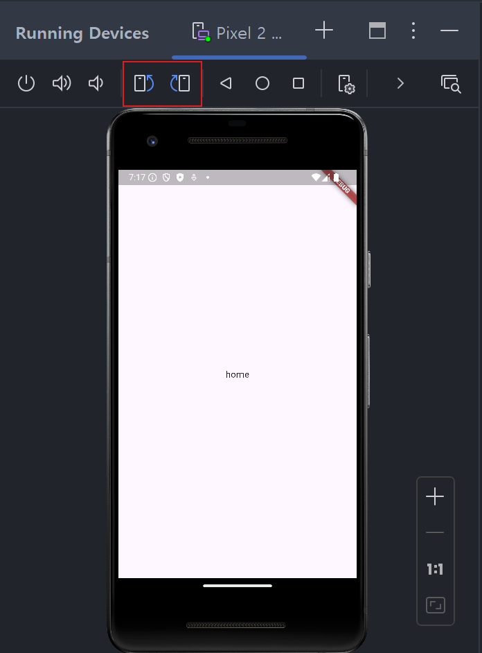|
 
<br>

### 03. 시간 변환 및 String 패딩
- Duration 클래스 : 기간을 표현할 수 있는 클래스

  - DateTime : 특정 날짜
 
- video_player 플러그인 사용

  - 현재 실행되고 있는 영상의 위치, 영상의 총 길이 등을 Duration 클래스로 반환
 
  - 보기 좋은 String 값으로 Duration 클래스 전환
 
    - 개발자가 선호하는 자료 형태와 실사용쟈가 선호하는 자료 형태 다르기 때문

> lib/main.dart
```dart
  import 'package:flutter/material.dart';
  
  void main() {
    Duration duration = Duration(seconds: 192);
    print(duration);    // 기간 출력
    
    runApp(
      MaterialApp(
        home: Scaffold(
          body: Center(
            child: Text(
              'home',
            ),
          ),
        ),
      ),
    );
  }
```
- Duration 클래스를 화면에 그대로 출력

  - 개발자들은 쉽게 이해 가능, 일반 사람은 이해 어려움

> 실행 결과
```
  I/flutter (29938): 0:03:12.000000
```

<br>

- 위 결과에서 '.' 뒷부분을 제외한 앞부분만 출력
> lib/main.dart
```dart
  ...생략...
    Duration duration = Duration(seconds: 192);
    print(duration.toString().split('.')[0]);
  ...생략
```
- split() 함수 : 첫 번째 매개변수에 들어오는 값을 기준으로 String 값을 나누고 각각 나뉜 값을 List 에 넣어 반환

> 실행 결과
```
  I/flutter (29938): 0:03:12
```

<br>

- '시' 단위 생략, '분분:초초' 현태로 Duration 표현
> lib/main.dart
```dart
  ...생략...
    Duration duration = Duration(seconds: 192);
    print(duration);
    print(duration.toString().split('.')[0].split(':').sublist(1, 3).join(':'));
  ...생략...
```
- '.' 기준으로 String 을 split() 해서 밀리초 단위 삭제

- 한번 더 ':' 기준으로 split() 해서 시, 분, 초 단위로 나뉜 List 값 반환

  - 리스트의 맨 앞의 값으로 반환되는 '시' qjfudi gka
 
    - sublist() 함수 이용해 1번 인덱스부터 2번 인덱스의 값들만 모아 join() 함수로 합침

> 실행 결과
```
  I/flutter (29938): 0:03:12.000000
  I/flutter (29938): 03:12
```

<br>

- Duration 클래스의 toString() 함수로 직접 코드 작성
> lib/main.dart
```dart
  ...생략...
    Duration duration = Duration(seconds: 192);
    print(duration);
    print('${duration.inMinutes.toString().padLeft(2, '0')}:${(duration.inSeconds % 60).toString().padLeft(2, '0')}');
    print('23'.padLeft(3, '0'));
    print('233'.padLeft(3, '0'));
  ...생략...
```
- Duration 클래스

  - inMinutes 게터 : 분 단위 시간 가져옴
 
  - inSeconds 게터 : 초 단위 시간 가져옴
 
    - 초 단위 시간은 분의 몫으로 넘어간 값을 제외한 나머지값만 보여주면 됨

- String 클래스

  - padLeft() : 최소 길이에 맞춰서 두 번째 매개변수에 입력된 값을 왼쪽에 채워줌
 
  - padRight() : 최소 길이에 맞춰서 두 번째 매개변수에 입력된 값을 오른쪽에 채워줌

  - pad() 함수들은 String 의 길이를 맞춰주는 역할
 
    - 첫 번째 매개변수 : String 의 최소 길이 입력
   
    - 두 번째 매개변수 : 길이가 부족할 때 채워줄 String 값 입력

> 실행 결과
```
  I/flutter (29938): 0:03:12.000000
  I/flutter (29938): 03:12
  I/flutter (29938): 023
  I/flutter (29938): 233
```
- 최소 3의 길이만큼 String 채워넣어야 하니 '023'

- '233'은 이미 최소 길이인 3 충족하여 그대로 '233'

<br>

---

<br>

12.2 사전 준비
---
### 01. 가상 단말에 동영상 추가
- 에셋 폴더에 추가해둔 동영상 파일들을 모두 에뮬레이터로 복사해야 함

  - [asset] 폴더 내 [video] 폴더 생성하여 원하는 동영상 옮기기

- 동영상 파일을 저장해도 파일 앱이 바로 실행되지 않기 때문에 파일이 잘 옮겨졌는지 직접 확인 필요

  - [Files] 앱 실행 후 왼쪽 상단의 메뉴 아이콘인 햄버거 버튼 클릭
 
  - 열리는 Drawer에서 [Downloads] 탭 클릭
 
  - 복사한 동영상이 모두 복사되어있는지 확인

|Files 앱 실행|햄버거 버튼|Downloads|파일확인|
|:-:|:-:|:-:|:-:|
|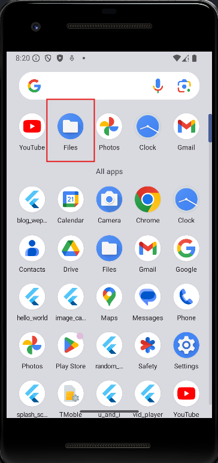|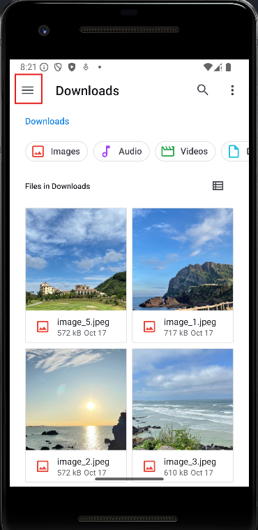|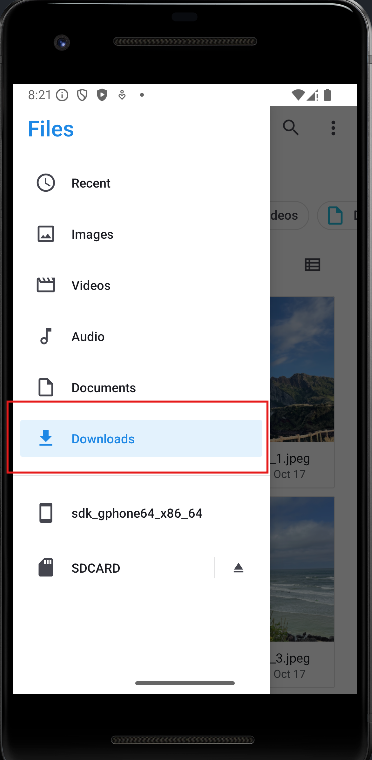|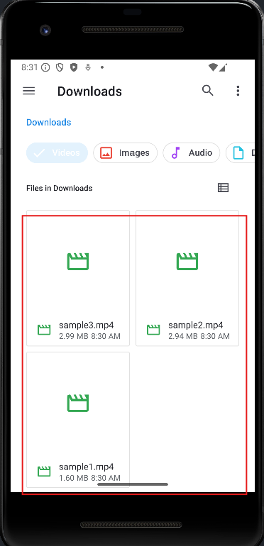|

<br>

### 02. 이미지 추가
- [asset] 폴더 내 [img] 폴더 내 배경 이미지 복사

<br>

### 03. pubspec.yaml 설정 후 [Pub get]
> pubspec.yaml
```dart
  ...생략...
  dependencies:
    flutter:
      sdk: flutter
      
    image_picker: 1.0.4
    video_player: ^2.5.1
    cupertino_icons: ^1.0.8
  
  ...생략...
  
  flutter:
  
    uses-material-design: true
    assets:
      - asset/img/
  ...생략///
```

<br>

### 04. 네이티브 설정(안드로이드용)
- 갤러리 관련 권한 필요

  - 안드로이드에서 갤러리 이미지 또는 동영상 읽기 가능

  - AndroidManifest.xml 파일에서 추가 가능
 
    - android.permission.READ_EXTERNAL_STORAGE 권한 추가
   
> android/app/src/main/AndroidManifest.xml
```dart
  <manifest xmlns:android="http://schemas.android.com/apk/res/android">
      <uses-permission android:name="android.permission.READ_EXTERNAL_STORAGE" />
      <application
          android:label="vid_player"
          android:name="${applicationName}"
          android:icon="@mipmap/ic_launcher">
        <!-- 생략 -->
      </application>
  </manifest>
```

<br>

### 05. 프로젝트 초기화
- [lib] 폴더에 [screen] 폴더 생성 후 HomeScreen 위젯 생성할 home_screen.dart 생성
```dart
  import 'package:flutter/material.dart';
  
  class HomeScreen extends StatelessWidget {
    const HomeScreen({Key? key}) : super(key: key);
    
    @override
    Widget build(BuildContext context) {
      return Scaffold(
        body: Text(
          'Home Screen',
        ),
      );
    }
  }
```

<br>

- lib/main.dart 파일에 HomeScreen 위젯 등록
```dart
  import 'package:flutter/material.dart';
  import 'package:vid_player/screen/home_screen.dart';
  
  void main() {
    runApp(
      MaterialApp(
        home: HomeScreen(),
      ),
    );
  }
```

<br>

---

<br>

12.3 레이아웃 구상
---
- 화면 하나로 구성

- 전체 화면을 차지하는 위젯 두 개를 활용해 조건에 따라 알맞은 위젯 노출

<br>

### 01. 첫 화면 : renderEmpty() 함수
- renderEmpty() : 앱을 처음 실행했을 때 화면에 보여줄 위젯을 반환하는 함수

  - 앱의 로고와 이름을 보여주고, grandient 배경 적용


<br>

### 02. 플레이 화면 : renderVideo() 함수
- 로고를 눌러서 실행하고 싶은 동영상 선택시 화면에 보여줄 위젯 반환

- 동영상을 볼 수 있고 동영상을 컨트롤할 수 있는 버튼 존재

  - 영상을 재생하거나 일시정지
 
  - 3초 전으로 돌리거나 3초 후로 이동
 
  - 새로운 영상 선택

<br>

---

<br>

12.4 구현
---
- ImagePicker 이용해 동영상을 선택하는 기능 구현 및 동영상 실행 기능 구현

<br>

### 01. 첫 화면 : renderEmpty() 함수 구현
- 홈 스크린에서 동영상 파일 선택과 관련해서 상태 관리

  - HomeScreen 클래스를 StatefulWidget 으로 구성
 
- image_picker 플러그인 : 이미지나 동영상을 선택했을 때 XFile 이라는 클래스 형태로 선택된 값 반환

- HomeScreen 에 선택된 동영상을 의미하는 XFile 형태의 video 변수 선언

  - 그 값을 기반으로 renderEmpty() 함수를 보여줄지, renderVideo() 함수 보여줄지 지정

- renderEmpty() 함수 설계

  - Column 위젯에 로고 넣고 바로 아래 앱 이름 넣기
 
    - _Logo 위젯으로 로고 코드 작성
   
    - _AppName 위젯으로 앱 이름 작업

> lib/screen/home_screen.dart
```dart
  import 'package:flutter/material.dart';
  import 'package:image_picker/image_picker.dart';
  
  class HomeScreen extends StatefulWidget {
    // StatelessWidget -> StatefulWidget
    const HomeScreen({Key? key}) : super(key: key);
  
    @override
    State<HomeScreen> createState() => _HomeScreenState();
  }
  
  class _HomeScreenState extends State<HomeScreen> {
    XFile? video;     // 1. 동영상 저장할 변수
  
    @override
    Widget build(BuildContext context) {
      return Scaffold(
        backgroundColor: Colors.black,
        // 2. 동영상이 선택됐을 때와 선택 안 됐을 때 보여줄 위젯
        body: video == null ? renderEmpty() : renderVideo(),
      );
    }
  
    // 3. 동영상 선택 전 보여줄 위젯
    Widget renderEmpty() {
      return Container(
        width: MediaQuery.of(context).size.width,   // 너비 최대로 늘려주기
        child: Column(
          // 위젯들 가운데 정렬
          mainAxisAlignment: MainAxisAlignment.center,
          children: [
            _Logo(),      // 로고 이미지
            SizedBox(height: 30.0),
            _AppName(),   // 앱 이름
          ],
        ),
      );
    }
  
    // 4. 동영상 선택 후 보여줄 위젯
    Widget renderVideo() {
        return Container();
    }
  }
  
  class _Logo extends StatelessWidget {
    const _Logo({Key? key}) : super(key: key);
  
    @override
    Widget build(BuildContext context) {
      return Image.asset(
        'asset/img/logo.png',   // 로고 이미지
      );
    }
  }
  
  class _AppName extends StatelessWidget {  // 앱 제목을 보여줄 위젯
    const _AppName({Key? key}) : super(key: key);
  
    @override
    Widget build(BuildContext context) {
      final textStyle = TextStyle(
        color: Colors.white,
        fontSize: 30.0,
        fontWeight: FontWeight.w300,
      );
  
      return Row(
        mainAxisAlignment: MainAxisAlignment.center,  // 글자 가운데 정렬
        children: [
          Text(
            'VIDEO',
            style: textStyle,
          ),
          Text(
            'PLAYER',
            style: textStyle.copyWith(
              // 5. TextStyle 에서 두꼐만 700 으로 변경
              fontWeight: FontWeight.w700,
            ),
          ),
        ],
      );
    }
  }
```
- image_picker 플러그인 사용시 XFile 클래스 형태로 동영상 받을 수 있음

  - 선택된 동영상이 있으면 해당 변수에 저장
 
- 선택된 동영상이 없으면 renderEmpty() 함수가 반환하는 위젯 노출

  - 선택된 동영상이 있으면 renderVideo() 함수가 반환하는 위젯 노출
 
- renderEmpty() : 선택된 동영상이 없을 때 보여줄 위젯을 렌더링하는 함수

- renderVideo() : 선택된 동영상이 있을 때 보여줄 위젯을 렌더링하는 함수

- TextStyle 의 copyWith 함수 : 현재 속성들을 그대로 유지한채로 특정 속성만 변경 가능한 함수

> 실행 결과

|-|
|-|
|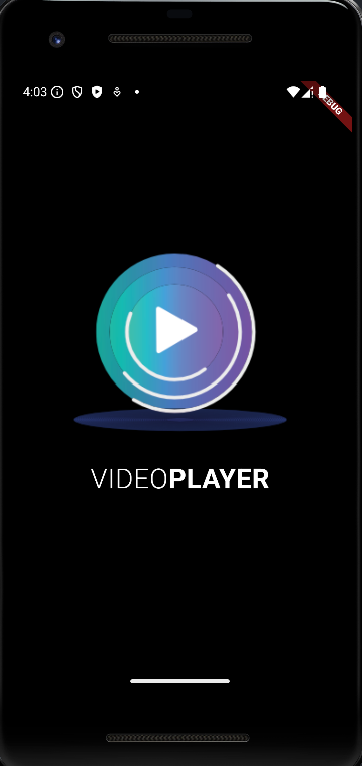|

<br>

### 02. 배경색 그라데이션 구현
- BoxDecoration 클래스

  - Container 위젯의 배경색, 테두리, 모서리 둥근 정도 등 전반적 디자인 변경 가능

- BoxDecoration 클래스의 gradient 매개변수

  - LinearGradient : 시작 부위부터 끝 부위까지 점점 색이 변함
 
  - RadialGradient : 중앙에서 색깔이 점점 퍼져가는 형태

> lib/screen/home_screen.dart
```dart
...생략...
class _HomeScreenState extends State<HomeScreen> {
  ...생략...
  // 동영상 선택 전 보여줄 위젯
  Widget renderEmpty() {
    return Container(
      width: MediaQuery.of(context).size.width,
      decoration: getBoxDecoration(),   // 1. 함수로부터 값 가져오기
      ...생략...
    );
  }

  BoxDecoration getBoxDecoration() {
    return BoxDecoration(
      // 2. 그라데이션으로 색상 적용
      gradient: LinearGradient(
        begin: Alignment.topCenter,
        end: Alignment.bottomCenter,
        colors: [
          Color(0xFF2A3A7C),
          Color(0xFF000118),
        ],
      ),
    );
  }
  ...셍략...
}
```
- decoration 매개변수에 들어갈 BoxDecoration 값을 getBoxDecoration() 함수에서 구현

- LinearGradient 클래스에 시작과 끝을 정하는 begin 과 end 매개변수 지정

  - Alignment 클래스를 사용해 정렬
 
- colors 매개변수에 배경을 구성할 색상들을 List 로 입력
 
  - 색상은 begin 에 입력된 위치부터 end 에 입력된 위치까지 순서대로 적용됨

> 실행 결과

|-|
|-|
|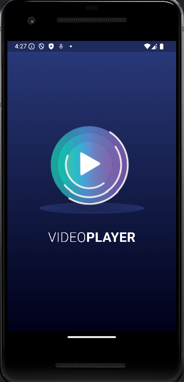|

<br>

### 03. 파일 선택 기능 구현
- 로고를 탭하면 비디오와 사진을 선택할 수 있는 기능 구현

  - 사용자가 파일을 선택했을 때 변수값을 처리하는 코드 작성
 
- _Logo 위젯에 GestureDetector 추가해 onTap() 함수가 실행됐을 때 동영상 선택하는 함수 실행

> lib/screen/home_screen.dart
```dart
...생략...
class _HomeScreenState extends State<HomeScreen> {
  ...생략
  Widget renderEmpty() {
    return Container(
      width: MediaQuery.of(context).size.width,
      decoration: getBoxDecoration(),
      child: Column(
        mainAxisAlignment: MainAxisAlignment.center,
        children: [
          _Logo(
            onTap: onNewVideoPressed,   // 1. 로고 탭하면 실행하는 함수
          ),
          SizedBox(height: 30.0),
          _AppName(),
        ],
      ),
    );
  }

  void onNewVideoPressed() async {    // 2. 이미지 선택하는 기능을 구현한 함수
    final video = await ImagePicker().pickVideo(
      source: ImageSource.gallery,
    );
    
    if (video != null) {
      setState(() {
        this.video = video;
      });
    }
  }
  ...생략...
}

class _Logo extends StatelessWidget {
  final GestureTapCallback onTap;   // 탭 했을 때 실행할 함수
  
  const _Logo({required this.onTap, Key? key}) : super(key: key);

  @override
  Widget build(BuildContext context) {
    return GestureDetector(
      onTap: onTap,     // 3. 상위 위젯으로부터 탭 콜백받기
      child: Image.asset(
        'asset/img/logo.png',   // 로고 이미지
      ),
    );
  }
}
...생략...
```
- _Logo 위젯 탭했을 때 실행되는 onTap 매개변수에 onNewVideoPressed() 함수 입력

  - 로고 탭하면 동영상을 선택하는 화면 실행됨
 
- ImagePicker().pickVideo() 함수 실행시 동영상을 선택하는 화면 실행

  - source 매개변수
 
    - ImageSource.gallery : 이미 저장되어 있는 동영상을 갤러리로부터 선택하는 화면 실행
   
    - ImageSource.camera : 카메라를 실행한 후 동영상 촬영을 마치면 해당 영상 선택
   
  - 선택된 동영상을 XFile 형태로 비동기로 반환받을 수 있음
 
  - 사용자가 선택한 값이 존재하면 video 변수에 저장
 
- Image.asset 을 GestureDetector 로 감싸서 onTap() 함수를 외부로부터 입력받기

  - _HomeScreenState 의 onNewVideoPressed() 함수 입력받음

> 실행 결과

|로고 탭|탭 이후|
|-|-|
|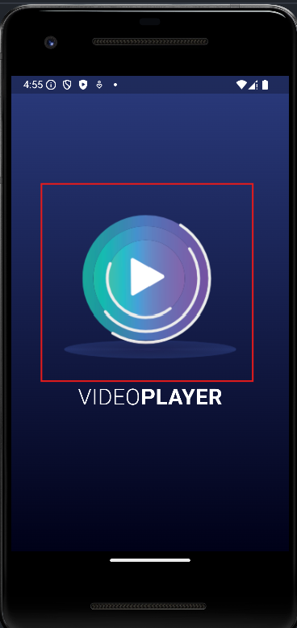|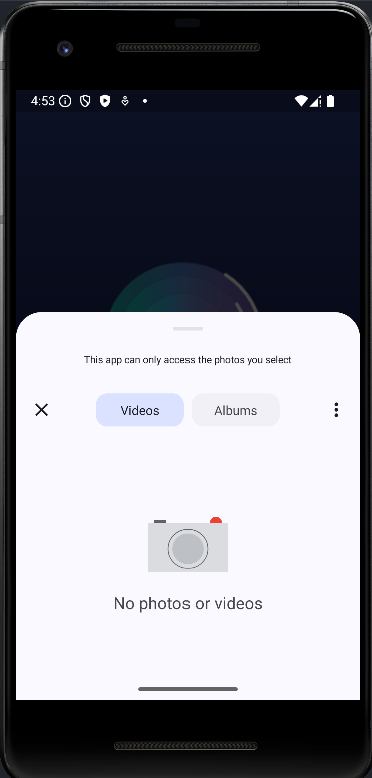|

<br>

### 04. 플레이어 화면 구현
- CustomVideoPlayer 위젯을 따로 생성해 영상 재생과 관련된 모든 코딩 작업

  - 화면 정중앙에 배치
  
> lib/screen/home_screen.dart
```dart
  ...생략...
  class _HomeScreenState extends State<HomeScreen> {
    ...생략...
    Widget renderVideo() {
        return Container(
          child: CustomVideoPlayer(), // 동영상 재생기 위젯
        );
    }
  }
  ...생략...
```

<br>

### 05. 동영상 재생기 구현
#### (1) 컴포넌트 생성
- [lib] 아래에 [component] 폴더 생성 후 custom_video_player.dart 파일 생성

- CustomVideoPlayer 위젯 : HomeScreen 위젯에서 선택된 동영상을 재생하는 모든 상태 관리

  - StatefulWidget 생성
  
  - 위젯이 잘 렌더링되는지 확인하는용도로 CustomVideoPlayer 글자만 정가운데 위치

> lib/component/custom_video_player.dart
```dart
  import 'package:flutter/material.dart';
  import 'package:image_picker/image_picker.dart';
  
  // 1. 동영상 위젯 생성
  class CustomVideoPlayer extends StatefulWidget {
    // 선택한 동영상을 저장할 변수
    // XFile 은 ImagePicker 로 영상 또는 이미지를 선택했을 때 반환하는 타입
    final XFile video;
  
    const CustomVideoPlayer({
      required this.video,  // 상위에서 선택한 동영상 주입해주기
      Key? key,
    }) : super(key: key);
  
    @override
    State<CustomVideoPlayer> createState() => _CustomVideoPlayerState();
  }
  
  class _CustomVideoPlayerState extends State<CustomVideoPlayer> {
    @override
    Widget build(BuildContext context) {
      return Center(
        child: Text(
          'CustomVideoPlayer',    // 2. 샘플 텍스트
          style: TextStyle(
            color: Colors.white,
          ),
        ),
      );
    }
  }
```

<br>


#### (2) home_screen.dart 내 CustomVideoPlayer 위젯에 video 매개변수 제공
> lib/screen/home_screen.dart
```dart
// 1. CustomVideoPlayer 위젯 파일 임포트
import 'package:vid_player/component/custom_video_player.dart';
...생략...

class _HomeScreenState extends State<HomeScreen> {
...생략...
  Widget renderVideo() {
      return Center(
        child: CustomVideoPlayer(
          video: video!,    // 2. 선택된 동영상 입력해주기
        ),
      );
  }
}

...생략...
```

> 실행 결과

|로고 탭하여 동영상 선택|동영상 선택 후 화면|
|-|-|
||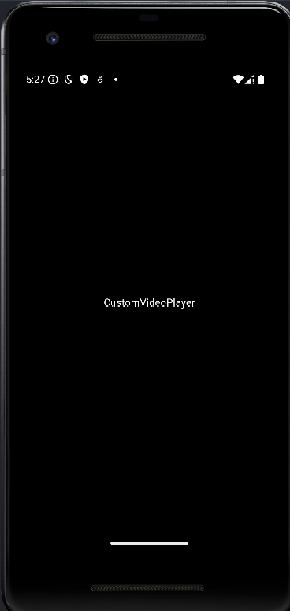|

<br>

#### (3) CustomVideoPlayer 위젯 기능 개선
- video_player 패키지

  - VideoPlayerController 와 VideoPlayer 위젯을 사용해 선택한 동영상을 화면에 보여주는 기능 구현

> lib/component/custom_video_player.dart
```dart
  ...생략...
  import 'package:video_player/video_player.dart';
  import 'dart:io';   // 파일 관련 작업 패키지
  
  ...생략...
  
  class _CustomVideoPlayerState extends State<CustomVideoPlayer> {
    // 1. 동영상을 조작하는 컨트롤러
    VideoPlayerController? videoController;
    
    @override
    void initState() {
      super.initState();
      
      initializeController();  // 2. 컨트롤러 초기화
    }
    
    initializeController() async {  // 3. 선택한 동영상으로 컨트롤러 초기화
      final videoController = VideoPlayerController.file(
        File(widget.video.path),
      );
      
      await videoController.initialize();
      
      setState(() {
        this.videoController = videoController;
      });
    }
    
    @override
    Widget build(BuildContext context) {
      // 4. 동영상 컨트롤러가 준비 중일 때 로딩 표시
      if (videoController == null) {
        return Center(
          child: CircularProgressIndicator(),
        );
      }
      
      return AspectRatio(   // 5. 동영상 비율에 따른 화면 렌더링
        aspectRatio: videoController!.value.aspectRatio,
        child: VideoPlayer(
          videoController!,
        ),
      );
    }
  }
```
- VideoPlayer 위젯 : VideoPlayerController 로 조작 가능

  - initState() 함수에서 설정할 VideoPlayerController 선언
 
- initializeController : VideoPlayerController 선언하는 역할

  - VideoPlayerController 는 State 생성되는 순간 한 번만 생성되어야 하니 initState() 함수에서 선언
 
- 파일로부터 VideoPlayerController 생성

  - VideoPlayerController.file 생성자를 이용해 컨트롤러 만들기
 
    - initialize() 함수 실행해 동영상 재생 가능 상태 준비
   
    - 에러 없이 initialize() 함수 완료되면 VideoPlayerController 사용 가능 상태
   
      - setState() 함수 이용해 this.videoController 에 준비한 videoController 변수 저장

- VideoPlayerController 가 성공적으로 초기화되어야만 videoPlayer 변수가 null 이 아닌 조건 생성 가능

  - videoPlayer 변수가 null 이면 VideoPlayerController 사용할 수 있는 상태가 아님
 
    - CircularProgressIndicator 띄워 로딩 중임을 암시
   
- AspectRatio : child 매개변수에 입력되는 위젯의 비율을 정할 수 있는 위젯

  - 매개변수에 원하는 비율 입력 가능
 
    - 너비/높이로 입력
   
    - ex) 16:9 비율 => 16/9 입력
   
  - VideoPlayerController 선언하면 입력된 동영상 비율을 value.aspectRatio 게터로 받아올 수 있음

> 실행 결과

|-|
|-|
|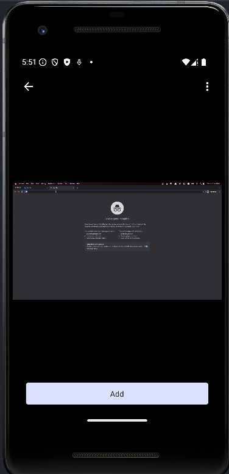|

<br>

#### 💡 VideoPlayerController 의 네임드 생성자(Named Constructors)
|생성자 이름|설명|
|-|-|
|VideoPlayerController.asset|asset 파일의 경로로부터 동영상을 불러옴|
|VideoPlayerController.network|네트워크 URL 로부터 동영상을 불러옴|
|VideoPlayerController.file|파일 경로로부터 동영상 불러옴|

<br>

### 06. Slider 위젯 동영상과 연동
#### (1) Slider 위젯을 사용해 동영상의 현재 재생 위치와 연동

  - Slider 위젯을 사용자가 스크롤하면 동영상이 해당되는 위치로 이동
 
  - 동영상이 실행되는 위치에 따라 자동으로 Slider 위젯이 움직여줘야 함
 
- VideoPlayer 위젯 위에 Slider 위젯이 위치하도록 Stack 위젯 사용

  - return 코드만 변경하면 됨

> lib/component/custom_video_player.dart
```dart
  class _CustomVideoPlayerState extends State<CustomVideoPlayer> {
  ...생략...
    @override
    Widget build(BuildContext context) {
      if (videoController == null) {
        return Center(
          child: CircularProgressIndicator(),
        );
      }
  
      return AspectRatio( 
        aspectRatio: videoController!.value.aspectRatio,
        child: Stack(       // 1. children 위젯을 위로 쌓을 수 있는 위젯
          children: [
            VideoPlayer(    // VideoPlayer 위젯을 Stack 으로 이동
              videoController!,
            ),
            Positioned(     // 2. child 위젯의 위치를 정할 수 있는 위젯
              bottom: 0,
              right: 0,
              left: 0,
              child: Slider(  // 3. 동영상 재생 상태를 보여주는 슬라이더
                onChanged: (double val){},
                value: 0,
                min: 0,
                max: videoController!.value.duration.inSeconds.toDouble(),
              ),
            ),
          ],
        ),
      );
    }
  }
```
- Stack 위젯 : Column 위젯과 Row 위젯처럼 children 매개변수에 여러 개의 위젯 위치 가능

  - 위젯이 List 에 입력되는 순서대로 아래부터 쌓아올려짐
 
- Stack 위젯은 기본적으로 children 위젯을 정중앙에 위치시킴

  - Stack 위젯 내부의 특정 위치에 위젯을 위치시키고 싶다면 Positioned 위젯 사용해 지정
 
    - child 매개변수 외 top, bottom, left, right 매개변수 입력 가능
   
      - 각각 위아래, 왼쪽, 오른쪽에서 몇 픽셀에 child 위젯을 위치할지 지정
     
      - bottom 매개변수에 0 입력시 Stack 위젯의 가장 아래에 Slider 위젯 위치
     
      - Slider 위젯이 최소한의 크기를 차지
     
        - 왼쪽~오른쪽 끝까지 늘어나게 하려면 left, right 매개변수에 0 값 입력
       
- Slider 위젯의 min 값은 항상 0

  - 동영상의 시작은 항상 0초부터 시작하기 때문
 
  - 최대값은 선택된 동영상의 재생 길이르 초 단위로 변환
 
    - videoController 변수의 value.duration 게터를 불러와서 Duration 클래스로 저넻 영상 길이 받아오기
   
    - inSeconds 게터를 이용해서 전체 길이를 초로 변환한 값 가져오기
   
    - int 값으로 반환되는 inSeconds 게터에 toDouble() 함수 실행해 double 형태로 형변환
   
      - max 매개변수는 int 가 아닌 double 값을 입력해야 함

> 실행 결과

|-|
|-|
|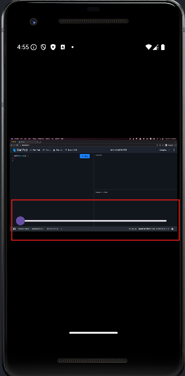|

<br>

#### (2) Slider 위젯의 매개변수들의 값 작업
- value 매개변수 : 현재값을 의미

  - 동영상의 현재 재생 위치를 초 단위로 변환한 값과 연동되어야 함
 
- onChanged 매개변수

  - VideoPlayerController 와 연동해 동영상 실행 위치 변경
 
    - value.position : 동영상이 현재 재생되고 있는 위치 가져옴
   
    - seekTo() : 동영상의 재생 위치 변경

> lib/component/custom_video_player.dart
```dart
class _CustomVideoPlayerState extends State<CustomVideoPlayer> {
...생략...
  @override
  Widget build(BuildContext context) {
    if (videoController == null) {
      return Center(
        child: CircularProgressIndicator(),
      );
    }

    return AspectRatio(
      aspectRatio: videoController!.value.aspectRatio,
      child: Stack(
        children: [
          VideoPlayer(
            videoController!,
          ),
          Positioned(
            bottom: 0,
            right: 0,
            left: 0,
            child: Slider(
              // 1. 슬라이더가 이동할 때마다 실행할 함수
              onChanged: (double val){
                videoController!.seekTo(
                  Duration(seconds: val.toInt()),
                );
              },
              
              // 2. 동영상 재생 위치를 초 단위로 표현
              value: videoController!.value.position.inSeconds.toDouble(),
              // value: 0,
              min: 0,
              max: videoController!.value.duration.inSeconds.toDouble(),
            ),
          ),
        ],
      ),
    );
  }
}
```
- seekTo() 매개변수에 Duration 값 입력

  - onChanged() 함수에 제공되는 val 값을 int 로 변경해서 Slider 위젯에서 입력된 재생 위치 받기 가능
 
- position.inSeconds 게터 실행시 현재 동영상이 실행되고 있는 위치 받기 가능

<br>

### 07. 동영상 컨트롤 버튼 구현
#### (1) 동영상 컨트롤 버튼(재생/일시정지, 뒤로 3초 이동, 앞으로 3초 이동, 새 동영상 선책)

  - 중복 코드 방지로 일반화된 위젯 구현

  - IconButton 의 onPressed 매개변수와 아이콘 모양을 결정짓는 IconData 값만 외부에서 입력받도록 작성

> lib/component/custom_icon_button.dart
```dart
  import 'package:flutter/material.dart';
  
  class CustomIconButton extends StatelessWidget {
    final GestureTapCallback onPressed;   // 아이콘을 눌렀을 때 실행할 함수
    final IconData iconData;              // 아이콘
  
    const CustomIconButton({
      required this.onPressed,
      required this.iconData,
      Key? key,
    }) : super(key: key);
    
    @override
    Widget build(BuildContext context){
      return IconButton(        // 아이콘 버튼으로 만들어주는 위젯
        onPressed: onPressed,   // 아이콘 눌렀을 때 실행할 함수
        iconSize: 30.0,         // 아이콘 크기
        color: Colors.white,    // 아이콘 색상
        icon: Icon(
          iconData,
        ),
      );
    }
  }
```

<br>

#### (2) 버튼들을 CustomIconButton 위젯으로 구현

  - Stack 위젯에서 Positioned 위젯이 아니어도 Align 위젯 사용해 children 위젯 정렬 가능
 
    - alignment 매개변수 입력 가능
   
      - LinearGradient 클래스의 begin, end 매개변수에 입력했던 값과 같은 Alignment 클래스 이용해 정렬 지정 가능

> lib/component/custom_video_player.dart
```dart
  // CustomIconButton 위젯 불러오기
  import 'package:vid_player/component/custom_icon_button.dart';
  ...생략...
  class _CustomVideoPlayerState extends State<CustomVideoPlayer> {
  ...생략...
    @override
    Widget build(BuildContext context) {
      ...생략...
  
      return AspectRatio( 
        aspectRatio: videoController!.value.aspectRatio,
        child: Stack( 
          children: [
            VideoPlayer(
              videoController!,
            ),
            Positioned(
              ...생략...
              ),
            Align(
              // 1. 오른쪽 위에 새 동영상 아이콘 위치
              alignment: Alignment.topRight,
              child: CustomIconButton(
                onPressed: (){},
                iconData: Icons.photo_camera_back,
              ),
            ),
            Align(
              // 2. 동영상 재생 관련 아이콘 중앙에 위치
              alignment: Alignment.center,
              child: Row(
                mainAxisAlignment: MainAxisAlignment.spaceEvenly,
                children: [
                  CustomIconButton(   // 되감기 버튼
                    onPressed: (){},
                    iconData: Icons.rotate_left,
                  ),
                  CustomIconButton(   // 재생 버튼
                    onPressed: (){},
                    iconData: videoController!.value.isPlaying ?
                        Icons.pause : Icons.play_arrow,
                  ),
                  CustomIconButton(   // 앞으로 감기 버튼
                    onPressed: (){},
                    iconData: Icons.rotate_right,
                  ),
                ],
              ),
            ),
          ],
        ),
      );
    }
  }
```
- 새 동영상 선택하기 아이콘은 오른쪽 위에 배치

- 나머지 새 버튼은 가운데 정렬을 하고 MainAxisAlignment.spaceEvenly 사용해 아이콘 간 간격 동일하게 적용

  - videoController.value.isPlaying 게터 이용해 현재 동영상이 재생 중인지 확인 가능
 
    - 재생 중이면 true 값 반환
   
      - 동영상이 재생 중이면 가운데 버튼 일시정지 아이콘
     
      - 동영상이 일시정지 중이라면 재생 버튼

> 실행 결과

|-|
|-|
|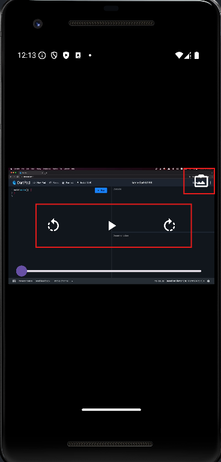|

<br>

#### (3) 버튼들에 onPressed 매개변수값 설정
- 동영상 재생과 관련된 새 버튼의 기능 구현

  - 현재 동영상이 재생되는 위치를 변경하는 건 seekTo() 함수 사용해 구현 가능
 
  - 가운데 재생 버튼은 일시정지 기능을 하는 pause() 함수 & play() 함수 이용해 구현 가능

> lib/componenet/custom_video_player.dart
```dart
  ...생략...
  class _CustomVideoPlayerState extends State<CustomVideoPlayer> {
  ...생략...
    @override
    Widget build(BuildContext context) {
    ...생략...
      return AspectRatio( 
        aspectRatio: videoController!.value.aspectRatio,
        child: Stack(
          children: [
            VideoPlayer( 
              videoController!,
            ),
            Positioned(
              ...생략...
            ),
            Align(
              alignment: Alignment.topRight,
              child: CustomIconButton(
                onPressed: (){},
                iconData: Icons.photo_camera_back,
              ),
            ),
            Align(
              alignment: Alignment.center,
              child: Row(
                mainAxisAlignment: MainAxisAlignment.spaceEvenly,
                children: [
                  CustomIconButton(
                    onPressed: onReversePressed,
                    iconData: Icons.rotate_left,
                  ),
                  CustomIconButton(
                    onPressed: onPlayPressed,
                    iconData: videoController!.value.isPlaying ?
                        Icons.pause : Icons.play_arrow,
                  ),
                  CustomIconButton(
                    onPressed: onForwardPressed,
                    iconData: Icons.rotate_right,
                  ),
                ],
              ),
            ),
          ],
        ),
      );
    }
    void onReversePressed() {     // 1. 되감기 버튼 눌렀을 때 실행할 함수
      final currentPosition = videoController!.value.position;  // 현재 실행 중인 위치
      
      Duration position = Duration();   // 0초로 실행 위치 초기화
      
      if (currentPosition.inSeconds > 3) {  // 현재 실행 위치가 3초보다 길 때만 3초 빼기
        position = currentPosition - Duration(seconds: 3);
      }
      
      videoController!.seekTo(position);
    }
    
    void onForwardPressed() {     // 2. 앞으로 감기 버튼 눌렀을 때 실행할 함수
      final maxPosition = videoController!.value.duration;  // 동영상 길이
      final currentPosition = videoController!.value.position;
      
      Duration position = maxPosition;    // 동영상 길이로 실행 위치 초기화
  
      // 동영상 길이에서 3초를 뺀 값보다 현재 위치가 짧을 때만 3초 더하기
      if ((maxPosition - Duration(seconds: 3)).inSeconds >
          currentPosition.inSeconds) {
        position = currentPosition + Duration(seconds: 3);
      }
  
      videoController!.seekTo(position);
    }
  
    void onPlayPressed() {    // 3. 재생 버튼을 눌렀을 때 실행할 함수
      if (videoController!.value.isPlaying) {
        videoController!.pause();
      } else {
        videoController!.play();
      }
    }
  }
```
- 뒤로 3초 돌리기 버튼 눌렀을 때 실행되는 함수

  - 현재 실행되고 있는 동영상의 위치가 3초보다 길면 현재 위치에서 3초를 뺀 위치로 이동
 
  - 현재 실행되고 있는 동영상의 위치가 3초보다 짧으면 0초의 위치로 이동
 
- 앞으로 3초 돌리기 버튼 눌렀을 때 실행되는 함수

  - 기본값을 동영상의 최대 길이로 설정

  - 현재 실행 중인 위치에서 3초를 더한 길이가 동영상 전체 길이보다 짧으면 현재 위치에서 3초를 더한 위치로 이동
 
  - 현재 실행 중인 위치에서 3초를 더한 길이가 동영상 전체 길이보다 길면 동영상의 끝으로 이동
 
- 재생 버튼 눌렀을 때 실행되는 함수

  - 현재 동영상이 실행 중이면 일시정지 기능인 pause() 함수실행
 
  - 현재 동영상이 일시정지 중이면 동영상을 실행하는 play() 함수 실행
 
  - 버튼을 재생 아이콘 또는 일시정지 아이콘으로 변경해줘야 하니 setState() 함수 실행

<br>

#### (4) 현재 동영상 위치 Slider 위젯에 반영
- 현재 Slider 위젯은 videoController 변수에서 가져오는 현재 동영상의 실행 위치값을 value 매개변수에 입력

  - 현재 실행되고 있는 위치가 바뀔때마다 build() 함수가 계속 실행되어야 함
 
    - 지금은 Slider 위젯이 한 번 빌드되면 다시 빌드되지 않는 상태
   
  - addListener() 함수 사용해 videoController 변수의 상태가 변경될 때마다 setState() 함수로 build() 함수 재실행

> lib/component/custom_video_player.dart
```dart
  class _CustomVideoPlayerState extends State<CustomVideoPlayer> {
    ...생략...
    initializeController() async { 
      final videoController = VideoPlayerController.file(
        File(widget.video.path),
      );
  
      await videoController.initialize();
  
      // 1. 컨트롤러의 속성이 변경될 때마다 실행할 함수 등록
      videoController.addListener(videoControllerListener);
  
      setState(() {
        this.videoController = videoController;
      });
    }
  
    // 동영상의 재생 상태가 변경될 때마다 setStat() 실행해 build() 재실행
    void videoControllerListener() {
      setState((){});
    }
  
    // State 폐기될 때 같이 폐기할 함수 실행
    @override
    void dispose(){
      // 2. listener 삭제
      videoController?.removeListener(videoControllerListener);
      super.dispose();
    }
    ...생략...
  }
```
- addListener() 함수에 videoControllerListener() 함수 제공

  - videoController 속성 변경될 때마다 실행
 
  - videoControllerListener() 함수 : estState() 함수 매번 실행
  
    - (동영상의 현재 재생 위치 등) videoController 속성이 변경될 때마다 build() 함수 재실행

- addListener() 함수 실행하면 꼭 dispose() 함수에서 removeListener() 함수 실행

  - 리소스 사용 최적화

> 실행 결과

|-|
|-|
|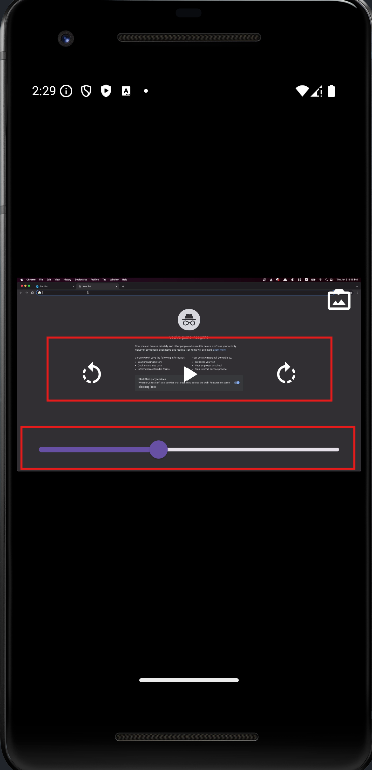|

<br>

#### (5) 영상 선택 버튼 기능 정의
- 기능은 HomeScreen 에 이미 정의해둠

  - onNewVideoPressed() 함수 전달하는 방식으로 작업

> lib/screen/home_screen.dart
```dart
  ...생략...
    Widget renderVideo() {
        return Center(    // 동영상 재생기 가운데 정렬
          child: CustomVideoPlayer(
            video: video!,    // 선택된 동영상 입력해주기
            onNewVideoPressed: onNewVideoPressed,
          ),
        );
    }
  ...생략
```

> lib/component/custom_video_player.dart
```dart
  ...생략...
  class CustomVideoPlayer extends StatefulWidget {
    final XFile video;
    
    // 새로운 동영상을 선택하면 실행되는 함수
    final GestureTapCallback onNewVideoPressed;
  
    const CustomVideoPlayer({
      required this.video,  // 상위에서 선택한 동영상 주입해주기
      required this.onNewVideoPressed,
      Key? key,
    }) : super(key: key);
    ...생략...
  
  class _CustomVideoPlayerState extends State<CustomVideoPlayer> {
    ...생략...
      return AspectRatio(
        aspectRatio: videoController!.value.aspectRatio,
        child: Stack(
          children: [
            VideoPlayer(
              videoController!,
            ),
            Positioned(
              ...생략...
            ),
            Align(
              // 오른쪽 위에 새 동영상 아이콘 위치
              alignment: Alignment.topRight,
              child: CustomIconButton(
                // 카메라 아이콘을 선택하면 새로운 동영상 선택 함수 실행
                onPressed: widget.onNewVideoPressed,
                iconData: Icons.photo_camera_back,
              ),
            ),
            Align(
              ...생략...
              ),
            ),
          ],
        ),
      );
    }
    ...생략...
  }
```

> 실행 결과

|-|
|-|
|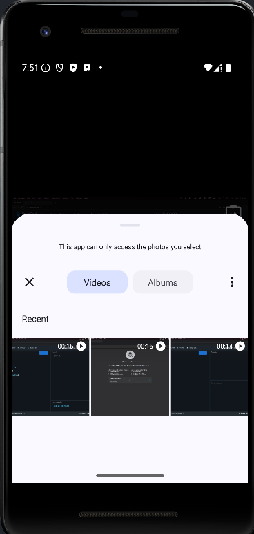|

<br>

#### (6) 동영상을 이미 선택한 상태에서도 새로운 동영상 선택 가능
- 버튼 누르면 image_picker 작동하지만 화면에는 새로 선택한 영상 실행 X

  - 동영상의 소스를 videoController 변수를 인스턴화할 때 선언
 
    - 현재 코드에서 videoController 변수는 initState() 함수에서만 선언되기 때문
   
- 해결

  - StatefulWidget 생명주기의 함수인 didUpdateWidget() 함수 사용

  - 새로운 동영상이 선택되었을 때 videoController 새로 생성하도록 코드 추가

> lib/component/custom_video_player.dart
```dart
  ...생략...
  class _CustomVideoPlayerState extends State<CustomVideoPlayer> {
    VideoPlayerController? videoController;
    
    @override
    // covariant 키워드는 CustomVideoPlayer 클래스의 상속된 값도 허가해줌
    void didUpdateWidget(covariant CustomVideoPlayer oldWidget) {
      super. didUpdateWidget(oldWidget);
      
      // 새로 선택한 동영상이 같은 동영상인지 확인
      if(oldWidget.video.path != widget.video.path) {
        initializeController();
      }
    }
    ...생략...
```
- statefulWidget 생명주기 : 위젯은 매개변수의 값이 변경될 때 폐기되고 새로 생성됨

  - didUpdateWidget 첫 번째 매개변수에 입력되는 oldWidget : 폐기되는 위젯
 
  - 폐기되는 위젯의 동영상 경로가 새로 생성되는 위젯의 동영상 경로와 다르다면 initializeController() 재실행
 
    - videoController 변수 재생성

<br>

### 08. 컨트롤러 감추기 기능 만들기
- 화면을 한 번 탭하면 컨트롤이 숨겨지고 다시 탭하면 컨트롤 노출

> lib/component/custom_video_player.dart
```dart
  ...생략...
  class _CustomVideoPlayerState extends State<CustomVideoPlayer> {
    bool showControls = false;    // 1. 동영상 조작하는 아이콘 노출 여부
    ...생략...
    @override
    Widget build(BuildContext context) {
    ...생략...
    @override
    Widget build(BuildContext context) {
      if (videoController == null) {
        return Center(
          child: CircularProgressIndicator(),
        );
      }
  
      return GestureDetector(   // 2. 화면 전체의 탭을 인식하기 위해 사용
        onTap: () {
          setState((){
            showControls = !showControls;
          });
        },
        child: AspectRatio(
          aspectRatio: videoController!.value.aspectRatio,
          child: Stack(
            children: [
              VideoPlayer(
                videoController!,
              ),
              if(showControls)
                Container(    // 3. 아이콘 버튼을 보일 때 화면을 어둡게 변경
                  color: Colors.black.withOpacity(0.5),
                ),
              Positioned(
              ...생략...
              ),
  
              // showControls 가 true 일 때만 아이콘 보여주기
              if(showControls)
                Align(    // 동영상 새로 선택하기 버튼
                ...생략...
                ),
              if(showControls)
                Align(    // 동영상 컨트롤 버튼
                ...생략...
                ),
            ],
          ),
        )
      );
    }
    ...생략...
  }
```
- showControls 변수를 선언해서 true 일 때는 동영상 컨트롤 버튼 보여주고 false 일때 보여주지 않음

- 동영상 플레이어를 통째로 GestureDetector 에 감싸서 탭했을 때의 콜백 함수 받기

- 밝은 배경의 영상을 틀었을 때 컨트롤 가시성을 위해 50% 투명도가 있는 검정 배경 추가

- 다트 언어에서는 List 안에서 직접 if 문 사용 가능

  - showControls 가 true 일 때만 바로 아래의 위젯을 렌더링하겠다는 의미

> 실행 결과

|컨트롤이 숨겨진 상태|컨트롤이 보이는 상태|
|-|
|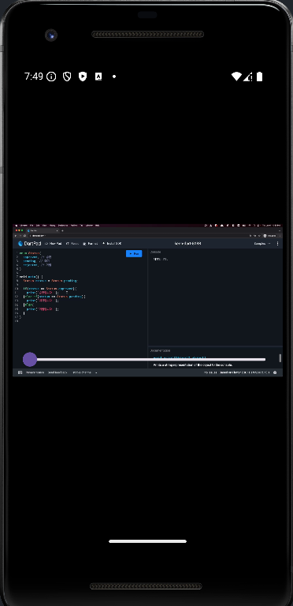|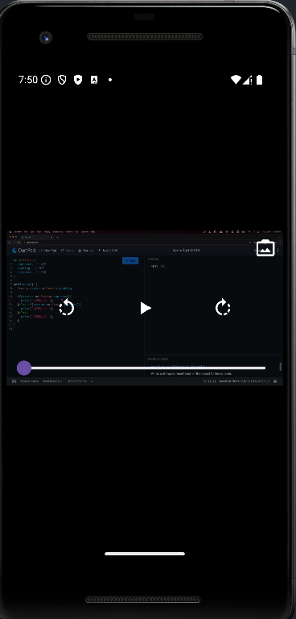|

<br>

### 09. 타임스탬프 추가
- Slider 보고 정확학 시간을 알 수 있도록 현재 실행 중인 위치와 동영상 길이를 Slider 좌우에 배치

- Slider 를 Row 위젯으로 감싸고 Slider 위젯을 최대로 늘린 다음 양쪽에 Text 위젯 배치

> lib/component/custom_video_player.dart
```dart
  class _CustomVideoPlayerState extends State<CustomVideoPlayer> {
    @override
    Widget build(BuildContext context) {
    ...위젯
      return GestureDetector(
        onTap: () {
          setState((){
            showControls = !showControls;
          });
        },
        child: AspectRatio(
          aspectRatio: videoController!.value.aspectRatio,
          child: Stack(
            children: [
              VideoPlayer(
                videoController!,
              ),
              if(showControls)
                Container(
                  color: Colors.black.withOpacity(0.5),
                ),
              Positioned(
                bottom: 0,
                right: 0,
                left: 0,
                child: Padding(
                  padding: EdgeInsets.symmetric(horizontal: 8.0),
                  child: Row(
                    children: [
                      renderTimeTextFromDuration(
                        // 동영상 현재 위치
                        videoController!.value.position,
                      ),
                      Expanded(
                        // Slider 가 남는 공간을 모두 차지하도록 구현
                        child: Slider(
                          onChanged: (double val){
                            videoController!.seekTo(
                              Duration(seconds: val.toInt()),
                            );
                          },
  
                          value: videoController!.value.position.inSeconds.toDouble(),
                          min: 0,
                          max: videoController!.value.duration.inSeconds.toDouble(),
                        ),
                      ),
                      renderTimeTextFromDuration(
                        // 동영상 총 길이
                        videoController!.value.duration,
                      ),
                    ],
                  ),
                ),
              ),
              ...생략
            ],
          ),
        )
      );
    }
  
    Widget renderTimeTextFromDuration(Duration duration) {
      // 1. Duration 값을 보기 편한 형태로 변환
      return Text(
        '${duration.inMinutes.toString().padLeft(2, '0')}:${(duration.inSeconds % 60).toString().padLeft(2, '0')}',
          style: TextStyle(
            color: Colors.white,
          ),
      );
    }
    ...생략...
  }
```
- Duration 클래스 : 기간을 분 단위, 초 단위로 표현해주는 iniMinutes, inSeconds 게터 제공

  - 소수점 버리고 정수 내림값으로 표현
 
    - 분 단위는 inMinutes 게터 그대로 사용시 Duration 의 분 단위값 알 수 있음
   
    - 초 단위값의 경우 분 단위값에서 남은 값만 표현
   
      - inSeconds 게터가 반환해주는 초 단위값을 60으로 나눈 후 나머지만 화면에 보여줌
   
        - ex) 61 초 → 01:01  
       
  - padLeft() : 실행되는 대상의 문자열의 왼쪽에 문자를 추가해주는 역할
 
    - 첫 번째 매개변수에 최소 문자열의 길이 입력
   
    - 두 번째 매개변수에 최소 문자열의 길이를 채우지 못했을 때 왼쪽에 추가해줄 문자 입력
   
      - ex) '1'.padLeft(2,'0') → 01

> 실행 결과

|-|
|-|
|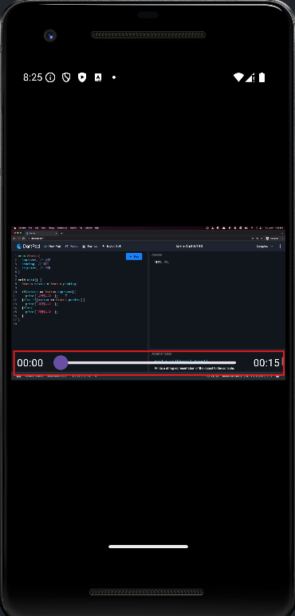|

<br>

---

<br>

🚨 핵심 요약
---
- **Stack 위젯** 이용하면 위젯 위에 위젯을 쌓을 수 있음

- **Positioned 위젯**과 **Align 위젯** 사용해서 Stack 에서 위젯들 정렬 가능

- **image_picker 플러그인** 사용하면 간편하게 유저로부터 파일 선택 입력받기 가능

- 동영상 파일의 위치만 알면 **video_player 플러그인** 사용해서 손쉽게 동영상 재생 가능

- StatefulWidget 생명주기 중 하나인 **didUpdateWidget() 함수**를 오버라이드

  - StatefulWidget 매개변수가 변경되었을 때 특정 함수 실행 가능


<br>


