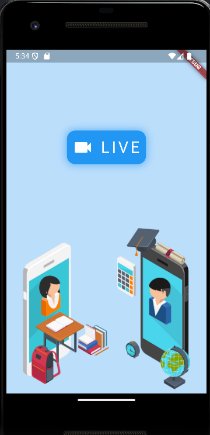

# 13단계 : 영상 통화
- WebRTC, 내비게이션, 아고라 API

  - WebRTC : 핸드폰 간의 영상 통화 구현
 
  - 아고라 API : 중계 서버, 유료 API, 1만 분까지 무료 이용 가능
 
  - permission)handler 플러그인 : 플러터에서 가장 대중적으로 사용되는 권한 관련 플러그인
 
    - 영상 통화를 하려면 동영상과 음성을 서로 전달해야 함
 
      - 카메라 권한과 마이크 권한 필요

- [실습 프로젝트 바로가기](https://github.com/SVW-App-Develop/Video_Call.git)

<br>

|개요|설명|
|-|-|
|**프로젝트명**|vidio_call|
|**개발환경**|플러터 SDK : 3.24.3|
|**미션**|영상 통화를 할 수 있는 앱 구현|
|**기능**|- 실제 핸드폰을 이용해서 1:1 영상 통화 가능<br><br>- 화상 통화 종료 가능|
|**조작법**|- [입장하기] 버튼 눌러서 영상 통화 참여 가능<br><br>- [채널 나가기] 버튼 눌러서 영상 통화 종료 가능|
|**핵심 구성요소**|- 아고라 API<br><br>- 권한 관리<br><br>- WebRTC|
|**플러그인**|- agora_rtc_engine: 6.2.4<br><br>- permission_handler: 11.0.1|

<br>

---

<br>

13.1 사전 지식
---
### 01. 카메라 플러그인
- 카메라 플러그인 사용시 카메라 기능 활용 가능

<br>

#### (1) camera 플러그인 추가
> pubspec.yaml
```dart
  dependencies:
    flutter:
      sdk: flutter
  
    # The following adds the Cupertino Icons font to your application.
    # Use with the CupertinoIcons class for iOS style icons.
    cupertino_icons: ^1.0.8
    camera: 0.10.5+5
```

<br>

#### (2) 코드 작성
> main.dart
```dart
  import 'package:camera/camera.dart';
  import 'package:flutter/material.dart';
  
  late List<CameraDescription> _cameras;
  
  Future<void> main() async {
    // 1. Flutter 앱이 실행될 준비가 됐는지 확인 : material.dart 에서 제공
    // main() 함수의 첫 실행값이 runApp() 이면 불필요
    // 다른 코드가 먼저 실행돼야 하면 꼭 제일 먼저 실행해줘야 함
    WidgetsFlutterBinding.ensureInitialized();
  
    // 2. 핸드폰에 있는 카메라들 가져오기
    // 기기에서 사용할 수 있는 카메라들을 가져옴
    _cameras = await availableCameras();
    runApp(const CameraApp());
  }
  
  class CameraApp extends StatefulWidget {
    const CameraApp({Key? key}) : super(key: key);
  
    @override
    State<CameraApp> createState() => _CameraAppState();
  }
  
  class _CameraAppState extends State<CameraApp> {
    // 3. 카메라를 제어할 수 있는 컨트롤러 선언
    late CameraController controller;
  
    @override
    void initState() {
      super.initState();
  
      initializeCamera();
    }
  
    initializeCamera() async {
      try {
        // 4. 가장 첫 번째 카메라로 카메라 설정하기
        controller = CameraController(_cameras[0], ResolutionPreset.max);
  
        // 5. 카메라 초기화
        await controller.initialize();
  
        setState(() {});
      } catch (e) {
        // 에러났을 때 출력
        if (e is CameraException) {
          switch (e.code) {
            case 'CameraAccessDenied':
              print('User denied camera access.');
              break;
            default:
              print('Handle other errors.');
              break;
          }
        }
      }
    }
  
    @override
    void dispose() {
      // 컨트롤러 삭제
      controller.dispose();
      super.dispose();
    }
  
    @override
    Widget build(BuildContext context) {
      // 6. 카메라 초기화 상태 확인
      if (!controller.value.isInitialized) {
        return Container();
      }
      return MaterialApp(
        // 7. 카메라 보여주기
        // CameraPreview 위젯 사용시 카메라를 화면에 보여줄 수 있음
        // 첫 번째 매개변수에 CameraController 입력 필요
        home: CameraPreview(controller),
      );
    }
  }
```
- CameraController 의 첫 번째 매개변수는 사용할 카메라 입력

  - 현재 기기에서 사용할 수 있는 첫 번째 카메라 입력

- CameraController 의 두 번째 매개변수는 해상도 설정

  - ResolutionPreset.max : 최대 해상도 의미

<br>

> ResolutionPreset 정보

|ResolutionPreset 값|해상도|
|-|-|
|ResolutionPreset.low|안드로이드와 웹은 240p, 아이폰은 352*288|
|ResolutionPreset.medium|안드로이드, 웹, 아이폰 모두 480p|
|ResolutionPreset.high|안드로이드, 웹, 아이폰 모두 720p|
|ResolutionPreset.veryHigh|안드로이드, 웹, 아이폰 모두 1080p|
|ResolutionPreset.ultraHigh|안드로이드와 아이폰 2160p, 웹은 4096*2160|
|ResolutionPreset.max|최대 해상도|

<br>

### 02. WebRTC
- 영상 통화 기능 구현하려면 필요한 기능

  - 영상과 음성 정보 저장하고 전송
 
  - 클라이언트 간의 연결하기 등
    
- 웹 브라우저 기반으로 통신하는 WebRTC API

  - 음성 통화, 영상 통화, P2P 파일 공유 기능 제공
 
  - 간단히 영상 통화 기능 구현 가능
 
  - 두 클라이언트 말고도 중계용 서버 필요(시그널링 서버, Signalling Server)
 
    - 직접 구현 or 아고라 서비스 이용

<br>

> 클라이언트와 서버 간의 정보 흐름 절차

|-|
|-|
||
|1. WebRTC 사용할 클라이언트들은 서로에게 연결할 수 있는 공개 1P 등의 정보를 서버에 전송하고 상대의 연결 정보를 받아오기|
|2. 서버에서 받아온 정보를 기반으로 내 영상 및 음성을 공유하고 상대의 영상 및 음성 정보를 이용|

<br>

### 03. iOS 시뮬레이터와 안드로이드 에뮬레이터에서의 카메라 사용
- iOS 시뮬레이터는 카메라 기능 제공 X

- 안드로이드 에뮬레이터는 카메라 앱을 실행할 수는 있지만 실제 카메라와 연동되지는 않고 샘플 영상 실행

- 앱 사용하려면 카메라를 사용할 수 있는 디바이스 두 대 필요

  - 사용할 수 있는 디바이스가 한 대뿐이라면 하나는 안드로이드 에뮬레이터로 대체

<br>

### 04. 내비게이션(Navigation)
- 플러터에서 화면을 이동할 때 사용하는 클래스

- 스택(stack)이라는 데이터 구조로 설계되어 있음

  - LIFO(Last In First Out) 구조
 
    - 마지막으로 들어온 요소가 가장 먼저 삭제되는 구조
   
- 플러터에서는 내비게이션 스택의 가장 위에 위치한 위젯을 화면으로 보여줌

  - Navigator 클래스에서 제공하는 메서드를 사용해 내비게이션 스택 사용 가능

<br>
   
> 내비게이션 스택 작동 방식

|1|2|3|
|-|-|-|
||||
|앱이 시작되면 home 매개변수에 제공된<br>위젯이 내비게이션 스택에 추가됨|스크린2 위젯을 생성하고 추가로 실행하면<br>(push 메서드) 내비게이션 스택의 스크린1<br>위젯 위에 스크린2 추가|뒤로 가기를 실행하면 (pop 메서드)<br>내비게이션 스택에 가장 늦게 들어온<br>스크린2 삭제|

<br>

> Navigator 클래스에서 제공하는 함수

|메서드|설명|
|-|-|
|push()|새로운 스크린을 추가|
|pushReplacement()|새로운 스크린을 추가하고 바로 아래 스크린 삭제<br>현재 스크린을 대체하는 것과 같으며 애니메이션은 push()와 동일하게 실행됨|
|pushAndRemoveUntil()|새로운 스크린을 추가하고 기존 내비게이션 스택에 존재하던 스크린들을 삭제할지 유지할지 정할 수 있음|
|pop()|현재 스크린을 삭제<br>LIFO 법칙대로 가장 최근에 추가된 스크린이 먼저 삭제됨|
|maybePop()|내비게이션 스택에 마지막으로 남은 스크린이 아닐 때만 pop() 함수를 실행<br>마지막 남은 스크린이라면 무엇도 실행하지 않음|
|popUntil()|내비게이션 스택에 있는 모든 스크린을 대상으로 스크린을 삭제할지 유지할지 결정할 수 있음|

<br>

---

<br>

13.2 사전 준비
---
- 카메라와 마이크를 사용하려면 권한 설정 필요

  - 아고라 API 에서 필수로 요구하는 사항으로 등록 필수
 
- permission_handler 패키지를 이용해서 앱 내에서 권한 요청

<br>

### 01. 아고라에서 필요한 상수값 가져오기
- 아고라(Agora) : 영상 통화와 통화 기능 API 를 유료로 제공하는 서비스

  - 유료 API 사용하려면 여러 가지 고윳값 필요
 
    - 아고라 입장에서는 누가 어떤 기능을 얼마만큼 사용하는지 알아야 함
   
    - 사용자별로 토큰을 발급해주며, 사용자들은 이 토큰값을 사용해 서비스 이용
   
  - 회원가입을 하면 매달 1만 분 무료 사용 가능

<br>

#### (1) [아고라](https://www.agora.io) 회원가입
- 토큰을 발급받으려면 아고라에 회원가입 해야 함

|과정|
|-|
||

<br>

#### (2) Project Management
- 로그인 및 회원가입 완료 후 대시보드 페이지로 이동

- 대시보드에서 왼쪽 사이드바에 마우스를 올린 다음 [Project Managment] 클릭

|과정|
|-|
||

<br>

#### (3) 프로젝트 생성
- [Create a Poroject] 버튼 눌러서 프로젝트 생성

- 프로젝트 이름, 사용 목적, Secure Model 선택 후 [Submit] 버튼 선택

  - Sevure Model 은 **APP ID + TOKEN** 모드 선택

|과정|
|-|
||

<br>

#### (4) 프로젝트 설정
- Project Management 페이지의 테이블에 새로 만든 프로젝트가 생성됨

- 생성한 프로젝트의 [config] 버튼 눌어서 설정 화면으로 이동

|과정|
|-|
||

<br>

#### (5) 토큰 생성
- 프로젝트 설정 페이지에서 Features 카테고리로 이동

- [Generate temp RTC Token] 버튼 클릭하면 토큰 생성 페이지 이동

- 채널이름 설정 후 [Generate] 버튼 누르면 토큰 생성

|과정|
|-|
||
||

<br>

|내용|
|-|
||
|- App ID : 앱 ID, 프로젝트의 유니크한 아이디를 의미<br>- Channel Name : 채널 이름, 핸드폰끼리 통신할 때 사용할 채널의 이름(원하는대로 작명)<br>- Temp Token : 임시 토큰, 아고라 API 사용 권한이 있음을 증명하는 데 사용<br>- 토큰 유효기간 : 모든 토큰은 생성 후 24시간만 유효<br><br>- 프로젝트에 필요한 값들은 App ID, Channel Name, Temp Token 이니 안전한 곳에 잘 복사해두기|

<br>

#### (6) 프로젝트 적용
- [lib/const] 폴더 생성 후 그 아래에 agora.dart 파일 생성해서 아고라와 관련된 값들 정리

- Temp Token 은 발급받은 시간으로부터 24시간만 유효

> lib/const/agora.dart
```dart
  const APP_ID = '앱 ID 입력';
  const CHANNEL_NAME = '채널 이름 입력';
  const TEMP_TOKEN = '토큰값 입력';
```

<br>

### 02. 이미지와 폰트 추가
- [asset] 폴더를 만들고 그 아래 [img] 폴더 생성

- 원하는 그림 파일들을 [img] 폴더로 드래그 앤 드롭

<br>

### 03. pubspec.yaml 설정
- 수정 후 [pub get] 실행

> pubspec.yaml
```dart
  dependencies:
    flutter:
      sdk: flutter
  
  
    # The following adds the Cupertino Icons font to your application.
    # Use with the CupertinoIcons class for iOS style icons.
    cupertino_icons: ^1.0.8
    agora_rtc_engine: 6.2.4
    permission_handler: 11.0.1
  ...
  flutter:
  
    # The following line ensures that the Material Icons font is
    # included with your application, so that you can use the icons in
    # the material Icons class.
    uses-material-design: true
    
    assets:
      - asset/img/
```

<br>

### 04. 네이티브 설정
- 안드로이드에서 추가할 네이티브 권한

  - 네트워크 상태를 읽는 READ_PHONE_STATE, ACCESS_NETWORK_STATE 권한
 
  - 인터넷을 이용해서 영상을 스트리밍해야 하므로 INTERNET 권한
 
  - 녹음, 녹화 기능과 관련된 RECORD_AUDIO, MODIFY_AUDIO_SETTINGS, CAMERA 권한
 
  - 블루투스를 이용한 녹음 및 녹화 기능을 사용할 수도 있으니 BLUETOOTH_CONNECT 기능 추가
 
  - 모듈의 build.gradle 파일 변경
 
- iOS 에서 추가할 네이티브 권한

  - 카메라 권한인 NSCameraUsageDescription
 
  - 마이크 권한인 NSMicrophoneUsageDescription

<br>

> Android 권한 추가<br>
> android/app/src/main/AndroidManifest.xml
```dart
  <manifest xmlns:android="http://schemas.android.com/apk/res/android"
      xmlns:tools="http://schemas.android.com/tools">
      <uses-permission android:name="android.permission.READ_PHONE_STATE" />
      <uses-permission android:name="android.permission.INTERNET" />
      <uses-permission android:name="android.permission.RECORD_AUDIO" />
      <uses-permission android:name="android.permission.CAMERA" />
      <uses-permission android:name="android.permission.MODIFY_AUDIO_SETTINGS" />
      <uses-permission android:name="android.permission.ACCESS_NETWORK_STATE" />
      <uses-permission android:name="android.permission.BLUETOOTH" />
      <uses-permission android:name="android.permission.ACCESS_WIFI_STATE" />
      <uses-permission android:name="android.permission.READ_EXTERNAL_STORAGE" />
      <uses-permission android:name="android.permission.WAKE_LOCK" />
      <uses-permission android:name="android.permission.READ_PRIVILEGED_PHONE_STATE" tools:ignore="ProtectedPermissions" />
      ...생략...
  </manifest>
```

<br>

> Android CompileSdkVersion 변경<br>
> android/app/build.gradle
```dart
  ...생략...
  android {
      namespace = "com.example.video_call"
      compileSdk = flutter.compileSdkVersion
      ndkVersion = flutter.ndkVersion
      compileSdkVersion 34    // 원본 : flutter.compileSdkVersion
      ...생략...
```

<br>

> iOS 권한 추가<br>
> ios/Runner/Info.plist
```dart
  <?xml version="1.0" encoding="UTF-8"?>
  <!DOCTYPE plist PUBLIC "-//Apple//DTD PLIST 1.0//EN" "http://www.apple.com/DTDs/PropertyList-1.0/dtd">
  <plist version="1.0">
  <dict>
    <!-- 생략 -->
    <key>NSCameraUsageDescription</key>
    <string>카메라 사용을 허가해주세요</string>
    <key>NSMicrophoneUsageDescription</key>
    <string>마이크 사용을 허가해주세요</string>
  </dict>
  </plist>
```

<br>

### 05. 플러터에서 권한 관리
- 특정 기능들, 특히 보안에 민감한 기능은 사용자가 권한을 허가해줘야 앱에서 정보를 가져오거나 기능 사용 가능

- 안드로이드와 iOS 는 권한을 요청하는 시스템이 비슷함

  - permission_handler 패키지를 이용하면 두 플랫폼 모두에서 쉽게 권한 관리 가능
 
- 사용자에게 이용 허가를 꼭 받아야 사용 가능한 카메라와 마이크 권한은 추가 확인 사항 有

  - 네이티브 설정에 등록을 했더라도 플러터 프레임워크에서 권한이 허가됐는지 아닌지 확인해야 함
 
- permission_handler 플러그인 사용법

  - Permission 클래스에 존재하는 권한 선택 후 request() 함수 실행하면 권한 요청 가능
 
  - 반환값으로는 PermissionStatus 에 해당되는 enum 값을 받아올 수 있음
 
  - PermissionStatus.granted 값을 돌려받으면 권한이 있다는 것을 의미

<br>

```dart
  final permission = await Permission.camera.request();  // 카메라 권한 요청
  
  if (permission == PermissionStatus.granted) {  // 권한 상태 확인
    print('권한 허가 완료');
  } else {
    print('권한 없음');
  }
```

<br>

> PermissionStatus 클래스

|값|설명|
|-|-|
|denied|권한이 거절된 상태<br>다시 request() 함수를 이용해 권한 요청 가능<br>권한을 한 번도 요청한 적이 없다면 기본값인 거절로 설정됨|
|granted|권한이 허가된 상태|
|restricted|iOS 에서만 해당되는 상태로 권한이 제한되어 있을 때 설정되는 상태<br>청소년, 자녀보호 기능 해당|
|limited|iOS 에서만 해당되는 상태로 제한적인 권한이 있을 때 해당됨|
|permanentlyDenied|권한이 거절된 상태<br>Denied 상태와 다른 점은 다시 request() 함수를 실행해서 앱에서 권한 요청 불가<br>설정 앱으로 이동해서 사용자가 직접 권한을 허가해줘야 함|

<br>

- 필요한 여러 권한을 한 번에 연속적으로 요청

  - 요청하고 싶은 권한을 순서대로 List 에 넣어서 한번에 request() 함수 실행
 
  - 권한 요청에 대한 결과는 Map 형태로 반환받음
  
    - 확인하고 싶은 권한의 값을 key 로 입력해주면 권한 요청의 결과를 가져올 수 있음

<br>

```dart
  final resp = await [Permission.camera, Permission.microphone].request();
  // 리스트의 모든 권한 요청
  
  final cameraPermission = resp[Permission.camera];  // 각 권한의 상태 확인
  final micPermission = resp[Permission.microphone];
  
  if (cameraPermission != PermissionStatus.granted) {
    throw '카메라 권한이 없습니다';
  }
  
  if (micPermission != PermissionStatus.granted) {
    throw '마이크 권한이 없습니다';
  }
```

<br>

### 06. 프로젝트 초기화
#### (1) [lib] 폴더에 [screen] 폴더 생성
- 앱의 기본 홈 화면으로 사용할 HomeScreen 위젯을 생성할 home_screen.dart 생성
 
> lib/screen/home_screen.dart
```dart
  import 'package:flutter/material.dart';
  
  class HomeScreen extends StatelessWidget {
    const HomeScreen({Key? key}) : super(key: key);
  
    @override
    Widget build(BuildContext context) {
      return Scaffold(
        body: Text('Hone Screen'),
      );
    }
  }
```

<br>

#### (2) HomeScreen 을 홈 위젯으로 등록

> lig/main.dart
```dart
  import 'package:video_call/screen/home_screen.dart';
  import 'package:flutter/material.dart';
  
  void main() {
    runApp(
      MaterialApp(
        home: HomeScreen(),
      ),
    );
  }
```

<br>

---

<br>

13.3 레이아웃 구상
---
- 첫 번째 화면은 홈 스크린으로 화상 통화 채널에 참여할 수 있는 화면

- 두 번째 화면은 화상 통화를 하는 화면

<br>

### 01. 홈 스크린 위젯
- 가장 위에 앱 로고 위치

- 중앙에 이미지 위치

- 마지막에 화상 통화 채널 참여 버튼 위치

<br>

### 02. 캠 스크린 위젯
- 캠 스크린에는 영상 통화를 할 수 있는 기능 넣기

- 영상 통화는 1:1로 진행하게 되니 내 카메라가 찍고 있는 화면과 상대방의 카메라가 찍고 있는 화면 동시 출력

  - Stack 위젯 이용

<br>

---

<br>

13.4 구현
---
- 홈 스크린과 캠 스크린 UI 구현 후 Agora API 이용해 화상 통화 기능 구현

<br>

### 01. 홈 스크린 위젯 구현
#### (1) 레이아웃 설정
- 로고, 이미지, 버튼을 각각 위젯으로 구현해 레이아웃 설정

> lib/screen/home_screen.dart
```dart
  import 'package:flutter/material.dart';
  
  class HomeScreen extends StatelessWidget {
    const HomeScreen({Key? key}) : super(key: key);
  
    @override
    Widget build(BuildContext context) {
      return Scaffold(
        backgroundColor: Colors.blue[100]!,
        body: SafeArea(
          child: Padding(
            padding: const EdgeInsets.all(8.0),
            child: Column(
              children: [
                Expanded(child: _Logo()),   // 로고
                Expanded(child: _Image()),  // 이미지
                Expanded(child: _EntryButton()),  // 화상 통화 시작 버튼
              ],
            ),
          ),
        ),
      );
    }
  }
```

<br>

#### (2) _Logo 위젯 작업
- 단순히 아이콘과 글자가 Container 안에 위치한 형태

- 로고에 그림자가 지게 만들기

  - 그림자는 BoxDecoration 클래스의 boxShadow 매개변수에 원하는 만큼 그림자를 BoxShadow 클래스로 제공해서 구현 가능

```dart
  // HomeScreen 위젯 바로 아래
  ...생략...
  class _Logo extends StatelessWidget {
    const _Logo({Key? key}) : super(key: key);
  
    @override
    Widget build(BuildContext context) {
      return Center(
        child: Container(
          decoration: BoxDecoration(
            color: Colors.blue,
            borderRadius: BorderRadius.circular(16.0),  // 모서리 둥글게 만들기
            boxShadow: [    // 1. 그림자 추가
              BoxShadow(
                color: Colors.blue[300]!,
                blurRadius: 12.0,
                spreadRadius: 2.0,
              ),
            ]
          ),
          child: Padding(
            padding: EdgeInsets.all(10.0),
            child: Row(
              mainAxisSize: MainAxisSize.min,  // 주축 최소 크기
              children: [
                Icon(   // 캠코더 아이콘
                  Icons.videocam,
                  color: Colors.white,
                  size: 40.0,
                ),
                SizedBox(width: 12.0),
                Text(   // 앱 이름
                  'LIVE',
                  style: TextStyle(
                    color: Colors.white,
                    fontSize: 30.0,
                    letterSpacing: 4.0,   // 글자 간 간격
                  ),
                ),
              ],
            )
          ),
        ),
      );
    }
  }
```
- 1 : boxShadow 매개변수에는 List 로 BoxShadow 클래스를 제공할 수 있음

  - 일반적으로는 하나의 그림자만 사용하겠지만, 여러 BoxShadow 클래스를 입력해 여러 그림자 적용 가능
 
  - BoxShadow 클래스
  
    - 그림자로 적용할 색상을 color 매개변수로 제공
   
    - blurRadius 에 흐림 정도 입력
   
    - spreadRadius 에 퍼짐 정도를 double 값으로 입력 가능

> 결과

|-|
|-|
||

<br>

#### (3) _Image 위젯 구현
- 이미지를 중앙에 위치하는 형태로 코드 작성

> lib/screen/home_screen.dart
```dart
  // _Logo 위젯 바로 아래
  ...생략...
  class _Image extends StatelessWidget {
    const _Image({Key? key}) : super(key: key);
  
    @override
    Widget build(BuildContext context) {
      return Center(
        child: Image.asset(
          'asset/img/home_img.png',
        ),
      );
    }
  }
```

> 결과

|-|
|-|
||

<br>

#### (4) _EntryButton 작업
- 화상 통화 채널에 접속할 수 있는 버튼 구현

  - 기능은 이후에 구현하고 가로로 최대한의 길이로 늘린 ElevatedButton 생성

> lib/screen/home_screen.dart
```dart
  // _Image 위젯 바로 아래
  ...생략...
  class _EntryButton extends StatelessWidget {
    const _EntryButton({Key? key}) : super(key: key);
  
    @override
    Widget build(BuildContext context) {
      return Column(
        mainAxisAlignment: MainAxisAlignment.end,
        crossAxisAlignment: CrossAxisAlignment.stretch,
        children: [
          ElevatedButton(
            onPressed: () {},
            child: Text('입장하기'),
          ),
        ],
      );
    }
  }
```

> 결과

|-|
|-|
||

<br>

### 02. 캠 스크린 위젯 구현
#### (1) CamScreen 구현
- lib/screen/cam_screen.dart 파일을 생성하고 CamScreen StatefulWidget 생성

  - Scaffold 에 AppBar 추가해서 기본 레이아웃 만들기
 
> lib/screen/cam_screen.dart
```dart
  import 'package:flutter/material.dart';
  
  class CamScreen extends StatefulWidget {
    const CamScreen({Key? key}) : super(key: key);
  
    @override
    _CamScreenState createState() => _CamScreenState();
  }
  
  class _CamScreenState extends State<CamScreen> {
    @override
    Widget build(BuildContext context) {
      return Scaffold (
        appBar: AppBar(
          title: Text('LIVE'),
        ),
        body: Center(
          child: Text('Cam Screen'),
        ),
      );
    }
  }
```

<br>

#### (2) HomeScreen 에서 CamScreen 으로 이동
- ElevatedButton 위젯을 클릭하면 CamScreen 위젯으로 화면이 넘어가야 함

  - 내비게이션(Navigator) 클래스를 사용해 구현 가능
 
    - 최상위에 MaterialApp 위젯 추가해주면 Navigator 클래스의 인스턴스 자동 생성
   
      - 이 값을 이용해 화면 이동 가능

> lib/screen/home_screen.dart
```dart
  import 'package:flutter/material.dart';
  import 'package:video_call/screen/cam_screen.dart';
  ...생략...
  class _EntryButton extends StatelessWidget {
    const _EntryButton({Key? key}) : super(key: key);
  
    @override
    Widget build(BuildContext context) {
      return Column(
        mainAxisAlignment: MainAxisAlignment.end,
        crossAxisAlignment: CrossAxisAlignment.stretch,
        children: [
          ElevatedButton(
            onPressed: () {
              Navigator.of(context).push(   // 1. 영상 통화 스크린으로 이동
                MaterialPageRoute(
                  builder: (_) => CamScreen(),
                ),
              );
            },
            child: Text('입장하기'),
          ),
        ],
      );
    }
  }
```
- 1 : Navigator.of(context) 실행해 위젯 트리의 가장 가까이에 있는 Navigator 가져옴

  - 테마를 이용할 때 Theme.of(context) 사용했던 것 생각하기
 
  - MaterialApp 으로 최상위를 감싸주면 자동으로 Navigator 생성
 
    - 앱 어디서든 Navigator.of(context) 실행해 값 가져올 수 있음
   
  - push() 함수를 이용하면 새로운 화면으로 이동 가능
 
    - 매개변수로 MaterialPageRoute 클래스의 builder() 함수에 새로운 화면으로 사용하고 싶은 위젯을 반환하는 함수 입력

<br>

#### (3) 화상 통화 기능 구현
- 카메라 권한과 마이크 권한 필요

  - init() 이라는 함수를 만들어 화상 통화에 필요한 권한 받아오기

> lib/screen/cam_screen.dart
```dart
  import 'package:flutter/material.dart';
  import 'package:permission_handler/permission_handler.dart';
  ...생략...
  class _CamScreenState extends State<CamScreen> {
    Future<bool> init() async {   // 1. 권한 관련 작업 모두 실행
      final resp = await [Permission.camera, Permission.microphone].request();
  
      final cameraPermission = resp[Permission.camera];
      final micPermission = resp[Permission.microphone];
  
      if (cameraPermission != PermissionStatus.granted ||
          micPermission != PermissionStatus.granted) {
        throw '카메라 또는 마이크 권한이 없습니다';
      }
  
      return true;
    }
  
    @override
    Widget build(BuildContext context) {
    ...생략...
    }
  }
```
- 권한을 가져오는 작업은 비동기 프로그래밍이 필요

  - 함수를 async 로 지정해주고 권한을 잘 가져왔을 땐 true  값을 반환
 
    - 문제가 있으면 메시지와 함께 에러를 던지는 로직 작성

<br>

#### (4) FutureBuilder 위젯 사용
- init() 함수를 사용하려면 특별한 위젯 필요

  - build() 함수는 위젯이 생성되면 그 즉시 실행됨
 
  - 카메라와 마이크의 권한이 있을 때 그리고 없을 때 보여줄 수 있는 화면이 달라야 함
 
- init() 함수가 비동기로 실행되니 언제 권한 요청이 끝날지 알 수 없으므로 FutureBuilder 위젯 사용

  - init() 함수에서 에러를 던지면
  
    - 에러 내용을 보여주고 아직 로딩중이면 CircularProgeressIndicator 보여줌
   
    - 모든 권한이 허가되면 '모든 권한이 있습니다' 라는 글자를 가운데에 보여주는 로직 작성

> lib/screen/cam_screen.dart
```dart
  ...생략...
  class _CamScreenState extends State<CamScreen> {
    ...생략...
    @override
    Widget build(BuildContext context) {
      return Scaffold (
        appBar: AppBar(
          title: Text('LIVE'),
        ),
        body: FutureBuilder(    // 1. Future 값을 기반으로 위젯 렌더링
          future: init(),
          builder: (BuildContext context, AsyncSnapshot snapshot) {
            if(snapshot.hasError){  // 2. Future 실행 후 에러가 있을 때
              return Center(
                child: Text(
                  snapshot.error.toString(),
                ),
              );
            }
            
            if(!snapshot.hasData){  // 3. Future 실행 후 아직 데이터가 없을 때 (로딩 중)
              return Center(
                child: CircularProgressIndicator(),
              );
            }
            
            return Center(  // 4. 나머지 상황에 권한 있음을 표시
              child: Text('모든 권한이 있습니다'),
            );
          }
        ),
      );
    }
  }
```
- 1 : FutureBuilder 는 Future 를 반환하는 함수의 결과에 따라 위젯을 렌더링할 때 사용

  - FutureBuilder 의 future 매개변수에 Future 값을 반환하는 함수 입력
 
  - builder 매개변수에 Future 값에 따라 다르게 렌더링해주고 싶은 로직 작성
 
  - builder() 함수는 BuildContext 와 AsyncSnapshot 제공
 
    - AsyncSnapshot 은 future 매개변수에 입력한 함수의 결과값 및 에러를 제공하는 역할
   
      - 추가적으로 비동기 함수의 진행 상황도 알 수 있음
     
    - AsyncSnapshot 에서 제공하는 값이 변경될 때마다 builder() 함수 재실행
   
- 2 : AsyncSnapshot 의 hasError 게터는 현재 실행한 비동기 함수에서 에러가 있는지 bool 값으로 반환

  - true 면 에러, false 면 에러가 없는 상태
 
    - 에러가 있을 때는 snapshot.error 실행해 에러값 가져올 수 있음
      
- 3 : AsyncSnaptshot 의 hasData 게터는 현재 실행한 비동기 함수에서 반환받은 데이터가 있는지 확인 가능

  - init() 함수는 성공적으로 실행되면 bool 값을 반환
 
    - 에러가 없는데 반환받은 데이터까지 없는 상황이라면 아직 비동기 함수가 실행 중이라고 볼 수 있음
   
  - snapshot.data 실행하면 반환된 데이터값도 받아볼 수 있음
 
- 4 : 2번과 3번이 모두 통과됐다면 성공적으로 권한을 받았다는 뜻

  - snapshot.connectionState 실행하면 비동기 함수의 현재 실행 상태 가져올 수 있음

> FutureBuilder 의 ConnectionState 및 캐싱

|값|설명|
|-|-|
|ConnectionState.none|비동기 함수를 제공하지 않은 상태|
|ConnectionState.waiting|비동기 함수가 아직 아무런 값을 반환하지 않은 상태<br>실행은 되었지만 끝나지 않은 상태로 로딩 중이라고 볼 수 있음|
|ConnectionState.active|FutureBuilder 에서는 사용되지 않고 비슷하지만 Stream 값으로 builder 를 실행하는 StreamBuilder 에서만 제공됨<br>Stream 이 실행되고 있는 상태를 표현함|
|ConnectionState.done|요청이 끝난 상태를 의미<br>에러가 났던 데이터값이 반환된 함수의 실행이 끝나면 반환되는 상태|

<br>

> snapshot.connectionState == ConnectionState.waiting 대신에 !snapshot.hasData 사용한 이유
```
  캐싱(caching) 때문
    - 캐싱 : 데이터를 일시적으로 저장하고 기억하는 걸 의미
  
  FutureBuilder 는 다른 위젯과 마찬가지로 build() 함수에 영향을 받음
    - build() 가 다시 실행되면 FutureBuilder 는 다시 렌더링되고 builder() 함수로 다시 실행됨
      - 그럴 때마다 비동기 함수 매번 다시 실행됨
  
  매번 로딩 상태가 false 로 돌아갔다가 함수가 끝날 때 다시 true 로 변하면?
    - build() 가 실행될 때마다 CircularProgressIndicator 가 렌더링되어 화면에 깜빡임이 생김
      - build() 함수에 기존 반환받았떤 데이터값을 기억해두면 방지 가능
        - 같은 build() 함수가 두 번 이상 실행될 때 snapshot.connectionState 가 ConnectionState.waiting 이더라도
          snapshot.data 에서 기존 실행했던 함수의 반환값을 받아볼 수 있음
        - 그래서 snapshot.connectionState 대신 snapshot.hasData 사용해 로딩 상태 인지
```

<br>

#### (5) 아고라 API 활성화
- 아고라의 RtcEngine 활성화

  - 활성화하면서 각종 이벤트를 받을 수 있는 콜백 함수도 설정
 
- RtcEngine 통해 사용하는 핸드폰의 카메라를 활성화

- 미리 받아둔 아고라 API 상수값들을 사용해 testchannel 에 참여

> lib/screen/cam_screen.dart
```dart
  import 'package:agora_rtc_engine/agora_rtc_engine.dart';
  import 'package:video_call/const/agora.dart';
  ...생략...
  class _CamScreenState extends State<CamScreen> {
    RtcEngine? engine;  // 아고라 엔진을 저장할 변수
    int? uid;           // 내 ID
    int? otherUid;      // 상대방 ID
  
    Future<bool> init() async {   // 권한 관련 작업 모두 실행
      final resp = await [Permission.camera, Permission.microphone].request();
  
      final cameraPermission = resp[Permission.camera];
      final micPermission = resp[Permission.microphone];
  
      if (cameraPermission != PermissionStatus.granted ||
          micPermission != PermissionStatus.granted) {
        throw '카메라 또는 마이크 권한이 없습니다';
      }
  
      if (engine == null) {
        // 1. 엔진이 정의되지 않았으면 새로 정의하기
        engine = createAgoraRtcEngine();
  
        // 아고라 엔진 초기화
        await engine!.initialize(
          // 초기화할 때 사용할 설정 제공
          RtcEngineContext(
            // 미리 저장해둔 APP ID 입력
            appId : APP_ID,
            // 라이브 동영상 송출에 최적화
            channelProfile: ChannelProfileType.channelProfileLiveBroadcasting,
          ),
        );
  
        engine!.registerEventHandler(
          // 2. 아고라 엔진에서 받을 수 있는 이벤트 값들 등록
          RtcEngineEventHandler(
            onJoinChannelSuccess: (RtcConnection connection, int elapsed) {
              // 3. 채널 접속에 성공했을 때 실행
              print('채널에 입장했습니다. uid : ${connection.localUid}');
              setState((){
                this.uid = connection.localUid;
              });
            },
            onLeaveChannel: (RtcConnection connection, RtcStats stats) {
              // 4. 채널을 퇴장했을 때 실행
              print('채널 퇴장');
              setState((){
                uid = null;
              });
            },
            onUserJoined: (RtcConnection connection, int remoteUid, int elapsed) {
              // 5. 다른 사용자가 접속했을 때 실행
              print('상대가 채널에 입장했습니다. uid : ${remoteUid}');
              setState((){
                otherUid = remoteUid;
              });
            },
            onUserOffline: (RtcConnection connection, int remoteUid, UserOfflineReasonType reason) {
              // 6. 다른 사용자가 채널을 나갔을 때 실행
              print('상대가 채널에서 나갔습니다. uid : $uid');
              setState((){
                otherUid = null;
              });
            },
          ),
        );
  
        // 엔진으로 영상을 송출하겠다고 설정
        await engine!.setClientRole(role: ClientRoleType.clientRoleBroadcaster);
        await engine!.enableVideo();    // 7. 동영상 기능 활성화
        await engine!.startPreview();   // 카메라를 이용해 동영상을 화면에 실행
        // 채널에 들어가기
        await engine!.joinChannel(
          // 8. 채널 입장하기
          token: TEMP_TOKEN,
          channelId: CHANNEL_NAME,
    
          // 영상과 관련된 여러 가지 설정 가능
          // 현재 프로젝트에서는 불필요
          options: ChannelMediaOptions(),
          uid: 0,
        );
      }
  
      return true;
    }
  ...생략...
```
- 1 : engine 값이 null 인지 확인하고 null 이면 새로운 engine 을 생성하는 로직 실행

- 2 : RtcEngine 에 이벤트 콜백 함수들을 등록하는 함수

  - RtcEngineEventHandler 클래스 사용
 
- 3 : 내가 채널에 입장했을 때 실행되는 함수

  - 채널에 입장한 상태면 uid 변수에 나의 고유 ID 기억
 
    - connection : 영상 통화 정보에 관련된 값, connection.localUid 로 내 ID 가져올 수 있음
   
    - elapsed : joinChannel 실행한 후 콜백이 실행되기까지 걸린 시간
   
- 4 : 내가 채널에서 나갔을 때 실행되는 콜백 함수

  - 채널에서 나갔으니 uid 를 null 로 변환
 
- 5 : 상대박이 채널에 입장했을 때 실행되는 함수

  - 상대방의 고유 ID 를 otherUid 변수에 저장
 
    - connection : 영상 통화 정보에 관련된 값, connection.localUid 로 내 ID 가져올 수 있음
   
    - remoteUid : 상대방 고유 ID
   
    - elapsed : 내가 채널을 들어왔을 때부터 상태가 들어올 때까지 걸린 시간
   
- 6 : 상대방이 채널에서 나갔을 때 실행되는 함수

  - otherUid 값을 null 로 지정해줌
 
    - connection : 영상 통화 정보에 관련된 값, connection.localUid 로 내 ID 를 가져올 수 있음
   
    - remoteUid : 상대방 고유 ID
   
    - reason : 방에서 나가게 된 이유 (직접 나가기 또는 네트워크 끊김 등)
   
- 7 : 내 카메라 활성화

- 8 : 채널에 입장

  - token 매개변수에는 아고라 토큰을 입력하고 channelId 매개변수에는 입장할 채널 입력
 
  - options 매개변수는 영상 송출과 관련된 여러 옵션을 상세하게 지정 가능
 
    - 이번 프로젝트에서는 기본 설정 사용
   
  - 마지막 매개변수는 내 고유 ID 를 지정하는 곳
 
    - 0 입력하면 자동으로 고유 ID 배정됨

<br>

#### (6) RtcEngine 에서 송수신하는 정보를 화면에 그려주는 코드 작성
- testchannel 에 참여하는 코드를 작성했지만 화면에 아직 아무것도 실행되지 않음

  - renderMainView() 와 renderSubView() 함수를 작성해 각각 상대방의 화면과 내 화면 보여주기
 
> lib/screen/cam_screen.dart
```dart
  ...생략...
  // build() 함수 바로 아래에 작성
    // 1. 내 핸드폰이 찍는 화면 렌더링
    Widget renderSubView(){
      if(uid != null) {
        // AgoraVideoView 위젯을 사용하면 동영상을 화면에 보여주는 위젯 구현 가능
        return AgoraVideoView(
          // VideoViewController 를 매개변수로 입력해주면 해당 컨트롤러가 제공하는 동영상 정보를
          // AgoraVideoView 위젯을 통해 보여줄 수 있음
          controller: VideoViewController(
            rtcEngine: engine!,
            // VideoCanvas 에 0 을 입력해서 내 영상을 보여줌
            canvas: const VideoCanvas(uid: 0),
          ),
        );
      } else {
        // 아직 내가 채널에 접속하지 않았다면 로딩 화면을 보여줌
        return CircularProgressIndicator();
      }
    }
    
    Widget renderMainView() {   // 2. 상대 핸드폰이 찍는 화면 렌더링
      if (otherUid != null) {
        return AgoraVideoView(
          // VideoViewController.remote 생성자를 이용하면
          // 상대방의 동영상을 AgoraVideoView 그려낼 수 있음
          controller: VideoViewController.remote(
            rtcEngine: engine!,
            // uid 에 상대방 ID 입력
            canvas: VideoCanvas(uid: otherUid),
            connection: const RtcConnection(channelId: CHANNEL_NAME),
          ),
        );
      } else {
        // 상대가 아직 채널에 들어오지 않았다면 대기 메시지를 보여줌
        return Center(
          child: const Text(
            '다른 사용자가 입장할 때까지 대기해주세요',
            textAlign: TextAlign.center,
          ),
        );
      }
    }
  }
```
- 1 : 내 핸드폰이 찍는 화면을 렌더링하는 함수

  - uid 가 null 이 아닐 때는 채널에 입장한 상태
  
    - AgoraVideoView 의 controller 매개변수에 VideoViewController() 입력해서 내 핸드폰에서 찍는 화면 보여줌
   
- 2 : renderSubView() 와 반대로 상대방의 핸드폰에서 찍는 화면을 보여주는 역할

  - AgoraVideoView 의 controller 매개변수에 VideoViewController.remote() 입력해줘서 상대의 화면을 보여줌
 
<br>

#### (7) 상대방의 화면 위에 내 화면을 쌓는 방식으로 화면 구현
- 작성한 함수를 build() 함수에 입력해서 화면에 보여주기

- 동영상 플레이어 앱에서 사용했던 Stack 위젯을 이용

> lib/screen/cam_screen.dart
```dart
  ...생략...
    @override
    Widget build(BuildContext context) {
      return Scaffold (
        appBar: AppBar(
          title: Text('LIVE'),
        ),
        body: FutureBuilder(    // Future 값을 기반으로 위젯 렌더링
          future: init(),
          builder: (BuildContext context, AsyncSnapshot snapshot) {
            if(snapshot.hasError){  // Future 실행 후 에러가 있을 때
              return Center(
                child: Text(
                  snapshot.error.toString(),
                ),
              );
            }
  
            if(!snapshot.hasData){  // Future 실행 후 아직 데이터가 없을 때 (로딩 중)
              return Center(
                child: CircularProgressIndicator(),
              );
            }
  
            return Stack(
              children: [
                renderMainView(), // 상대방이 찍는 화면
                Align(    // 내가 찍는 화면
                  alignment: Alignment.topLeft, // 왼쪽 위에 위치
                  child: Container(
                    color: Colors.grey,
                    height: 160,
                    width: 120,
                    child: renderSubView(),
                  ),
                ),
              ],
            );
          }
        ),
      );
    }
  ...생략...
```

<br>

#### (8) [나가기] 버튼 설계
- 뒤로 가기 기능은 pop() 함수 사용하면 구현 가능

> lib/screen/cam_screen.dart
```dart
  ...생략...
            // 기존 'return Stack' 코드 수정
            return Column(
              crossAxisAlignment: CrossAxisAlignment.stretch,
              children: [
                Expanded(
                  child: Stack(
                    children: [
                      renderMainView(), // 상대방이 찍는 화면
                      Align(    // 내가 찍는 화면
                        alignment: Alignment.topLeft, // 왼쪽 위에 위치
                        child: Container(
                          color: Colors.grey,
                          height: 160,
                          width: 120,
                          child: renderSubView(),
                        ),
                      ),
                    ],
                  ),
                ),
                Padding(
                  padding: EdgeInsets.symmetric(horizontal: 8.0),
                  child: ElevatedButton(  // 뒤로 가기 기능 및 채널 퇴장 기능
                    onPressed: () async {
                      if(engine != null){
                        await engine!.leaveChannel();
                      }
                      Navigator.of(context).pop();
                    },
                    child: Text('채널 나가기'),
                  ),
                ),
              ],
            );
          },
        ),
      );
    }
  ...생략...
```

<br>

---

<br>

🚨 핵심 요약
---
- **WebRTC** : 현대에서 영상 통화에 가장 많이 사용하는 오픈 소스 프로토콜

  - 실시간으로 오디오 통화, 비디오 통신, P2P 파일 공유 가능
 
- **내비게이션** : 스크린을 전환할 때 사용하는 클래스

- **아고라 API** 사용시 WebRTC 기술이 잘 구현된 서비스를 이용할 수 있음

- **카메라 권한**rhk **마이크 권한**을 받으면 동영상 촬영 기능 구현 가능

  - iOS 에서의 권한은 Info.plist 에서 설정
 
  - 안드로이드에서의 권한은 android/app/src/main/AndroidManifest.xml 에서 설정

<br>


