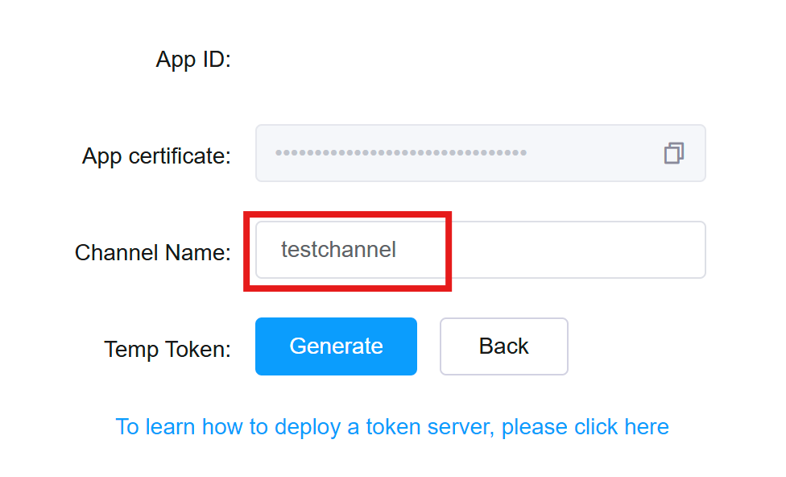

# 13단계 : 영상 통화
- WebRTC, 내비게이션, 아고라 API

  - WebRTC : 핸드폰 간의 영상 통화 구현
 
  - 아고라 API : 중계 서버, 유료 API, 1만 분까지 무료 이용 가능
 
  - permission)handler 플러그인 : 플러터에서 가장 대중적으로 사용되는 권한 관련 플러그인
 
    - 영상 통화를 하려면 동영상과 음성을 서로 전달해야 함
 
      - 카메라 권한과 마이크 권한 필요

- [실습 프로젝트 바로가기](https://github.com/SVW-App-Develop/Video_Call.git)

<br>

|개요|설명|
|-|-|
|**프로젝트명**|vidio_call|
|**개발환경**|플러터 SDK : 3.24.3|
|**미션**|영상 통화를 할 수 있는 앱 구현|
|**기능**|- 실제 핸드폰을 이용해서 1:1 영상 통화 가능<br><br>- 화상 통화 종료 가능|
|**조작법**|- [입장하기] 버튼 눌러서 영상 통화 참여 가능<br><br>- [채널 나가기] 버튼 눌러서 영상 통화 종료 가능|
|**핵심 구성요소**|- 아고라 API<br><br>- 권한 관리<br><br>- WebRTC|
|**플러그인**|- agora_rtc_engine: 6.2.4<br><br>- permission_handler: 11.0.1|

<br>

---

<br>

13.1 사전 지식
---
### 01. 카메라 플러그인
- 카메라 플러그인 사용시 카메라 기능 활용 가능

<br>

#### (1) camera 플러그인 추가
> pubspec.yaml
```dart
  dependencies:
    flutter:
      sdk: flutter
  
    # The following adds the Cupertino Icons font to your application.
    # Use with the CupertinoIcons class for iOS style icons.
    cupertino_icons: ^1.0.8
    camera: 0.10.5+5
```

<br>

#### (2) 코드 작성
> main.dart
```dart
  import 'package:camera/camera.dart';
  import 'package:flutter/material.dart';
  
  late List<CameraDescription> _cameras;
  
  Future<void> main() async {
    // 1. Flutter 앱이 실행될 준비가 됐는지 확인 : material.dart 에서 제공
    // main() 함수의 첫 실행값이 runApp() 이면 불필요
    // 다른 코드가 먼저 실행돼야 하면 꼭 제일 먼저 실행해줘야 함
    WidgetsFlutterBinding.ensureInitialized();
  
    // 2. 핸드폰에 있는 카메라들 가져오기
    // 기기에서 사용할 수 있는 카메라들을 가져옴
    _cameras = await availableCameras();
    runApp(const CameraApp());
  }
  
  class CameraApp extends StatefulWidget {
    const CameraApp({Key? key}) : super(key: key);
  
    @override
    State<CameraApp> createState() => _CameraAppState();
  }
  
  class _CameraAppState extends State<CameraApp> {
    // 3. 카메라를 제어할 수 있는 컨트롤러 선언
    late CameraController controller;
  
    @override
    void initState() {
      super.initState();
  
      initializeCamera();
    }
  
    initializeCamera() async {
      try {
        // 4. 가장 첫 번째 카메라로 카메라 설정하기
        controller = CameraController(_cameras[0], ResolutionPreset.max);
  
        // 5. 카메라 초기화
        await controller.initialize();
  
        setState(() {});
      } catch (e) {
        // 에러났을 때 출력
        if (e is CameraException) {
          switch (e.code) {
            case 'CameraAccessDenied':
              print('User denied camera access.');
              break;
            default:
              print('Handle other errors.');
              break;
          }
        }
      }
    }
  
    @override
    void dispose() {
      // 컨트롤러 삭제
      controller.dispose();
      super.dispose();
    }
  
    @override
    Widget build(BuildContext context) {
      // 6. 카메라 초기화 상태 확인
      if (!controller.value.isInitialized) {
        return Container();
      }
      return MaterialApp(
        // 7. 카메라 보여주기
        // CameraPreview 위젯 사용시 카메라를 화면에 보여줄 수 있음
        // 첫 번째 매개변수에 CameraController 입력 필요
        home: CameraPreview(controller),
      );
    }
  }
```
- CameraController 의 첫 번째 매개변수는 사용할 카메라 입력

  - 현재 기기에서 사용할 수 있는 첫 번째 카메라 입력

- CameraController 의 두 번째 매개변수는 해상도 설정

  - ResolutionPreset.max : 최대 해상도 의미

<br>

> ResolutionPreset 정보

|ResolutionPreset 값|해상도|
|-|-|
|ResolutionPreset.low|안드로이드와 웹은 240p, 아이폰은 352*288|
|ResolutionPreset.medium|안드로이드, 웹, 아이폰 모두 480p|
|ResolutionPreset.high|안드로이드, 웹, 아이폰 모두 720p|
|ResolutionPreset.veryHigh|안드로이드, 웹, 아이폰 모두 1080p|
|ResolutionPreset.ultraHigh|안드로이드와 아이폰 2160p, 웹은 4096*2160|
|ResolutionPreset.max|최대 해상도|

<br>

### 02. WebRTC
- 영상 통화 기능 구현하려면 필요한 기능

  - 영상과 음성 정보 저장하고 전송
 
  - 클라이언트 간의 연결하기 등
    
- 웹 브라우저 기반으로 통신하는 WebRTC API

  - 음성 통화, 영상 통화, P2P 파일 공유 기능 제공
 
  - 간단히 영상 통화 기능 구현 가능
 
  - 두 클라이언트 말고도 중계용 서버 필요(시그널링 서버, Signalling Server)
 
    - 직접 구현 or 아고라 서비스 이용

<br>

> 클라이언트와 서버 간의 정보 흐름 절차

|-|
|-|
||
|1. WebRTC 사용할 클라이언트들은 서로에게 연결할 수 있는 공개 1P 등의 정보를 서버에 전송하고 상대의 연결 정보를 받아오기|
|2. 서버에서 받아온 정보를 기반으로 내 영상 및 음성을 공유하고 상대의 영상 및 음성 정보를 이용|

<br>

### 03. iOS 시뮬레이터와 안드로이드 에뮬레이터에서의 카메라 사용
- iOS 시뮬레이터는 카메라 기능 제공 X

- 안드로이드 에뮬레이터는 카메라 앱을 실행할 수는 있지만 실제 카메라와 연동되지는 않고 샘플 영상 실행

- 앱 사용하려면 카메라를 사용할 수 있는 디바이스 두 대 필요

  - 사용할 수 있는 디바이스가 한 대뿐이라면 하나는 안드로이드 에뮬레이터로 대체

<br>

### 04. 내비게이션(Navigation)
- 플러터에서 화면을 이동할 때 사용하는 클래스

- 스택(stack)이라는 데이터 구조로 설계되어 있음

  - LIFO(Last In First Out) 구조
 
    - 마지막으로 들어온 요소가 가장 먼저 삭제되는 구조
   
- 플러터에서는 내비게이션 스택의 가장 위에 위치한 위젯을 화면으로 보여줌

  - Navigator 클래스에서 제공하는 메서드를 사용해 내비게이션 스택 사용 가능

<br>
   
> 내비게이션 스택 작동 방식

|1|2|3|
|-|-|-|
||||
|앱이 시작되면 home 매개변수에 제공된<br>위젯이 내비게이션 스택에 추가됨|스크린2 위젯을 생성하고 추가로 실행하면<br>(push 메서드) 내비게이션 스택의 스크린1<br>위젯 위에 스크린2 추가|뒤로 가기를 실행하면 (pop 메서드)<br>내비게이션 스택에 가장 늦게 들어온<br>스크린2 삭제|

<br>

> Navigator 클래스에서 제공하는 함수

|메서드|설명|
|-|-|
|push()|새로운 스크린을 추가|
|pushReplacement()|새로운 스크린을 추가하고 바로 아래 스크린 삭제<br>현재 스크린을 대체하는 것과 같으며 애니메이션은 push()와 동일하게 실행됨|
|pushAndRemoveUntil()|새로운 스크린을 추가하고 기존 내비게이션 스택에 존재하던 스크린들을 삭제할지 유지할지 정할 수 있음|
|pop()|현재 스크린을 삭제<br>LIFO 법칙대로 가장 최근에 추가된 스크린이 먼저 삭제됨|
|maybePop()|내비게이션 스택에 마지막으로 남은 스크린이 아닐 때만 pop() 함수를 실행<br>마지막 남은 스크린이라면 무엇도 실행하지 않음|
|popUntil()|내비게이션 스택에 있는 모든 스크린을 대상으로 스크린을 삭제할지 유지할지 결정할 수 있음|

<br>

---

<br>

13.2 사전 준비
---
- 카메라와 마이크를 사용하려면 권한 설정 필요

  - 아고라 API 에서 필수로 요구하는 사항으로 등록 필수
 
- permission_handler 패키지를 이용해서 앱 내에서 권한 요청

<br>

### 01. 아고라에서 필요한 상수값 가져오기
- 아고라(Agora) : 영상 통화와 통화 기능 API 를 유료로 제공하는 서비스

  - 유료 API 사용하려면 여러 가지 고윳값 필요
 
    - 아고라 입장에서는 누가 어떤 기능을 얼마만큼 사용하는지 알아야 함
   
    - 사용자별로 토큰을 발급해주며, 사용자들은 이 토큰값을 사용해 서비스 이용
   
  - 회원가입을 하면 매달 1만 분 무료 사용 가능

<br>

#### (1) [아고라](https://www.agora.io) 회원가입
- 토큰을 발급받으려면 아고라에 회원가입 해야 함

|과정|
|-|
||

<br>

#### (2) Project Management
- 로그인 및 회원가입 완료 후 대시보드 페이지로 이동

- 대시보드에서 왼쪽 사이드바에 마우스를 올린 다음 [Project Managment] 클릭

|과정|
|-|
||

<br>

#### (3) 프로젝트 생성
- [Create a Poroject] 버튼 눌러서 프로젝트 생성

- 프로젝트 이름, 사용 목적, Secure Model 선택 후 [Submit] 버튼 선택

  - Sevure Model 은 **APP ID + TOKEN** 모드 선택

|과정|
|-|
||

<br>

#### (4) 프로젝트 설정
- Project Management 페이지의 테이블에 새로 만든 프로젝트가 생성됨

- 생성한 프로젝트의 [config] 버튼 눌어서 설정 화면으로 이동

|과정|
|-|
||

<br>

#### (5) 토큰 생성
- 프로젝트 설정 페이지에서 Features 카테고리로 이동

- [Generate temp RTC Token] 버튼 클릭하면 토큰 생성 페이지 이동

- 채널이름 설정 후 [Generate] 버튼 누르면 토큰 생성

|과정|
|-|
||
||

<br>

|내용|
|-|
||
|- App ID : 앱 ID, 프로젝트의 유니크한 아이디를 의미<br>- Channel Name : 채널 이름, 핸드폰끼리 통신할 때 사용할 채널의 이름(원하는대로 작명)<br>- Temp Token : 임시 토큰, 아고라 API 사용 권한이 있음을 증명하는 데 사용<br>- 토큰 유효기간 : 모든 토큰은 생성 후 24시간만 유효<br><br>- 프로젝트에 필요한 값들은 App ID, Channel Name, Temp Token 이니 안전한 곳에 잘 복사해두기|

<br>

#### (6) 프로젝트 적용
- [lib/const] 폴더 생성 후 그 아래에 agora.dart 파일 생성해서 아고라와 관련된 값들 정리

- Temp Token 은 발급받은 시간으로부터 24시간만 유효

> lib/const/agora.dart
```dart
  const API_ID = '앱 ID 입력';
  const CHANNEL_NAME = '채널 이름 입력';
  const TEMP_TOKEN = '토큰값 입력';
```

<br>

### 02. 이미지와 폰트 추가
- [asset] 폴더를 만들고 그 아래 [img] 폴더 생성

- 원하는 그림 파일들을 [img] 폴더로 드래그 앤 드롭

<br>

### 03. pubspec.yaml 설정
- 수정 후 [pub get] 실행

> pubspec.yaml
```dart
  dependencies:
    flutter:
      sdk: flutter
  
  
    # The following adds the Cupertino Icons font to your application.
    # Use with the CupertinoIcons class for iOS style icons.
    cupertino_icons: ^1.0.8
    agora_rtc_engine: 6.2.4
    permission_handler: 11.0.1
  ...
  flutter:
  
    # The following line ensures that the Material Icons font is
    # included with your application, so that you can use the icons in
    # the material Icons class.
    uses-material-design: true
    
    assets:
      - asset/img/
```

<br>

### 04. 네이티브 설정
- 안드로이드에서 추가할 네이티브 권한

  - 네트워크 상태를 읽는 READ_PHONE_STATE, ACCESS_NETWORK_STATE 권한
 
  - 인터넷을 이용해서 영상을 스트리밍해야 하므로 INTERNET 권한
 
  - 녹음, 녹화 기능과 관련된 RECORD_AUDIO, MODIFY_AUDIO_SETTINGS, CAMERA 권한
 
  - 블루투스를 이용한 녹음 및 녹화 기능을 사용할 수도 있으니 BLUETOOTH_CONNECT 기능 추가
 
  - 모듈의 build.gradle 파일 변경
 
- iOS 에서 추가할 네이티브 권한

  - 카메라 권한인 NSCameraUsageDescription
 
  - 마이크 권한인 NSMicrophoneUsageDescription

<br>

> Android 권한 추가<br>
> android/app/src/main/AndroidManifest.xml
```dart
  <manifest xmlns:android="http://schemas.android.com/apk/res/android"
      xmlns:tools="http://schemas.android.com/tools">
      <uses-permission android:name="android.permission.READ_PHONE_STATE" />
      <uses-permission android:name="android.permission.INTERNET" />
      <uses-permission android:name="android.permission.RECORD_AUDIO" />
      <uses-permission android:name="android.permission.CAMERA" />
      <uses-permission android:name="android.permission.MODIFY_AUDIO_SETTINGS" />
      <uses-permission android:name="android.permission.ACCESS_NETWORK_STATE" />
      <uses-permission android:name="android.permission.BLUETOOTH" />
      <uses-permission android:name="android.permission.ACCESS_WIFI_STATE" />
      <uses-permission android:name="android.permission.READ_EXTERNAL_STORAGE" />
      <uses-permission android:name="android.permission.WAKE_LOCK" />
      <uses-permission android:name="android.permission.READ_PRIVILEGED_PHONE_STATE" tools:ignore="ProtectedPermissions" />
      ...생략...
  </manifest>
```

<br>

> Android CompileSdkVersion 변경<br>
> android/app/build.gradle
```dart
  ...생략...
  android {
      namespace = "com.example.video_call"
      compileSdk = flutter.compileSdkVersion
      ndkVersion = flutter.ndkVersion
      compileSdkVersion 34    // 원본 : flutter.compileSdkVersion
      ...생략...
```

<br>

> iOS 권한 추가<br>
> ios/Runner/Info.plist
```dart
  <?xml version="1.0" encoding="UTF-8"?>
  <!DOCTYPE plist PUBLIC "-//Apple//DTD PLIST 1.0//EN" "http://www.apple.com/DTDs/PropertyList-1.0/dtd">
  <plist version="1.0">
  <dict>
    <!-- 생략 -->
    <key>NSCameraUsageDescription</key>
    <string>카메라 사용을 허가해주세요</string>
    <key>NSMicrophoneUsageDescription</key>
    <string>마이크 사용을 허가해주세요</string>
  </dict>
  </plist>
```

<br>

### 05. 플러터에서 권한 관리
- 특정 기능들, 특히 보안에 민감한 기능은 사용자가 권한을 허가해줘야 앱에서 정보를 가져오거나 기능 사용 가능

- 안드로이드와 iOS 는 권한을 요청하는 시스템이 비슷함

  - permission_handler 패키지를 이용하면 두 플랫폼 모두에서 쉽게 권한 관리 가능
 
- 사용자에게 이용 허가를 꼭 받아야 사용 가능한 카메라와 마이크 권한은 추가 확인 사항 有

  - 네이티브 설정에 등록을 했더라도 플러터 프레임워크에서 권한이 허가됐는지 아닌지 확인해야 함
 
- permission_handler 플러그인 사용법

  - Permission 클래스에 존재하는 권한 선택 후 request() 함수 실행하면 권한 요청 가능
 
  - 반환값으로는 PermissionStatus 에 해당되는 enum 값을 받아올 수 있음
 
  - PermissionStatus.granted 값을 돌려받으면 권한이 있다는 것을 의미

<br>

```dart
  final permission = await Permission.camera.request();  // 카메라 권한 요청
  
  if (permission == PermissionStatus.granted) {  // 권한 상태 확인
    print('권한 허가 완료');
  } else {
    print('권한 없음');
  }
```

<br>

> PermissionStatus 클래스

|값|설명|
|-|-|
|denied|권한이 거절된 상태<br>다시 request() 함수를 이용해 권한 요청 가능<br>권한을 한 번도 요청한 적이 없다면 기본값인 거절로 설정됨|
|granted|권한이 허가된 상태|
|restricted|iOS 에서만 해당되는 상태로 권한이 제한되어 있을 때 설정되는 상태<br>청소년, 자녀보호 기능 해당|
|limited|iOS 에서만 해당되는 상태로 제한적인 권한이 있을 때 해당됨|
|permanentlyDenied|권한이 거절된 상태<br>Denied 상태와 다른 점은 다시 request() 함수를 실행해서 앱에서 권한 요청 불가<br>설정 앱으로 이동해서 사용자가 직접 권한을 허가해줘야 함|

<br>

- 필요한 여러 권한을 한 번에 연속적으로 요청

  - 요청하고 싶은 권한을 순서대로 List 에 넣어서 한번에 request() 함수 실행
 
  - 권한 요청에 대한 결과는 Map 형태로 반환받음
  
    - 확인하고 싶은 권한의 값을 key 로 입력해주면 권한 요청의 결과를 가져올 수 있음

<br>

```dart
  final resp = await [Permission.camera, Permission.microphone].request();
  // 리스트의 모든 권한 요청
  
  final cameraPermission = resp[Permission.camera];  // 각 권한의 상태 확인
  final micPermission = resp[Permission.microphone];
  
  if (cameraPermission != PermissionStatus.granted) {
    throw '카메라 권한이 없습니다';
  }
  
  if (micPermission != PermissionStatus.granted) {
    throw '마이크 권한이 없습니다';
  }
```

<br>

### 06. 프로젝트 초기화
#### (1) [lib] 폴더에 [screen] 폴더 생성
- 앱의 기본 홈 화면으로 사용할 HomeScreen 위젯을 생성할 home_screen.dart 생성
 
> lib/screen/home_screen.dart
```dart
  import 'package:flutter/material.dart';
  
  class HomeScreen extends StatelessWidget {
    const HomeScreen({Key? key}) : super(key: key);
  
    @override
    Widget build(BuildContext context) {
      return Scaffold(
        body: Text('Hone Screen'),
      );
    }
  }
```

<br>

#### (2) HomeScreen 을 홈 위젯으로 등록

> lig/main.dart
```dart
  import 'package:video_call/screen/home_screen.dart';
  import 'package:flutter/material.dart';
  
  void main() {
    runApp(
      MaterialApp(
        home: HomeScreen(),
      ),
    );
  }
```

<br>

---

<br>


